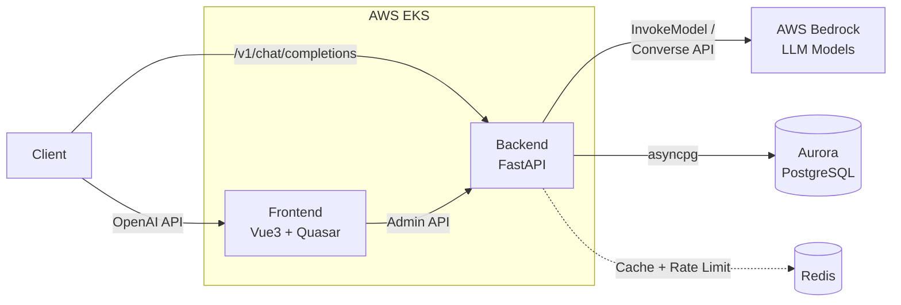

# Kolya BR Proxy

**[English](README.md) | [中文](README.zh.md)**

**An AI Gateway that provides an OpenAI-compatible API backed by AWS Bedrock — supporting Claude, Nova, DeepSeek, Mistral, Llama, and more.**

---

## Why Kolya BR Proxy?

- **Zero migration cost** — Drop-in replacement for OpenAI API. Any tool (Cline, Cursor, OpenAI SDK) works with zero code changes
- **Up to 90% cost savings** — Prompt caching reads at 0.1x price; Agent loops save ~60% after just 2 requests
- **Enterprise-grade security** — 3-layer CSRF defense, AWS WAF, API token dual protection (SHA256 + AES-128), ESO secrets management
- **Production-ready at scale** — Distributed Redis rate limiting, HPA autoscaling (1-10 Pods), streaming heartbeat optimization

---

## Screenshots


---

## Key Features

### API Gateway
- OpenAI-compatible `/v1/chat/completions` and `/v1/models` endpoints
- Streaming and non-streaming responses with 15s heartbeat keep-alive
- Multi-modal message support (text + images)
- Dual API routing: `/v1/*` for SDK clients + `/admin/*` JWT-based dashboard

### Multi-Provider Support
- **19 providers** via unified translation layer
- Anthropic Claude via native InvokeModel API (full thinking, effort, prompt caching support)
- Amazon Nova, DeepSeek, Mistral, Llama via Converse API
- Automatic request/response format translation

### Cost Optimization
- **Prompt cache**: 90% discount on reads, 25% premium on writes; breakeven at request 2
- **Per-token billing by model**: Dynamic pricing from AWS API + scraper (181+ regional pricing records)
- **Real-time cost tracking**: Background async usage recording with per-token quota limits
- **Agent loop savings**: ~60% total cost reduction for 10+ turn conversations

### Enterprise Security
- **Defense-in-depth CSRF**: Origin + Referer + X-Requested-With header validation
- **AWS WAF**: Rate limiting at ALB layer (20/300/2000 req per 5min by endpoint tier), SQLi/XSS managed rules
- **API token protection**: SHA256 hash index for O(1) lookup (0.5ms) + Fernet AES-128 encrypted storage
- **OAuth SSO**: AWS Cognito (default) + Microsoft Entra ID; PKCE (S256) + OAuth State with 10min expiry; refresh tokens in HttpOnly cookies
- **ESO + AWS Secrets Manager**: Secrets never in git, auto-sync every 10 minutes via Pod Identity

### High-Performance Architecture
- **Distributed Redis token bucket**: Global 500 RPM rate limit via Lua scripts, graceful fallback to per-Pod LocalTokenBucket
- **Streaming optimization**: ALB idle timeout (600s) > Bedrock read timeout (300s); inner layer fails first with meaningful errors
- **Asyncio semaphore**: 50 concurrent requests with back-pressure matching connection pool
- **HPA autoscaling**: CPU-based scaling (70% threshold), round-robin ALB distribution

### Production-Ready Infrastructure
- **Kubernetes-native**: EKS deployment with Karpenter, Metrics Server, gp3 StorageClass
- **Two deployment modes**: `deploy-all.sh` (full IaC with Terraform) or `deploy-to-existing.sh` (existing EKS cluster)
- **Optional Global Accelerator**: One-flag enable (`enable_global_accelerator = true`) for Anycast IP global low-latency routing with automatic failover
- **Admin dashboard**: Vue 3 + Quasar with AI Playground, token management, model access control
- **Observability**: Structured logging, health checks, Swagger UI in debug mode

---

## Architecture



Clients send OpenAI-formatted requests to the Backend, which translates them into AWS Bedrock
API calls. Anthropic models use the InvokeModel API (native Messages API format) while
non-Anthropic models use the Converse API. The Frontend provides an admin dashboard for token
and model management.

---

## Tech Stack

| Layer | Technology |
|-------|-----------|
| **Frontend** | Vue 3, Quasar Framework, TypeScript, Pinia, Vite |
| **Backend** | Python 3.12+, FastAPI, SQLAlchemy (async), Alembic, Pydantic |
| **Database** | PostgreSQL (Aurora in prod), asyncpg driver |
| **Cache** | Redis (rate limiting, prompt cache tracking) |
| **Auth** | JWT, AWS Cognito (default), Microsoft OAuth |
| **Cloud** | AWS Bedrock, EKS, ECR, WAF, Secrets Manager |
| **IaC** | Terraform, Karpenter, External Secrets Operator |
| **Package Mgmt** | uv (backend), npm (frontend) |

---

## Quick Start

### Prerequisites

- Python 3.12+
- Node.js 18+
- PostgreSQL 15+ (or Docker)
- AWS credentials with Bedrock access
- [uv](https://github.com/astral-sh/uv) package manager

### 1. Start PostgreSQL with Docker

```bash
docker run -d \
  --name kolya-br-postgres \
  -e POSTGRES_USER=postgres \
  -e POSTGRES_PASSWORD=password \
  -e POSTGRES_DB=kolyabrproxy \
  -p 5432:5432 \
  postgres:15
```

### 2. Backend Setup

```bash
cd backend

# Install dependencies
uv sync

# Create .env from template
cp .env.example .env
# Edit .env with your values

# Run database migrations
uv run alembic upgrade head

# Start development server
cd backend
KBR_ENV=local uv run python main.py
```

The backend runs at `http://localhost:8000`. Visit `/docs` for Swagger UI.

### 3. Frontend Setup

```bash
cd frontend

# Install dependencies
npm install

# Start development server
npm run dev
```

The frontend runs at `http://localhost:9000`.

### 4. Quick Test

```bash
# Using curl (replace <api_token> with your token)
curl -X POST http://localhost:8000/v1/chat/completions \
  -H "Content-Type: application/json" \
  -H "Authorization: Bearer <api_token>" \
  -d '{
    "model": "global.anthropic.claude-sonnet-4-5-20250929-v1:0",
    "messages": [{"role": "user", "content": "Hello!"}],
    "stream": true
  }'
```

```python
# Using OpenAI Python SDK
from openai import OpenAI

client = OpenAI(
    api_key="kbr_your_token_here",  # pragma: allowlist secret
    base_url="http://localhost:8000/v1",
)

stream = client.chat.completions.create(
    model="global.anthropic.claude-sonnet-4-5-20250929-v1:0",
    messages=[{"role": "user", "content": "Hello!"}],
    stream=True,
)

for chunk in stream:
    if chunk.choices[0].delta.content:
        print(chunk.choices[0].delta.content, end="", flush=True)
```

### 5. Swagger UI (API Testing)

When running in debug mode (`KBR_DEBUG=true`), the backend exposes interactive API documentation:

| URL | Description |
|-----|-------------|
| `http://localhost:8000/docs` | Swagger UI - Interactive API testing interface |
| `http://localhost:8000/redoc` | ReDoc - API documentation (read-only) |
| `http://localhost:8000/openapi.json` | OpenAPI Schema (JSON) |

**Authentication:**

Click the **Authorize** button in the top-right corner of Swagger UI:
- **Gateway API** (`/v1/*`): Enter `Bearer kbr_your_token_here` (API Token)
- **Admin API** (`/admin/*`): Enter `Bearer <jwt_token>` (JWT token obtained via OAuth login)
- **Health API** (`/health/*`): No authentication required

> Note: Swagger UI is only available when `KBR_DEBUG=true`. It is disabled in production by default.

---

## Deployment

### Option 1: Full IaC (New Infrastructure)

```bash
# Creates EKS cluster, RDS, VPC, and deploys everything
./deploy-all.sh
```

### Option 2: Existing EKS Cluster

```bash
# Interactive mode
./deploy-to-existing.sh

# Or with config file
./deploy-to-existing.sh --config config.yaml

# Or single step
./deploy-to-existing.sh --step 1  # Helm infrastructure only
```

See [Deployment Guide](docs/deployment.md) for detailed instructions.

---

## Documentation

Start with [Architecture](docs/architecture.md) for the system overview, then drill into specific topics:

| Document | Description |
|----------|-------------|
| **[Architecture](docs/architecture.md)** | System overview, component diagrams, database ER, auth flows, pricing model |
| **[Performance](docs/performance.md)** | Streaming optimization, rate limiting, timeout tuning, HPA autoscaling |
| **[Pricing System](docs/pricing-system.md)** | Per-token billing, dynamic pricing, prompt cache cost model |
| **[Prompt Caching](docs/prompt-caching.md)** | Auto-injection mechanism, cost savings analysis, model thresholds |
| **[Security](docs/security.md)** | CORS & CSRF protection, WAF rules, defense-in-depth implementation |
| **[Request Translation](docs/request-translation.md)** | OpenAI to Bedrock/Anthropic format translation |
| **[API Reference](docs/api-reference.md)** | Full endpoint documentation with request/response examples |
| **[OAuth Setup](docs/oauth-setup.md)** | Microsoft and Cognito OAuth configuration |
| **[Deployment](docs/deployment.md)** | Production and non-production deployment guide |
| [backend/README.md](backend/README.md) | Backend development details |
| [frontend/README.md](frontend/README.md) | Frontend development details |
| [k8s/README.md](k8s/README.md) | Kubernetes deployment guide |

### Interactive Architecture Diagram

An interactive HTML architecture diagram is available at `kolya-br-proxy-arch/bundle.html`. It covers all layers (Client, Ingress, Frontend, Backend, Infrastructure, AWS Services) with click-to-inspect detail panels including CORS/CSRF protection details and the full request flow.

```bash
open kolya-br-proxy-arch/bundle.html
```

---

## Client Configuration

### Cline / Cursor

| Setting | Value |
|---------|-------|
| Base URL | `http://localhost:8000/v1` (dev) or `https://api.kbp.kolya.fun/v1` (prod) |
| API Key | Your API token (starts with `kbr_`) |
| Model | `global.anthropic.claude-sonnet-4-5-20250929-v1:0` |

### OpenAI SDK (Python)

```python
from openai import OpenAI

client = OpenAI(
    api_key="kbr_...",  # pragma: allowlist secret
    base_url="http://localhost:8000/v1",
)
```

### OpenAI SDK (TypeScript)

```typescript
import OpenAI from "openai";

const client = new OpenAI({
  apiKey: "kbr_...",
  baseURL: "http://localhost:8000/v1",
});
```

---

## Development

### Backend

```bash
cd backend
uv run ruff check .    # Lint
uv run ruff format .   # Format
uv run pytest          # Test
```

### Frontend

```bash
cd frontend
npm run lint           # Lint
npm run format         # Format
```

---

## License

MIT License — see [LICENSE](LICENSE) for details.
