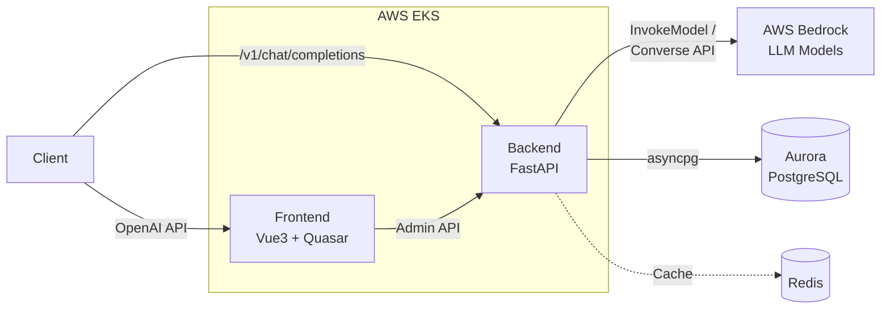

# Kolya BR Proxy

**An AI Gateway that provides an OpenAI-compatible API backed by AWS Bedrock (Claude, Nova, DeepSeek, and more).**

---

## Overview

Kolya BR Proxy bridges the OpenAI API ecosystem with AWS Bedrock models. Any tool or SDK
that speaks the OpenAI protocol (Cline, Cursor, OpenAI Python/JS SDK, etc.) can connect to
Bedrock through this gateway with zero code changes. Anthropic models (Claude) use the native
InvokeModel API for full feature support (thinking, effort, prompt caching), while non-Anthropic
models (Amazon Nova, DeepSeek, Mistral, Llama, etc.) are automatically routed through the
Bedrock Converse API.

### Key Features

- OpenAI-compatible `/v1/chat/completions` and `/v1/models` endpoints
- Streaming and non-streaming responses
- Multi-modal message support (text + images)
- OAuth-only authentication with AWS Cognito (default) and Microsoft Entra ID SSO
- Per-token quota management (USD-based billing)
- Per-token model access control
- Admin dashboard with AI Playground
- Kubernetes-native deployment on AWS EKS

---

## Architecture



Clients send OpenAI-formatted requests to the Backend, which translates them into AWS Bedrock
API calls. Anthropic models use the InvokeModel API (native Messages API format) while
non-Anthropic models use the Converse API. The Frontend provides an admin dashboard for token
and model management.

---

## Tech Stack

| Layer | Technology |
|-------|-----------|
| **Frontend** | Vue 3, Quasar Framework, TypeScript, Pinia, Vite |
| **Backend** | Python 3.12+, FastAPI, SQLAlchemy (async), Alembic, Pydantic |
| **Database** | PostgreSQL (Aurora in prod), asyncpg driver |
| **Auth** | JWT, AWS Cognito (default), Microsoft OAuth |
| **Cloud** | AWS Bedrock, EKS, ECR, Global Accelerator |
| **IaC** | Terraform, Karpenter |
| **Package Mgmt** | uv (backend), npm (frontend) |

---

## Quick Start

### Prerequisites

- Python 3.12+
- Node.js 18+
- PostgreSQL 15+ (or Docker)
- AWS credentials with Bedrock access
- [uv](https://github.com/astral-sh/uv) package manager

### 1. Start PostgreSQL with Docker

```bash
docker run -d \
  --name kolya-br-postgres \
  -e POSTGRES_USER=postgres \
  -e POSTGRES_PASSWORD=password \
  -e POSTGRES_DB=kolyabrproxy \
  -p 5432:5432 \
  postgres:15
```

### 2. Backend Setup

```bash
cd backend

# Install dependencies
uv sync

# Create .env from template
cp .env.example .env
# Edit .env with your values

# Run database migrations
uv run alembic upgrade head

# Start development server
cd backend
uv run python main.py
```

The backend runs at `http://localhost:8000`. Visit `/docs` for Swagger UI.

### 3. Frontend Setup

```bash
cd frontend

# Install dependencies
npm install

# Start development server
npm run dev
```

The frontend runs at `http://localhost:9000`.

### 4. Quick Test

```bash
# Using curl (replace <api_token> with your token)
curl -X POST http://localhost:8000/v1/chat/completions \
  -H "Content-Type: application/json" \
  -H "Authorization: Bearer <api_token>" \
  -d '{
    "model": "global.anthropic.claude-sonnet-4-5-20250929-v1:0",
    "messages": [{"role": "user", "content": "Hello!"}],
    "stream": true
  }'
```

```python
# Using OpenAI Python SDK
from openai import OpenAI

client = OpenAI(
    api_key="kbr_your_token_here",  # pragma: allowlist secret
    base_url="http://localhost:8000/v1",
)

stream = client.chat.completions.create(
    model="global.anthropic.claude-sonnet-4-5-20250929-v1:0",
    messages=[{"role": "user", "content": "Hello!"}],
    stream=True,
)

for chunk in stream:
    if chunk.choices[0].delta.content:
        print(chunk.choices[0].delta.content, end="", flush=True)
```

---

## Directory Structure

```
kolya-br-proxy/
├── backend/                  # FastAPI backend service
│   ├── app/
│   │   ├── api/              # API routes (admin + v1 gateway)
│   │   ├── core/             # Config, database, security
│   │   ├── middleware/        # Request middleware
│   │   ├── models/           # SQLAlchemy ORM models
│   │   ├── schemas/          # Pydantic request/response schemas
│   │   └── services/         # Business logic (Bedrock, OAuth, etc.)
│   ├── alembic/              # Database migrations
│   ├── main.py               # Application entry point
│   ├── app/                  # Application code
│   │   ├── api/              # API endpoints
│   │   ├── core/             # Core configuration
│   │   ├── models/           # Database models
│   │   ├── schemas/          # Pydantic schemas
│   │   └── services/         # Business logic
├── frontend/                 # Vue 3 + Quasar admin dashboard
│   └── src/
│       ├── pages/            # Page components
│       ├── stores/           # Pinia state management
│       └── router/           # Vue Router config
├── k8s/                      # Kubernetes manifests
│   ├── application/          # App deployments and services
│   └── infrastructure/       # Cluster-level resources
├── iac-612674025488-us-west-2/  # Terraform IaC
│   └── modules/              # Terraform modules
├── docs/                     # Extended documentation
├── build-and-push.sh         # Container image build script
└── deploy-all.sh             # Full deployment script
```

---

## Environment Variables

All backend environment variables use the `KBR_` prefix. Key variables:

| Variable | Description | Default |
|----------|------------|---------|
| `KBR_ENV` | Environment mode (`non-prod` or `prod`) | `non-prod` |
| `KBR_DEBUG` | Enable debug mode | `false` |
| `KBR_PORT` | Server port | `8000` |
| `KBR_DATABASE_URL` | PostgreSQL connection string (asyncpg) | -- (required) |
| `KBR_DATABASE_POOL_SIZE` | Connection pool size | `10` |
| `KBR_DATABASE_MAX_OVERFLOW` | Max overflow connections | `20` |
| `KBR_JWT_SECRET_KEY` | JWT signing key (min 32 chars) | -- (required) |
| `KBR_JWT_ALGORITHM` | JWT algorithm | `HS256` |
| `KBR_JWT_ACCESS_TOKEN_EXPIRE_MINUTES` | Access token TTL (minutes) | `30` |
| `KBR_JWT_REFRESH_TOKEN_EXPIRE_DAYS` | Refresh token TTL (days) | `7` |
| `KBR_AWS_REGION` | AWS region for Bedrock | `us-west-2` |
| `KBR_AWS_PROFILE` | AWS CLI profile (local dev only) | -- |
| `KBR_ALLOWED_ORIGINS` | CORS origins (comma-separated) | `localhost` |
| `KBR_MICROSOFT_CLIENT_ID` | Microsoft OAuth client ID | -- |
| `KBR_MICROSOFT_CLIENT_SECRET` | Microsoft OAuth client secret | -- |
| `KBR_MICROSOFT_TENANT_ID` | Microsoft OAuth tenant ID | -- |
| `KBR_COGNITO_USER_POOL_ID` | AWS Cognito User Pool ID | -- |
| `KBR_COGNITO_CLIENT_ID` | AWS Cognito App Client ID | -- |
| `KBR_INITIAL_USER_BALANCE_USD` | Initial balance for new users | `5.0` |
| `KBR_LOG_LEVEL` | Logging level | `INFO` |

See `backend/.env.example` for a complete template.

---

## Environment Configuration

### Local Development

**Configuration:**
- Config file: `.env.local` (only environment file used locally)
- `KBR_ENV`: Not set (defaults to `non-prod`)
- `KBR_DEBUG`: `true`
- `KBR_LOG_LEVEL`: `INFO` or `DEBUG`

**Infrastructure:**
- Database: Local PostgreSQL (`127.0.0.1:5432`)
- AWS Auth: `KBR_AWS_PROFILE` or `KBR_AWS_ACCESS_KEY_ID`/`KBR_AWS_SECRET_ACCESS_KEY`
- CORS: `localhost` origins (can include `*`)
- OAuth Redirect: `http://localhost:9000/auth/*/callback`
- TLS: Optional

### Cloud Deployments (Non-Production & Production)

**Configuration Source:**
- All environment variables are defined in Kubernetes manifests:
  - `k8s/application/backend-configmap.yaml` - Non-sensitive configuration
  - `k8s/application/secrets.yaml` - Sensitive credentials (database URL, JWT secret, OAuth credentials)
- `.env.non-prod` and `.env.prod` files are NOT used in cloud deployments

**Non-Production (Cloud):**
- `KBR_ENV`: `non-prod` (set in ConfigMap)
- `KBR_DEBUG`: `true`
- `KBR_LOG_LEVEL`: `INFO`
- Database: Aurora PostgreSQL (RDS)
- AWS Auth: EKS Pod Identity (no credentials needed)
- CORS: Non-prod domain origins (can include `*` for testing)
- OAuth Redirect: Non-prod domain URLs
- TLS: Required (ALB/Global Accelerator)
- Deletion Protection: Disabled (Terraform)
- Backup Retention: 1 day (Terraform)
- Performance Insights: Disabled (Terraform)

**Production (Cloud):**
- `KBR_ENV`: `prod` (set in ConfigMap)
- `KBR_DEBUG`: `false`
- `KBR_LOG_LEVEL`: `WARNING`
- Database: Aurora PostgreSQL (RDS)
- AWS Auth: EKS Pod Identity
- CORS: Strict domain whitelist (no wildcards allowed)
- OAuth Redirect: Production domain URLs only
- TLS: Required (ALB/Global Accelerator)
- Deletion Protection: Enabled (Terraform)
- Backup Retention: 7 days (Terraform)
- Performance Insights: Enabled (Terraform)

For detailed deployment instructions, see `docs/deployment.md`.

---

## Documentation

Start with [Architecture](docs/architecture.md) for the system overview, then drill into specific topics:

| Document | Description |
|----------|-------------|
| **[Architecture](docs/architecture.md)** | System overview, component diagrams, database ER, auth flows, pricing model |
| ↳ [Request Translation](docs/request-translation.md) | How requests are translated between OpenAI, Bedrock, and Anthropic formats |
| ↳ [API Reference](docs/api-reference.md) | Full endpoint documentation with request/response examples |
| ↳ [OAuth Setup](docs/oauth-setup.md) | Microsoft and Cognito OAuth configuration |
| ↳ [Deployment](docs/deployment.md) | Production and non-production deployment guide |
| [backend/README.md](backend/README.md) | Backend development details |
| [frontend/README.md](frontend/README.md) | Frontend development details |
| [k8s/README.md](k8s/README.md) | Kubernetes deployment guide |

### Interactive Architecture Diagram

An interactive HTML architecture diagram is available at `kolya-br-proxy-arch/bundle.html`. It covers all layers (Client, Ingress, Frontend, Backend, Infrastructure, AWS Services) with click-to-inspect detail panels including CORS/CSRF protection details and the full request flow.

```bash
open kolya-br-proxy-arch/bundle.html
```

---

## Client Configuration

### Cline / Cursor

| Setting | Value |
|---------|-------|
| Base URL | `http://localhost:8000/v1` (dev) or `https://api.kbp.kolya.fun/v1` (prod) |
| API Key | Your API token (starts with `kbr_`) |
| Model | `global.anthropic.claude-sonnet-4-5-20250929-v1:0` |

### OpenAI SDK (Python)

```python
from openai import OpenAI

client = OpenAI(
    api_key="kbr_...",  # pragma: allowlist secret
    base_url="http://localhost:8000/v1",
)
```

### OpenAI SDK (TypeScript)

```typescript
import OpenAI from "openai";

const client = new OpenAI({
  apiKey: "kbr_...",
  baseURL: "http://localhost:8000/v1",
});
```

---

## Development

### Backend

```bash
cd backend
uv run ruff check .    # Lint
uv run ruff format .   # Format
uv run pytest          # Test
```

### Frontend

```bash
cd frontend
npm run lint           # Lint
npm run format         # Format
```

---

## License

This project is proprietary and for internal use.
