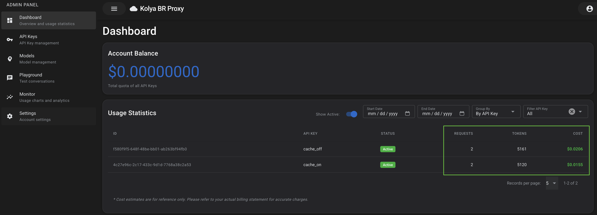
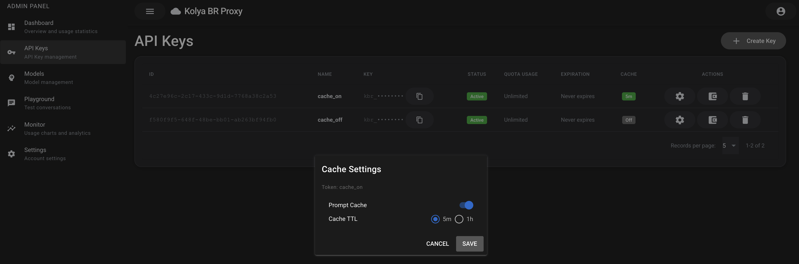
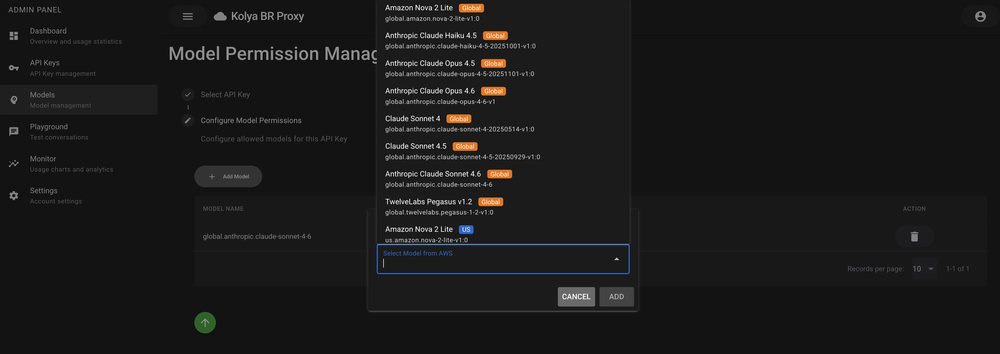
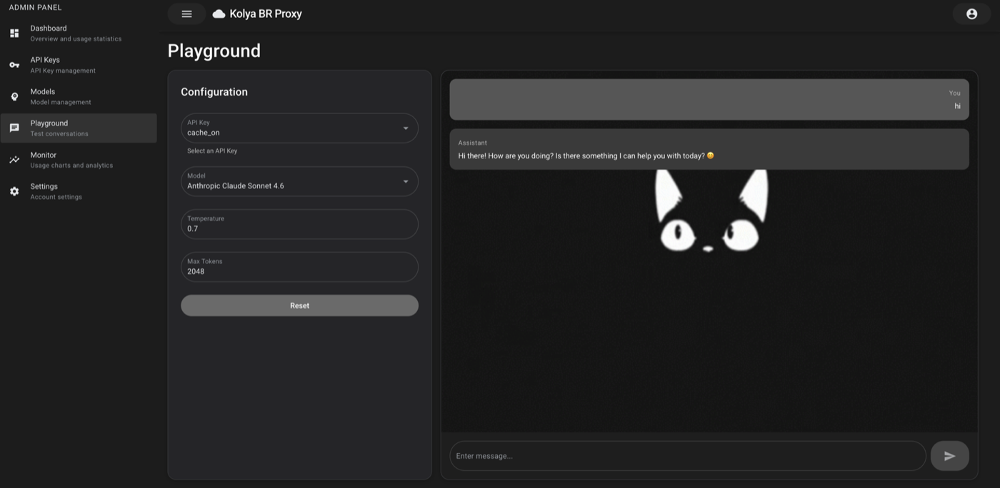
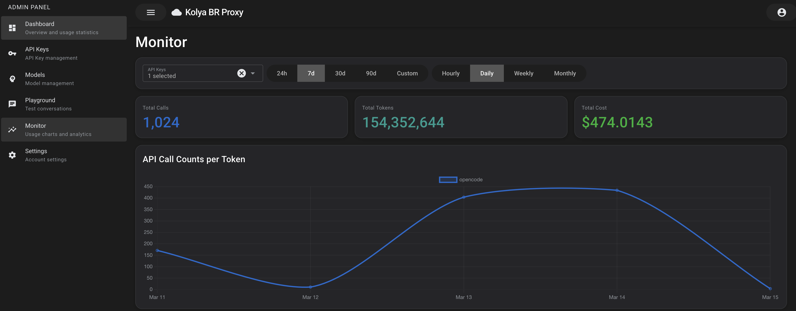
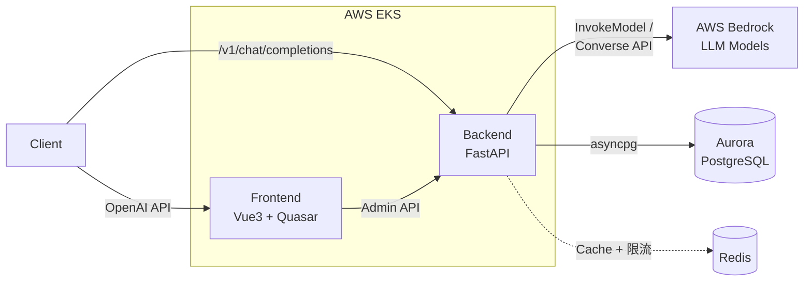

# Kolya BR Proxy

**[English](README.md) | [中文](README.zh.md)**

**AI Gateway — 提供兼容 OpenAI API 的 AWS Bedrock 代理服务，支持 Claude、Nova、DeepSeek、Mistral、Llama 等模型。**

---

## 为什么选择 Kolya BR Proxy？

- **零迁移成本** — OpenAI API 直接替换。Cline、Cursor、OpenAI SDK 等工具无需修改代码即可接入
- **最高 90% 成本节省** — Prompt Cache 读取按 0.1 倍计费；Agent 循环仅 2 次请求即可回本，10+ 轮节省约 60%
- **企业级安全** — 三层 CSRF 防御、AWS WAF、API Token 双重保护（SHA256 + AES-128）、ESO 密钥管理
- **生产级可扩展** — 分布式 Redis 令牌桶限流、HPA 自动扩缩（1-10 Pods）、流式心跳优化

---

## 截图预览











---

## 核心功能

### API 网关
- 兼容 OpenAI 的 `/v1/chat/completions` 和 `/v1/models` 端点
- 流式和非流式响应，15 秒心跳保持连接活跃
- 多模态消息支持（文本 + 图像）
- 双 API 路由：`/v1/*` 供 SDK 客户端 + `/admin/*` JWT 认证管理面板

### 多厂商支持
- 通过统一转换层支持 **19 家厂商**
- Anthropic Claude 使用原生 InvokeModel API（完整支持 thinking、effort、prompt caching）
- Amazon Nova、DeepSeek、Mistral、Llama 通过 Converse API
- 自动请求/响应格式转换

### 成本优化
- **Prompt Cache**：读取 90% 折扣，写入 25% 溢价；第 2 次请求即可回本
- **按模型按 Token 计费**：动态价格来自 AWS API + 爬虫（181+ 个地区价格记录）
- **实时成本追踪**：后台异步记录使用量，每个 API Token 配额限制
- **Agent 循环优化**：10+ 轮对话总成本降低约 60%

### 企业安全
- **纵深防御 CSRF**：Origin + Referer + X-Requested-With 头验证
- **AWS WAF**：ALB 层限流（按端点层级 20/300/2000 req 每 5min），SQLi/XSS 托管规则
- **API Token 双重保护**：SHA256 哈希索引 O(1) 查询（0.5ms）+ Fernet AES-128 加密存储
- **OAuth SSO**：AWS Cognito（默认）+ Microsoft Entra ID；PKCE (S256) + OAuth State 10 分钟过期；Refresh Token 使用 HttpOnly Cookie 存储
- **ESO + AWS Secrets Manager**：密钥不入 Git，通过 Pod Identity 每 10 分钟自动同步

### 高性能架构
- **分布式 Redis 令牌桶**：Lua 脚本实现全局 500 RPM 限流，Redis 不可用时优雅回退到 per-Pod LocalTokenBucket
- **流式响应优化**：ALB 空闲超时（600s）> Bedrock 读超时（300s）；内层先超时返回有意义的错误
- **异步信号量**：50 并发请求，反压匹配连接池大小
- **HPA 自动扩缩**：CPU 70% 阈值触发扩容，ALB 轮询算法均衡分发

### 生产就绪基础设施
- **Kubernetes 原生**：EKS 部署，Karpenter、Metrics Server、gp3 StorageClass
- **两种部署模式**：`deploy-all.sh`（完整 IaC + Terraform）或 `deploy-to-existing.sh`（已有 EKS 集群）
- **Global Accelerator 可选集成**：一键启用 AWS Global Accelerator，Anycast IP 全球低延迟接入，自动故障转移（`enable_global_accelerator = true`）
- **管理面板**：Vue 3 + Quasar，内含 AI Playground、Token 管理、模型访问控制
- **可观测性**：结构化日志、健康检查、调试模式下 Swagger UI

---

## 架构



客户端发送 OpenAI 格式的请求到后端，后端将其转换为 AWS Bedrock API 调用。Anthropic 模型使用
InvokeModel API（原生 Messages API 格式），非 Anthropic 模型使用 Converse API。前端提供管理
面板用于 Token 和模型管理。

---

## 技术栈

| 层级 | 技术 |
|------|------|
| **前端** | Vue 3, Quasar Framework, TypeScript, Pinia, Vite |
| **后端** | Python 3.12+, FastAPI, SQLAlchemy (async), Alembic, Pydantic |
| **数据库** | PostgreSQL（生产环境使用 Aurora），asyncpg 驱动 |
| **缓存** | Redis（限流、Prompt Cache 追踪） |
| **认证** | JWT, AWS Cognito（默认）, Microsoft OAuth |
| **云服务** | AWS Bedrock, EKS, ECR, WAF, Secrets Manager |
| **基础设施即代码** | Terraform, Karpenter, External Secrets Operator |
| **包管理** | uv（后端）, npm（前端） |

---

## 快速开始

### 前提条件

- Python 3.12+
- Node.js 18+
- PostgreSQL 15+（或 Docker）
- 具有 Bedrock 访问权限的 AWS 凭证
- [uv](https://github.com/astral-sh/uv) 包管理器

### 1. 使用 Docker 启动 PostgreSQL

```bash
docker run -d \
  --name kolya-br-postgres \
  -e POSTGRES_USER=postgres \
  -e POSTGRES_PASSWORD=password \
  -e POSTGRES_DB=kolyabrproxy \
  -p 5432:5432 \
  postgres:15
```

### 2. 后端设置

```bash
cd backend

# 安装依赖
uv sync

# 从模板创建配置文件
cp .env.example .env
# 编辑 .env 填入你的配置

# 执行数据库迁移
uv run alembic upgrade head

# 启动开发服务器
cd backend
KBR_ENV=local uv run python main.py
```

后端运行在 `http://localhost:8000`，访问 `/docs` 查看 Swagger UI。

### 3. 前端设置

```bash
cd frontend

# 安装依赖
npm install

# 启动开发服务器
npm run dev
```

前端运行在 `http://localhost:9000`。

### 4. 快速测试

```bash
# 使用 curl（将 <api_token> 替换为你的令牌）
curl -X POST http://localhost:8000/v1/chat/completions \
  -H "Content-Type: application/json" \
  -H "Authorization: Bearer <api_token>" \
  -d '{
    "model": "global.anthropic.claude-sonnet-4-5-20250929-v1:0",
    "messages": [{"role": "user", "content": "Hello!"}],
    "stream": true
  }'
```

```python
# 使用 OpenAI Python SDK
from openai import OpenAI

client = OpenAI(
    api_key="kbr_your_token_here",  # pragma: allowlist secret
    base_url="http://localhost:8000/v1",
)

stream = client.chat.completions.create(
    model="global.anthropic.claude-sonnet-4-5-20250929-v1:0",
    messages=[{"role": "user", "content": "Hello!"}],
    stream=True,
)

for chunk in stream:
    if chunk.choices[0].delta.content:
        print(chunk.choices[0].delta.content, end="", flush=True)
```

### 5. Swagger UI 测试接口

在 DEBUG 模式下（`KBR_DEBUG=true`），后端自动启用以下 API 文档和测试界面：

| 地址 | 说明 |
|------|------|
| `http://localhost:8000/docs` | Swagger UI - 交互式 API 测试界面 |
| `http://localhost:8000/redoc` | ReDoc - API 文档（只读） |
| `http://localhost:8000/openapi.json` | OpenAPI Schema（JSON 格式） |

**认证方式：**

在 Swagger UI 页面点击右上角 **Authorize** 按钮：
- **Gateway API**（`/v1/*`）：输入 `Bearer kbr_your_token_here`（API Token）
- **Admin API**（`/admin/*`）：输入 `Bearer <jwt_token>`（通过 OAuth 登录获取的 JWT Token）
- **Health API**（`/health/*`）：无需认证，可直接测试

> 注意：Swagger UI 仅在 `KBR_DEBUG=true` 时可用，生产环境默认关闭。

---

## 部署

### 方式一：完整 IaC（新建基础设施）

```bash
# 创建 EKS 集群、RDS、VPC 并部署所有组件
./deploy-all.sh
```

### 方式二：已有 EKS 集群

```bash
# 交互式模式
./deploy-to-existing.sh

# 或使用配置文件
./deploy-to-existing.sh --config config.yaml

# 或单步执行
./deploy-to-existing.sh --step 1  # 仅安装 Helm 基础设施
```

详细部署说明请参考[部署指南](docs/deployment.md)。

---

## 文档

从[架构概览](docs/architecture.zh.md)开始了解系统全貌，然后深入各专题：

| 文档 | 描述 |
|------|------|
| **[架构概览](docs/architecture.zh.md)** | 系统架构、组件图、数据库 ER 图、认证流程、计费模型 |
| **[性能优化](docs/performance.zh.md)** | 流式优化、限流机制、超时调优、HPA 自动扩缩 |
| **[计费系统](docs/pricing-system.zh.md)** | 按 Token 计费、动态定价、Prompt Cache 成本模型 |
| **[Prompt 缓存](docs/prompt-caching.zh.md)** | 自动注入机制、成本节省分析、模型阈值 |
| **[安全防护](docs/security.zh.md)** | CORS 与 CSRF 防护、WAF 规则、纵深防御实现 |
| **[请求转换](docs/request-translation.md)** | OpenAI 到 Bedrock/Anthropic 格式转换 |
| **[API 参考](docs/api-reference.md)** | 完整端点文档及请求/响应示例 |
| **[OAuth 配置](docs/oauth-setup.md)** | Microsoft 和 Cognito OAuth 配置说明 |
| **[部署指南](docs/deployment.md)** | 生产和非生产环境部署指南 |
| [backend/README.md](backend/README.md) | 后端开发详情 |
| [frontend/README.md](frontend/README.md) | 前端开发详情 |
| [k8s/README.md](k8s/README.md) | Kubernetes 部署指南 |

### 交互式架构图

交互式 HTML 架构图位于 `kolya-br-proxy-arch/bundle.html`，覆盖所有层级（客户端、Ingress、前端、后端、基础设施、AWS 服务），支持点击查看详情面板，包含 CORS/CSRF 防护细节和完整请求流程。

```bash
open kolya-br-proxy-arch/bundle.html
```

---

## 客户端配置

### Cline / Cursor

| 设置 | 值 |
|------|------|
| Base URL | `http://localhost:8000/v1`（开发）或 `https://api.kbp.kolya.fun/v1`（生产） |
| API Key | 你的 API 令牌（以 `kbr_` 开头） |
| Model | `global.anthropic.claude-sonnet-4-5-20250929-v1:0` |

### OpenAI SDK (Python)

```python
from openai import OpenAI

client = OpenAI(
    api_key="kbr_...",  # pragma: allowlist secret
    base_url="http://localhost:8000/v1",
)
```

### OpenAI SDK (TypeScript)

```typescript
import OpenAI from "openai";

const client = new OpenAI({
  apiKey: "kbr_...",
  baseURL: "http://localhost:8000/v1",
});
```

---

## 开发

### 后端

```bash
cd backend
uv run ruff check .    # 代码检查
uv run ruff format .   # 代码格式化
uv run pytest          # 测试
```

### 前端

```bash
cd frontend
npm run lint           # 代码检查
npm run format         # 代码格式化
```

---

## 许可

MIT License — 详见 [LICENSE](LICENSE)。
