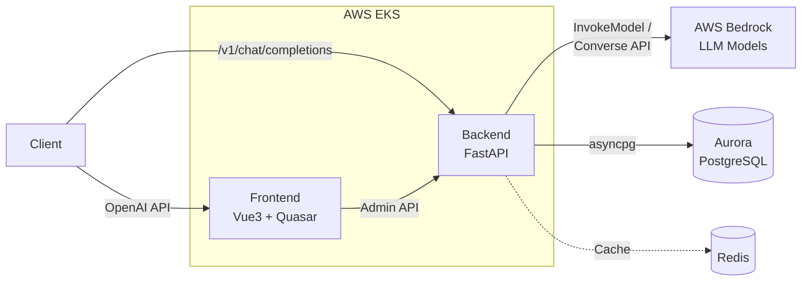

# Kolya BR Proxy

**AI Gateway -- 提供兼容 OpenAI API 的 AWS Bedrock 代理服务（支持 Claude、Nova、DeepSeek 等模型）。**

---

## 概述

Kolya BR Proxy 将 OpenAI API 生态与 AWS Bedrock 模型连接起来。任何支持 OpenAI 协议的工具或
SDK（Cline、Cursor、OpenAI Python/JS SDK 等）都可以通过此网关无缝接入 Bedrock，无需修改代码。
Anthropic 模型（Claude）使用原生 InvokeModel API 以支持全部特性（thinking、effort、prompt caching），
非 Anthropic 模型（Amazon Nova、DeepSeek、Mistral、Llama 等）自动通过 Bedrock Converse API 路由。

### 主要功能

- 兼容 OpenAI 的 `/v1/chat/completions` 和 `/v1/models` 端点
- 流式和非流式响应
- 多模态消息支持（文本 + 图像）
- 纯 OAuth 认证，支持 AWS Cognito（默认）和 Microsoft Entra ID SSO
- 基于 USD 计费的按令牌配额管理
- 按令牌模型访问控制
- 管理面板，内含 AI Playground
- 基于 AWS EKS 的 Kubernetes 原生部署

---

## 架构



客户端发送 OpenAI 格式的请求到后端，后端将其转换为 AWS Bedrock API 调用。Anthropic 模型使用
InvokeModel API（原生 Messages API 格式），非 Anthropic 模型使用 Converse API。前端提供管理
面板用于 Token 和模型管理。

---

## 技术栈

| 层级 | 技术 |
|------|------|
| **前端** | Vue 3, Quasar Framework, TypeScript, Pinia, Vite |
| **后端** | Python 3.12+, FastAPI, SQLAlchemy (async), Alembic, Pydantic |
| **数据库** | PostgreSQL（生产环境使用 Aurora），asyncpg 驱动 |
| **认证** | JWT, AWS Cognito（默认）, Microsoft OAuth |
| **云服务** | AWS Bedrock, EKS, ECR, Global Accelerator |
| **基础设施即代码** | Terraform, Karpenter |
| **包管理** | uv（后端）, npm（前端） |

---

## 快速开始

### 前提条件

- Python 3.12+
- Node.js 18+
- PostgreSQL 15+（或 Docker）
- 具有 Bedrock 访问权限的 AWS 凭证
- [uv](https://github.com/astral-sh/uv) 包管理器

### 1. 使用 Docker 启动 PostgreSQL

```bash
docker run -d \
  --name kolya-br-postgres \
  -e POSTGRES_USER=postgres \
  -e POSTGRES_PASSWORD=password \
  -e POSTGRES_DB=kolyabrproxy \
  -p 5432:5432 \
  postgres:15
```

### 2. 后端设置

```bash
cd backend

# 安装依赖
uv sync

# 从模板创建配置文件
cp .env.example .env
# 编辑 .env 填入你的配置

# 执行数据库迁移
uv run alembic upgrade head

# 启动开发服务器
uv run python run_dev.py
```

后端运行在 `http://localhost:8000`，访问 `/docs` 查看 Swagger UI。

### 3. 前端设置

```bash
cd frontend

# 安装依赖
npm install

# 启动开发服务器
npm run dev
```

前端运行在 `http://localhost:9000`。

### 4. 快速测试

```bash
# 使用 curl（将 <api_token> 替换为你的令牌）
curl -X POST http://localhost:8000/v1/chat/completions \
  -H "Content-Type: application/json" \
  -H "Authorization: Bearer <api_token>" \
  -d '{
    "model": "global.anthropic.claude-sonnet-4-5-20250929-v1:0",
    "messages": [{"role": "user", "content": "Hello!"}],
    "stream": true
  }'
```

```python
# 使用 OpenAI Python SDK
from openai import OpenAI

client = OpenAI(
    api_key="kbr_your_token_here",  # pragma: allowlist secret
    base_url="http://localhost:8000/v1",
)

stream = client.chat.completions.create(
    model="global.anthropic.claude-sonnet-4-5-20250929-v1:0",
    messages=[{"role": "user", "content": "Hello!"}],
    stream=True,
)

for chunk in stream:
    if chunk.choices[0].delta.content:
        print(chunk.choices[0].delta.content, end="", flush=True)
```

---

## 项目结构

```
kolya-br-proxy/
├── backend/                  # FastAPI 后端服务
│   ├── app/
│   │   ├── api/              # API 路由（管理 + v1 网关）
│   │   ├── core/             # 配置、数据库、安全
│   │   ├── middleware/        # 请求中间件
│   │   ├── models/           # SQLAlchemy ORM 模型
│   │   ├── schemas/          # Pydantic 请求/响应模式
│   │   └── services/         # 业务逻辑（Bedrock、OAuth 等）
│   ├── alembic/              # 数据库迁移
│   ├── main.py               # 应用入口
│   └── run_dev.py            # 开发服务器启动器
├── frontend/                 # Vue 3 + Quasar 管理面板
│   └── src/
│       ├── pages/            # 页面组件
│       ├── stores/           # Pinia 状态管理
│       └── router/           # Vue Router 配置
├── k8s/                      # Kubernetes 清单
│   ├── application/          # 应用部署和服务
│   └── infrastructure/       # 集群级资源
├── iac-612674025488-us-west-2/  # Terraform 基础设施即代码
│   └── modules/              # Terraform 模块
├── docs/                     # 扩展文档
├── build-and-push.sh         # 容器镜像构建脚本
└── deploy-all.sh             # 完整部署脚本
```

---

## 环境变量

所有后端环境变量使用 `KBR_` 前缀。主要变量：

| 变量 | 描述 | 默认值 |
|------|------|--------|
| `KBR_ENV` | 环境模式（`non-prod` 或 `prod`） | `non-prod` |
| `KBR_DEBUG` | 启用调试模式 | `false` |
| `KBR_PORT` | 服务端口 | `8000` |
| `KBR_DATABASE_URL` | PostgreSQL 连接字符串（asyncpg） | --（必填） |
| `KBR_DATABASE_POOL_SIZE` | 连接池大小 | `10` |
| `KBR_DATABASE_MAX_OVERFLOW` | 最大溢出连接数 | `20` |
| `KBR_JWT_SECRET_KEY` | JWT 签名密钥（至少 32 字符） | --（必填） |
| `KBR_JWT_ALGORITHM` | JWT 算法 | `HS256` |
| `KBR_JWT_ACCESS_TOKEN_EXPIRE_MINUTES` | 访问令牌有效期（分钟） | `30` |
| `KBR_JWT_REFRESH_TOKEN_EXPIRE_DAYS` | 刷新令牌有效期（天） | `7` |
| `KBR_AWS_REGION` | Bedrock 所在 AWS 区域 | `us-west-2` |
| `KBR_AWS_PROFILE` | AWS CLI 配置文件（仅本地开发） | -- |
| `KBR_ALLOWED_ORIGINS` | CORS 来源（逗号分隔） | `localhost` |
| `KBR_MICROSOFT_CLIENT_ID` | Microsoft OAuth 客户端 ID | -- |
| `KBR_MICROSOFT_CLIENT_SECRET` | Microsoft OAuth 客户端密钥 | -- |
| `KBR_MICROSOFT_TENANT_ID` | Microsoft OAuth 租户 ID | -- |
| `KBR_COGNITO_USER_POOL_ID` | AWS Cognito 用户池 ID | -- |
| `KBR_COGNITO_CLIENT_ID` | AWS Cognito 应用客户端 ID | -- |
| `KBR_INITIAL_USER_BALANCE_USD` | 新用户初始余额 | `5.0` |
| `KBR_LOG_LEVEL` | 日志级别 | `INFO` |

完整模板请参考 `backend/.env.example`。

---

## 环境配置

### 本地开发环境

**配置：**
- 配置文件: `.env.local`（本地唯一使用的环境文件）
- `KBR_ENV`: 不设置（默认为 `non-prod`）
- `KBR_DEBUG`: `true`
- `KBR_LOG_LEVEL`: `INFO` 或 `DEBUG`

**基础设施：**
- 数据库: 本地 PostgreSQL (`127.0.0.1:5432`)
- AWS 认证: `KBR_AWS_PROFILE` 或 `KBR_AWS_ACCESS_KEY_ID`/`KBR_AWS_SECRET_ACCESS_KEY`
- CORS: `localhost` 来源（可包含 `*`）
- OAuth 重定向: `http://localhost:9000/auth/*/callback`
- TLS: 可选

### 云端部署（非生产和生产环境）

**配置来源：**
- 所有环境变量在 Kubernetes manifest 中定义：
  - `k8s/application/backend-configmap.yaml` - 非敏感配置
  - `k8s/application/secrets.yaml` - 敏感凭证（数据库 URL、JWT 密钥、OAuth 凭证）
- `.env.non-prod` 和 `.env.prod` 文件在云端部署时不使用

**非生产环境（云端）：**
- `KBR_ENV`: `non-prod`（在 ConfigMap 中设置）
- `KBR_DEBUG`: `true`
- `KBR_LOG_LEVEL`: `INFO`
- 数据库: Aurora PostgreSQL (RDS)
- AWS 认证: EKS Pod Identity（无需凭证）
- CORS: 非生产域名来源（可包含 `*` 用于测试）
- OAuth 重定向: 非生产域名 URL
- TLS: 必须（ALB/Global Accelerator）
- 删除保护: 禁用（Terraform）
- 备份保留: 1 天（Terraform）
- 性能洞察: 禁用（Terraform）

**生产环境（云端）：**
- `KBR_ENV`: `prod`（在 ConfigMap 中设置）
- `KBR_DEBUG`: `false`
- `KBR_LOG_LEVEL`: `WARNING`
- 数据库: Aurora PostgreSQL (RDS)
- AWS 认证: EKS Pod Identity
- CORS: 严格域名白名单（不允许通配符）
- OAuth 重定向: 仅生产域名 URL
- TLS: 必须（ALB/Global Accelerator）
- 删除保护: 启用（Terraform）
- 备份保留: 7 天（Terraform）
- 性能洞察: 启用（Terraform）

详细部署说明请参考 `docs/deployment.md`。

---

## 文档

| 文档 | 描述 |
|------|------|
| [docs/architecture.md](docs/architecture.md) | 系统架构与流程图 |
| [docs/deployment.md](docs/deployment.md) | 生产部署指南 |
| [docs/api-reference.md](docs/api-reference.md) | API 端点参考 |
| [docs/oauth-setup.md](docs/oauth-setup.md) | OAuth 配置说明 |
| [backend/README.md](backend/README.md) | 后端开发详情 |
| [frontend/README.md](frontend/README.md) | 前端开发详情 |
| [k8s/README.md](k8s/README.md) | Kubernetes 部署指南 |

---

## 客户端配置

### Cline / Cursor

| 设置 | 值 |
|------|------|
| Base URL | `http://localhost:8000/v1`（开发）或 `https://api.kbp.kolya.fun/v1`（生产） |
| API Key | 你的 API 令牌（以 `kbr_` 开头） |
| Model | `global.anthropic.claude-sonnet-4-5-20250929-v1:0` |

### OpenAI SDK (Python)

```python
from openai import OpenAI

client = OpenAI(
    api_key="kbr_...",  # pragma: allowlist secret
    base_url="http://localhost:8000/v1",
)
```

### OpenAI SDK (TypeScript)

```typescript
import OpenAI from "openai";

const client = new OpenAI({
  apiKey: "kbr_...",
  baseURL: "http://localhost:8000/v1",
});
```

---

## 开发

### 后端

```bash
cd backend
uv run ruff check .    # 代码检查
uv run ruff format .   # 代码格式化
uv run pytest          # 测试
```

### 前端

```bash
cd frontend
npm run lint           # 代码检查
npm run format         # 代码格式化
```

---

## 许可

本项目为内部使用的专有项目。
