# Architecture

Comprehensive architecture documentation for Kolya BR Proxy -- an AI Gateway that provides both OpenAI-compatible and Anthropic Messages API access to AWS Bedrock models (Claude, Nova, DeepSeek, Mistral, Llama, etc.) and Google Gemini models via the native generateContent API.

---

## Table of Contents

1. [System Architecture Overview](#1-system-architecture-overview)
2. [Backend Layer Architecture](#2-backend-layer-architecture)
3. [Database ER Diagram](#3-database-er-diagram)
4. [Frontend Architecture](#4-frontend-architecture)
5. [Infrastructure Architecture](#5-infrastructure-architecture)
6. [Authentication Flow](#6-authentication-flow)
7. [Request Processing Flow](#7-request-processing-flow)
8. [Pricing Model](#8-pricing-model)

---

## 1. System Architecture Overview

The system follows a classic three-tier architecture: a Vue 3 frontend served by Nginx, a FastAPI backend running on Uvicorn, and AWS Bedrock as the upstream LLM provider. All components run inside an AWS EKS cluster with PostgreSQL for persistence, Redis for distributed rate limiting, and External Secrets Operator (ESO) for secrets management.

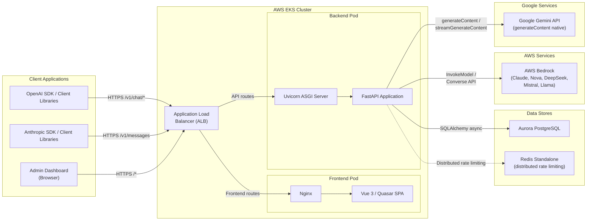

### Key Design Decisions

| Decision | Rationale |
|---|---|
| Dual API compatibility | OpenAI-compatible (`/v1/chat/completions`) and Anthropic Messages API (`/v1/messages`); clients only change `base_url` and `api_key` |
| Configurable API key prefix | Keys default to `kbr_` prefix; `sk-ant-api03` prefix available for Claude Code / Anthropic SDK compatibility |
| Strip thinking blocks from history | Bedrock doesn't support adaptive signature-only thinking blocks, so they are removed from conversation history before forwarding |
| Dynamic model resolution | `_ProfileCache` queries AWS APIs at startup + daily 03:00 UTC to discover available inference profiles and foundation models; `resolve_model()` routes dynamically instead of using hardcoded prefix lists |
| Singleton `BedrockClient` | One shared aioboto3 session + connection pool per process |
| Asyncio semaphore (50) | Back-pressure to match connection pool size; prevents request queuing |
| JWT for dashboard, API keys for gateway | Separate auth concerns; API keys are long-lived, JWTs are short-lived |
| Background usage recording | `record_usage` runs as a background task to avoid blocking responses |
| Gemini native API (not OpenAI compat) | Uses `generateContent` / `streamGenerateContent` directly; avoids Gemini's OpenAI-compat layer which rejects fields like `frequency_penalty` |
| Gemini format conversion in client layer | `GeminiClient` converts OpenAI ↔ Gemini natively; `chat.py` sees uniform OpenAI format regardless of backend |

---

## 2. Backend Layer Architecture

The backend is organized into four layers: API (routing + validation), Middleware (security + CORS), Service (business logic), and Data (SQLAlchemy models). The entry point is `backend/main.py` which sets up the FastAPI app via the `create_app()` factory and the `lifespan` context manager.

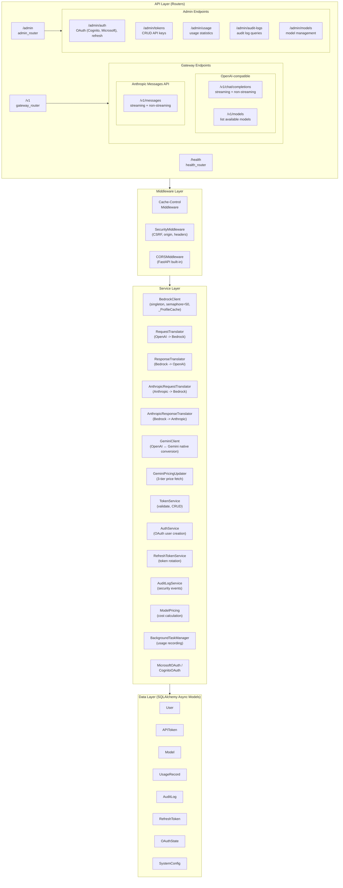

### Middleware Stack Order

Middleware is registered in `create_app()` in `backend/main.py`. FastAPI processes middleware in reverse registration order (last added = outermost). The effective processing order for an incoming request is:

1. **Cache-Control** -- adds `no-cache, no-store` headers to every response
2. **SecurityMiddleware** -- origin validation, CSRF protection (`X-Requested-With`), security response headers (`X-Content-Type-Options`, `X-Frame-Options`, CSP)
3. **CORSMiddleware** -- handles `OPTIONS` preflight, sets `Access-Control-*` headers

### Lifespan Events

```python
# backend/main.py
@asynccontextmanager
async def lifespan(app: FastAPI):
    await init_db()                          # Initialize database connection pool
    # Initialize pricing data if DB is empty (AWS + Gemini)
    bedrock = BedrockClient.get_instance()   # Create singleton Bedrock client
    await bedrock.refresh_profile_cache()    # Populate inference profile cache from AWS APIs
    start_scheduler()                        # APScheduler: pricing @ 02:00/02:30, profile cache @ 03:00 UTC
    yield
    stop_scheduler()
    # Shutdown: cleanup resources
```

---

## 3. Database ER Diagram

All models use UUID primary keys and are defined in `backend/app/models/`. Relationships are enforced via SQLAlchemy ORM with cascade deletes where appropriate.

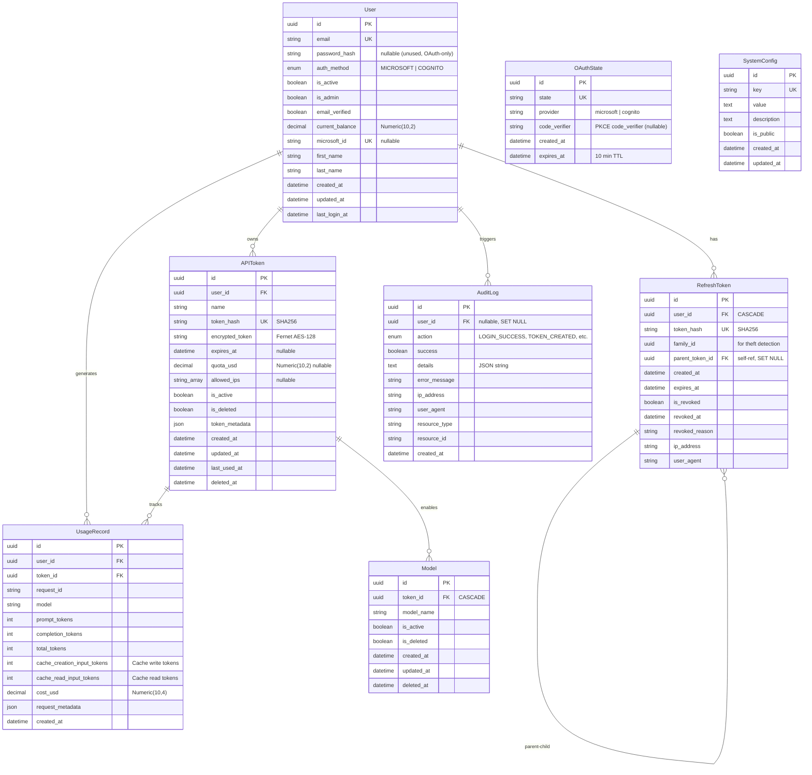

### Key Model Notes

- **User.auth_method**: Enum with values `MICROSOFT`, `COGNITO`. All users authenticate via OAuth and have `password_hash = NULL`.
- **APIToken**: Stores both `token_hash` (SHA256, for lookup) and `encrypted_token` (Fernet AES, for recovery). The `quota_usd` field limits total spending per token. Model access is controlled via the related `Model` table rather than an array column.
- **Model**: Each row links one Bedrock model name to one APIToken. A token can access only models with `is_active=True` and `is_deleted=False`.
- **RefreshToken.family_id**: Groups related tokens for theft detection. If a revoked token is reused, the entire family is revoked.

---

## 4. Frontend Architecture

The frontend is a Vue 3 SPA built with the Quasar framework (dark theme). It uses Pinia stores for state management, Vue Router for navigation with authentication guards, and Axios with automatic 401 refresh interceptors.

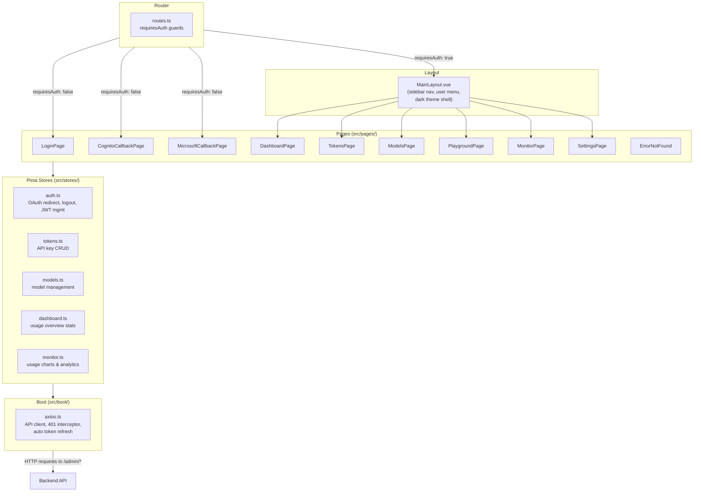

### Route Structure

| Path | Page | Auth Required | Description |
|---|---|---|---|
| `/login` | LoginPage | No | User login (OAuth provider selection) |
| `/auth/cognito/callback` | CognitoCallbackPage | No | Cognito OAuth callback |
| `/auth/microsoft/callback` | MicrosoftCallbackPage | No | Microsoft OAuth callback |
| `/` | DashboardPage | Yes | Overview, usage stats |
| `/tokens` | TokensPage | Yes | API key management |
| `/models` | ModelsPage | Yes | Model configuration |
| `/playground` | PlaygroundPage | Yes | Test conversations |
| `/monitor` | MonitorPage | Yes | Usage charts & analytics |
| `/settings` | SettingsPage | Yes | Account settings |

### Sidebar Navigation

The `MainLayout.vue` renders a persistent left drawer with these menu items: Dashboard, API Keys, Models, Playground, Monitor, Settings. The header shows the app title and a user menu (email, balance, settings, logout).

---

## 5. Infrastructure Architecture

Infrastructure is defined in Terraform (`iac/`). All configuration is centralized in `iac/terraform.tfvars` as the single source of truth (account, region, domains, feature toggles). The `deploy-all.sh` script orchestrates the full deployment in 6 steps (0-5), while `destroy.sh` handles safe teardown. It provisions a VPC, EKS cluster with Karpenter autoscaling, Aurora PostgreSQL, Redis for distributed rate limiting, and optional WAF / Global Accelerator. Secrets are managed via AWS Secrets Manager with External Secrets Operator (ESO) syncing them into Kubernetes.

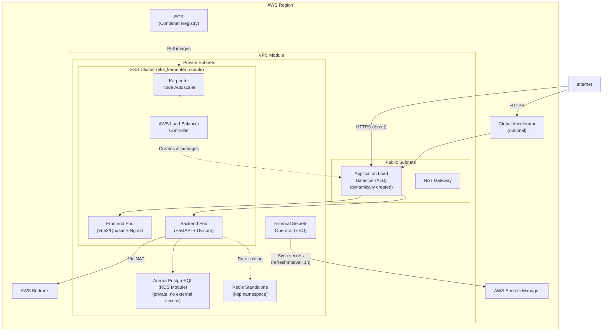

### Secrets Management (ESO + AWS Secrets Manager)

Secrets are stored in **AWS Secrets Manager** and automatically synced to Kubernetes Secrets by the **External Secrets Operator (ESO)**. This replaces local `secrets.yaml` files and ensures secrets never exist in version control.

| Component | Role |
|---|---|
| AWS Secrets Manager | Single source of truth for all secrets (DB credentials, JWT keys, OAuth client secrets, etc.) |
| External Secrets Operator (ESO) | Runs in-cluster, watches `ExternalSecret` CRDs, and syncs secrets from AWS Secrets Manager to K8s Secrets |
| Pod Identity | ESO authenticates to AWS Secrets Manager via EKS Pod Identity (no static AWS credentials) |
| `deploy-all.sh` Step 4 | Pushes secrets to AWS Secrets Manager via `aws secretsmanager put-secret-value` (preserves existing values) |

**Sync behavior:**
- `refreshInterval: 1h` -- ESO re-fetches secrets from Secrets Manager every hour
- Secrets are created as standard Kubernetes Secrets, consumed by Pods via `envFrom` or `env` references
- Secret rotation in AWS Secrets Manager is automatically picked up within the refresh interval

### Redis for Distributed Rate Limiting

A **Redis standalone** instance runs in the `kbp` (kolya-br-proxy) namespace to provide distributed rate limiting across all backend Pods.

| Aspect | Details |
|---|---|
| Deployment | Redis standalone in `kbp` namespace (Kubernetes Deployment + Service) |
| Purpose | Global token bucket rate limiting via atomic Lua scripts |
| Fallback | If Redis is unavailable, each Pod falls back to a local in-memory `LocalTokenBucket` (per-Pod rate limiting, not skip) |
| Access | Backend Pods connect via Kubernetes Service DNS (`redis.kbp.svc.cluster.local`) |

### Configuration: `terraform.tfvars`

All deployment configuration is centralized in `iac/terraform.tfvars`. Both `deploy-all.sh` and `destroy.sh` read from and write to this file.

| Key | Description |
|---|---|
| `account` / `region` | AWS account ID and target region |
| `frontend_domain` / `api_domain` | Domain names (e.g. `kbp.kolya.fun`, `api.kbp.kolya.fun`) |
| `project_name` / `project_name_alias` | Resource naming (some resources use full name, others use alias) |
| `enable_waf` | WAF toggle (auto-enabled after ALBs are ready in Step 4) |
| `enable_global_accelerator` | Global Accelerator toggle (Step 5) |
| `enable_cognito` | Authentication provider toggle (Step 0 selection) |
| `cognito_allowed_email_domains` | Email domain whitelist for Cognito |

### Deployment Pipeline: `deploy-all.sh`

| Step | Command | What It Does |
|---|---|---|
| 0 | `--step 0` | Auto-detect account/region, select auth provider, configure domains → write `terraform.tfvars` |
| 1 | `--step 1` | `terraform init` + `plan` + `apply` (VPC, EKS, RDS, Cognito, etc.) |
| 2 | `--step 2` | Deploy Helm charts (ALB Controller, Karpenter, Metrics Server) |
| 3 | `--step 3` | Build Docker images, push to ECR (domains read from tfvars) |
| 4 | `--step 4` | Deploy K8s app (generate configs from tfvars, push secrets to SM, auto-enable WAF) |
| 5 | `--step 5` | Toggle Global Accelerator on/off |

### Teardown: `destroy.sh`

1. Verify AWS identity and confirm target (account, region, workspace)
2. Initialize Terraform and select workspace
3. Disable WAF/GA via `terraform apply` (their `data "aws_lb"` lookups require ALBs to exist)
4. Clean up K8s resources (Ingress first → triggers ALB deletion, then ExternalSecrets, namespace)
5. `terraform destroy` to remove all remaining infrastructure

> **Important:** K8s resources (especially Ingress/ALB) must be deleted before `terraform destroy`, otherwise ALBs and target groups will block Terraform.

### Terraform Modules

| Module | Source Path | Purpose |
|---|---|---|
| `vpc` | `./modules/vpc` | VPC with public/private subnets, IGW, NAT, security groups |
| `rds_aurora_postgresql` | `./modules/rds-aurora-postgresql` | Aurora PostgreSQL with encryption, backups, monitoring |
| `eks_karpenter` | `./modules/eks-karpenter` | EKS cluster + Karpenter for node autoscaling |
| `eks_addons` | `./modules/eks-addons` | Karpenter Helm chart, AWS LB Controller |
| `cognito` | `./modules/cognito` | Cognito User Pool & App Client (callback URLs auto-derived from `frontend_domain`) |
| `waf` | `./modules/waf` | Web Application Firewall (auto-enabled after ALBs are ready) |
| `global_accelerator` | `./modules/global-accelerator` | Optional GA for global edge routing |

### Environment Differences

| Setting | Production | Non-Production |
|---|---|---|
| `deletion_protection` | `true` | `false` |
| `backup_retention_period` | 7 days | 1 day |
| `performance_insights` | Enabled | Disabled |
| `monitoring_interval` | 60s | 0 (disabled) |
| `skip_final_snapshot` | `false` | `true` |
| `apply_immediately` | `false` | `true` |
| `flow_logs` (GA) | Enabled | Disabled |

---

## 6. Authentication Flow

The system supports two OAuth authentication methods: **AWS Cognito** and **Microsoft Entra ID** (selectable during `deploy-all.sh --step 0`). There is no local username/password authentication. The admin dashboard uses JWT (access + refresh tokens), while the gateway APIs use API keys (`kbr_` prefix) -- via `Authorization: Bearer` for OpenAI-compatible endpoints or `x-api-key` header for Anthropic endpoints. Both auth methods validate the same `kbr_` tokens. Cognito callback URLs are automatically derived from `frontend_domain` in `terraform.tfvars`.

### 6.1 OAuth Flow (Cognito / Microsoft)

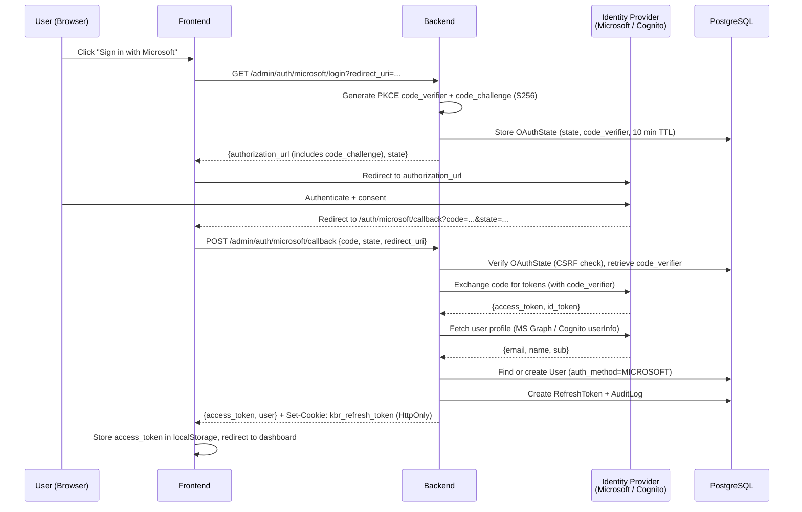

### 6.2 API Key Authentication (Gateway)

The same `kbr_` API keys work for both OpenAI-compatible and Anthropic endpoints. The only difference is the header format:

- **OpenAI path**: `Authorization: Bearer kbr_xxx` (extracted from Bearer token)
- **Anthropic path**: `x-api-key: kbr_xxx` (extracted from `x-api-key` header)

Both paths use the same validation logic (Redis cache → DB fallback).

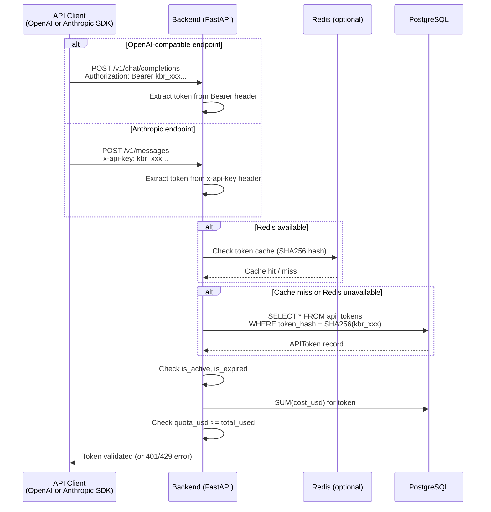

### Token Comparison

| Property | JWT Access Token | JWT Refresh Token | API Key (`kbr_`) |
|---|---|---|---|
| Lifetime | 30 minutes | 7 days | Until expiry or revocation |
| Used by | Admin dashboard | Admin dashboard (refresh) | OpenAI / Anthropic clients |
| Storage | localStorage | HttpOnly cookie (`kbr_refresh_token`, Path=/admin/auth) | Client configuration |
| Validation | JWT decode + signature | DB lookup (hash + family) | DB lookup (SHA256 hash) |
| Rotation | On refresh | On each use (new token issued) | Manual |

---

## 7. Request Processing Flow

This section details the full lifecycle of gateway requests. The proxy supports three API paths:

- **OpenAI path → AWS Bedrock** (`/v1/chat/completions`, non-Gemini models): Full translation between OpenAI and Bedrock formats
- **OpenAI path → Google Gemini** (`/v1/chat/completions`, `gemini-*` models): `GeminiClient` converts OpenAI ↔ Gemini native format; `chat.py` is format-agnostic
- **Anthropic path** (`/v1/messages`): Near-passthrough since Bedrock InvokeModel natively uses Anthropic Messages API format

### 7.1 OpenAI Path Sequence Diagram

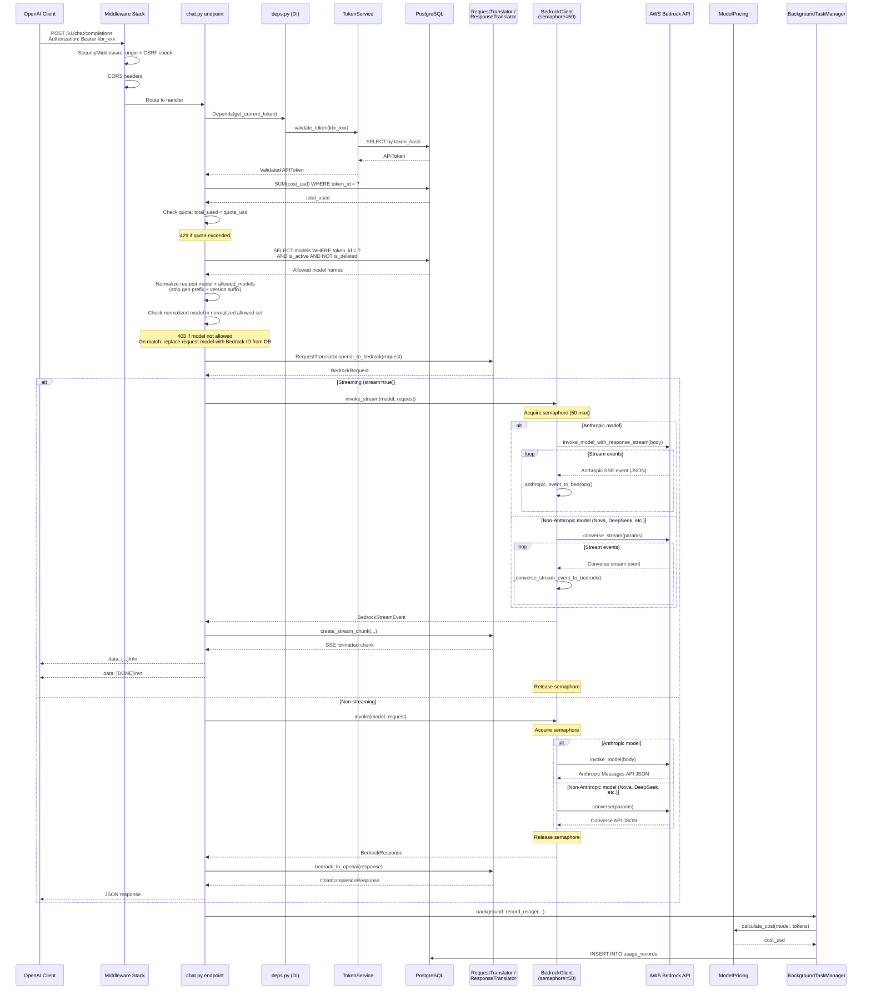

### 7.2 Gemini Path Sequence Diagram

When the requested model starts with `gemini-`, `chat.py` routes to `_handle_gemini_request()`. The `GeminiClient` handles all format conversion internally; `chat.py` always receives an OpenAI-format response dict.

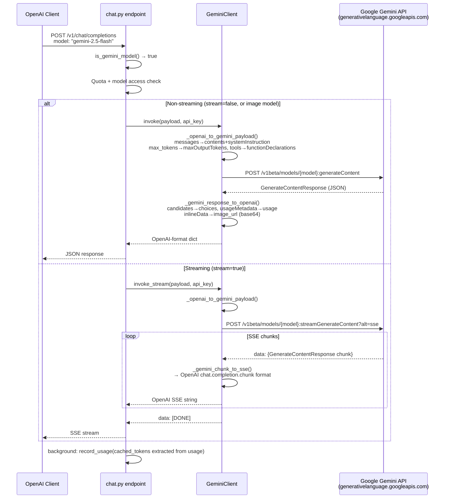

**Key conversion mappings (OpenAI → Gemini):**

| OpenAI field | Gemini field |
|---|---|
| `messages[role=system]` | `systemInstruction.parts` |
| `messages[role=user/assistant]` | `contents[role=user/model]` |
| `messages[role=tool]` | `contents[role=user].parts[functionResponse]` |
| `tool_calls` in assistant message | `parts[functionCall]` |
| `max_tokens` | `generationConfig.maxOutputTokens` |
| `temperature` | `generationConfig.temperature` |
| `top_p` | `generationConfig.topP` |
| `stop` | `generationConfig.stopSequences` |
| `tools[].function` | `tools[].functionDeclarations[]` |
| `tool_choice: "none/auto/required"` | `toolConfig.functionCallingConfig.mode: NONE/AUTO/ANY` |
| `image_url` (base64 data URI) | `inlineData.mimeType + inlineData.data` |

**Key conversion mappings (Gemini → OpenAI):**

| Gemini field | OpenAI field |
|---|---|
| `candidates[0].content.parts[text]` | `choices[0].message.content` (string) |
| `candidates[0].content.parts[functionCall]` | `choices[0].message.tool_calls[]` |
| `candidates[0].content.parts[inlineData]` | `choices[0].message.content` (array with `image_url`) |
| `candidates[0].finishReason: STOP` | `choices[0].finish_reason: stop` |
| `candidates[0].finishReason: MAX_TOKENS` | `choices[0].finish_reason: length` |
| `candidates[0].finishReason: SAFETY` | `choices[0].finish_reason: content_filter` |
| `usageMetadata.promptTokenCount` | `usage.prompt_tokens` |
| `usageMetadata.candidatesTokenCount` | `usage.completion_tokens` |
| `usageMetadata.cachedContentTokenCount` | `usage.prompt_tokens_details.cached_tokens` |

### 7.3 Anthropic Path Sequence Diagram

The Anthropic path is a near-passthrough: since Bedrock's InvokeModel API natively accepts Anthropic Messages API format, minimal translation is needed. Key differences from the OpenAI path:

- Auth via `x-api-key` header instead of `Authorization: Bearer`
- Thinking blocks are preserved in responses (OpenAI path skips them)
- Streaming uses Anthropic SSE format (`event: type\ndata: {json}\n\n`) instead of OpenAI format (`data: {json}\n\n`)

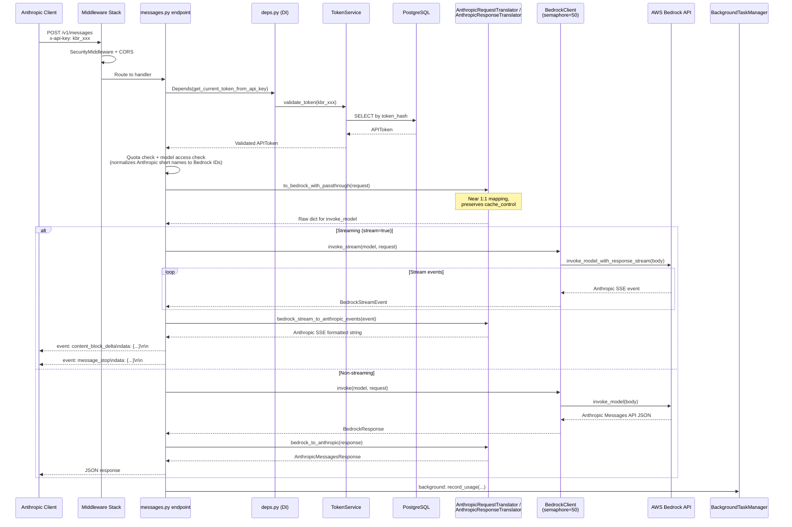

### 7.4 Request/Response Translation Summary

| Path | Translation | Notes |
|---|---|---|
| **OpenAI → Bedrock** | Three-phase (OpenAI → `BedrockRequest` → Bedrock API → `BedrockResponse` → OpenAI) | Full translation; tool calls, images, Bedrock extensions |
| **OpenAI → Gemini** | `GeminiClient` internal conversion (OpenAI → Gemini GenerateContentRequest / back) | Native `generateContent` API; no OpenAI-compat layer |
| **Anthropic → Bedrock** | Near-passthrough (`invoke_model`) | Minimal translation; preserves `cache_control`, thinking blocks |

For non-Anthropic Bedrock models (Nova, DeepSeek, Mistral, Llama, etc.), the Bedrock path uses the Converse API via `converse`/`converse_stream`.

For the complete translation pipeline documentation, see **[Request Translation](request-translation.md)**.

---

## 8. Pricing Model

Cost is calculated per request based on actual AWS Bedrock pricing for each model. The `ModelPricing` class in `backend/app/services/pricing.py` fetches per-token rates from the database. Pricing region is determined dynamically via `BedrockClient.resolve_model()`, which uses the inference profile cache to identify the actual region where the model runs.

### 8.1 Cost Calculation Flow

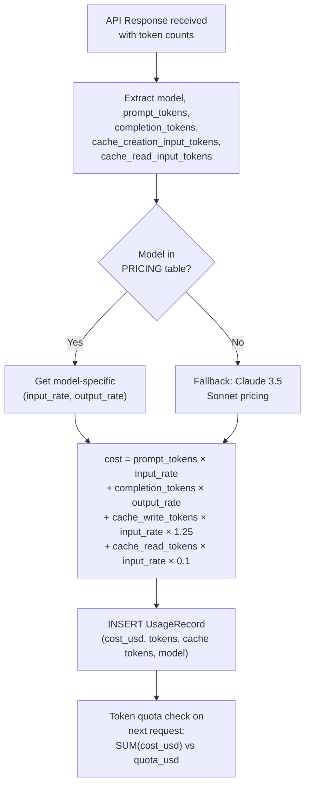

> **Prompt Cache Pricing**: When prompt caching is enabled, cache write tokens are charged at 1.25x and cache read tokens at 0.1x the base input price. See [Dynamic Pricing System](pricing-system.md#prompt-cache-differentiated-pricing) for details.

### 8.2 Supported Model Pricing

| Model | Input (per 1M tokens) | Output (per 1M tokens) | Typical Use Case |
|---|---|---|---|
| Claude 3.5 Sonnet v2 | $3.00 | $15.00 | Balanced performance |
| Claude 3.5 Sonnet | $3.00 | $15.00 | Balanced performance |
| Claude 3 Sonnet | $3.00 | $15.00 | Standard tasks |
| Claude 3 Haiku | $0.25 | $1.25 | Fast, cost-effective |
| Claude 3 Opus | $15.00 | $75.00 | Highest intelligence |
| Mistral Large | $0.50 | $1.50 | European alternative |
| Mistral Small | $1.00 | $3.00 | Lightweight tasks |
| Llama 3 70B | $2.65 | $3.50 | Open source, large |
| Llama 3 8B | $0.30 | $0.60 | Open source, small |

### 8.3 Example Calculation

**Request**: Claude 3 Haiku, 10,000 input tokens, 5,000 output tokens

```
input_cost  = 10,000 * ($0.25 / 1,000,000) = $0.0025
output_cost =  5,000 * ($1.25 / 1,000,000) = $0.00625
total_cost  = $0.0025 + $0.00625 = $0.00875
```

### 8.4 Token Quota System

Each API token (`APIToken.quota_usd`) can have an optional spending limit. The quota check happens at the beginning of each request:

1. Query `SUM(cost_usd)` from `usage_records` for the token
2. Compare against `quota_usd`
3. If `total_used >= quota_usd`, return **HTTP 429** with message: `Token quota exceeded. Used: $X.XX, Quota: $Y.YY`

Usage recording is performed **asynchronously** via `BackgroundTaskManager` to avoid blocking the response to the client. The cost is calculated using `ModelPricing.calculate_cost()` with a fallback to Claude 3.5 Sonnet pricing if the model is not found in the pricing table.

### 8.5 Cost Disclaimer

Displayed costs are estimates based on token usage. Actual AWS billing may differ due to pricing updates, regional variations, additional AWS fees, and rounding differences in token counting.

---

## Related Documentation

| Document | Description |
|---|---|
| [Request Translation](request-translation.md) | Full request/response translation pipeline (OpenAI → Bedrock → Anthropic) |
| [Dynamic Pricing System](pricing-system.md) | Price fetching, cache-aware cost calculation, and pricing table display |
| [API Reference](api-reference.md) | Complete endpoint documentation with request/response examples |
| [OAuth Setup](oauth-setup.md) | Microsoft and Cognito OAuth configuration |
| [Deployment](deployment.md) | Production and non-production deployment guide |
