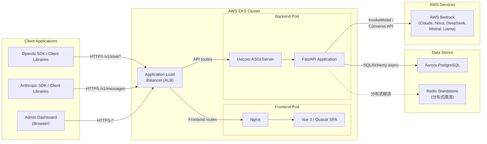
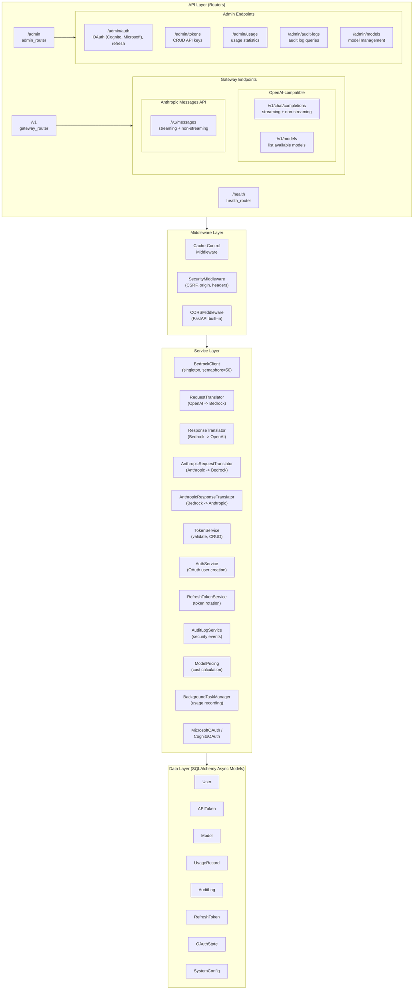
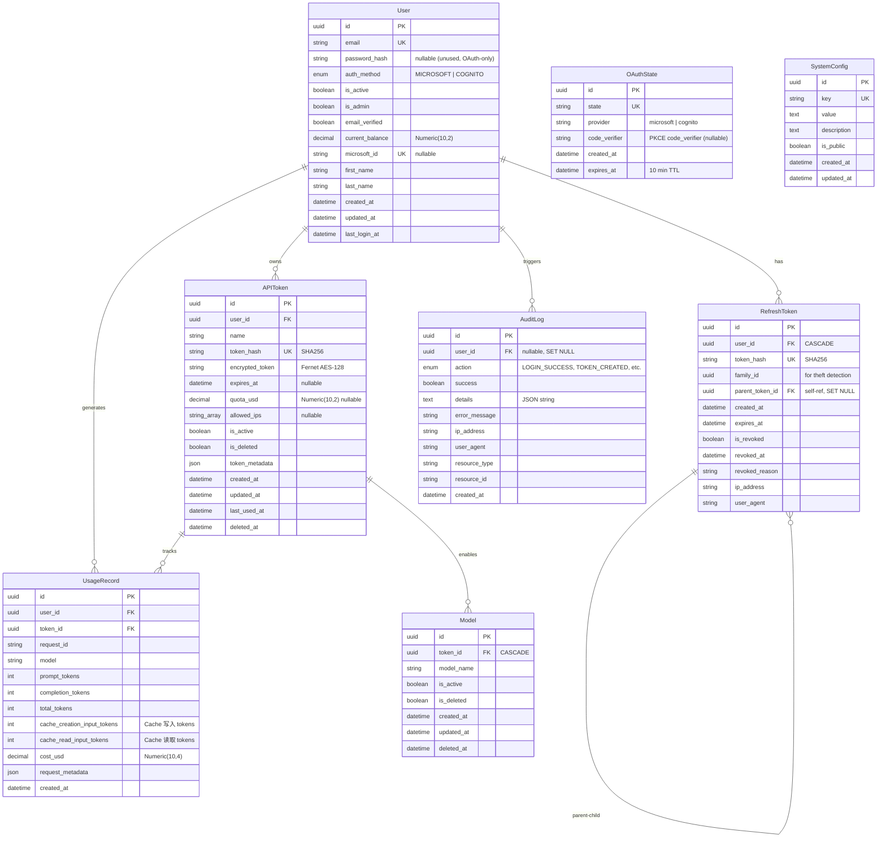
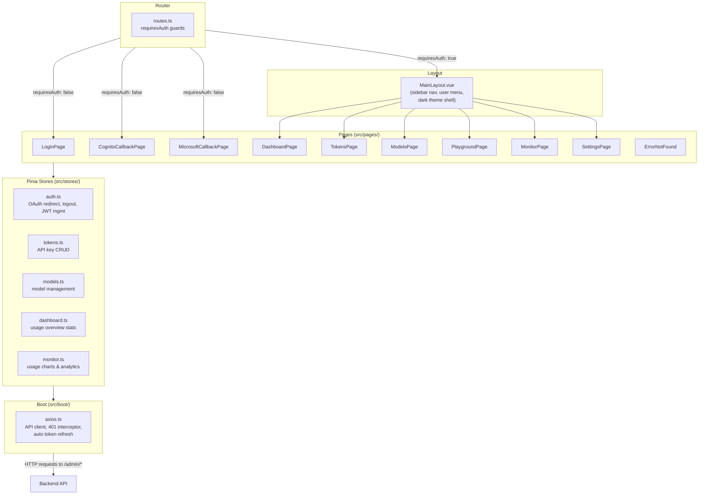
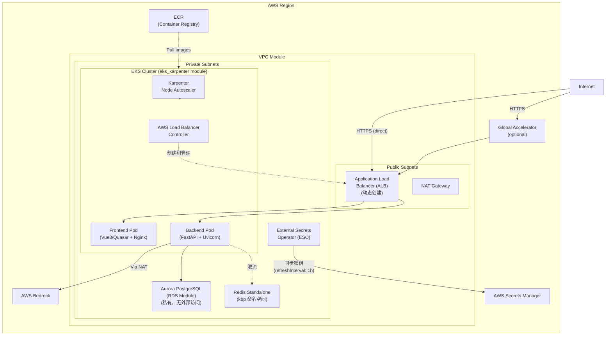
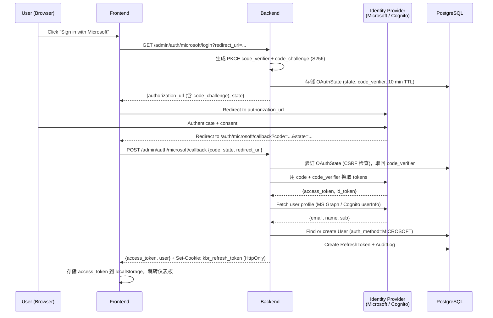
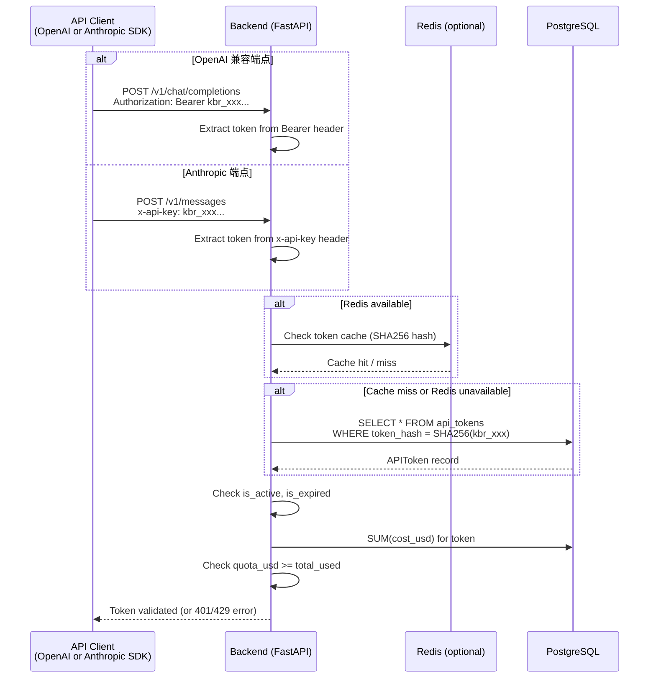
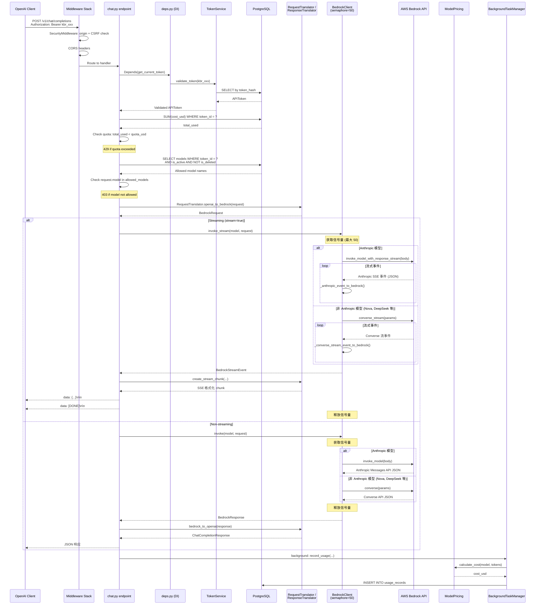
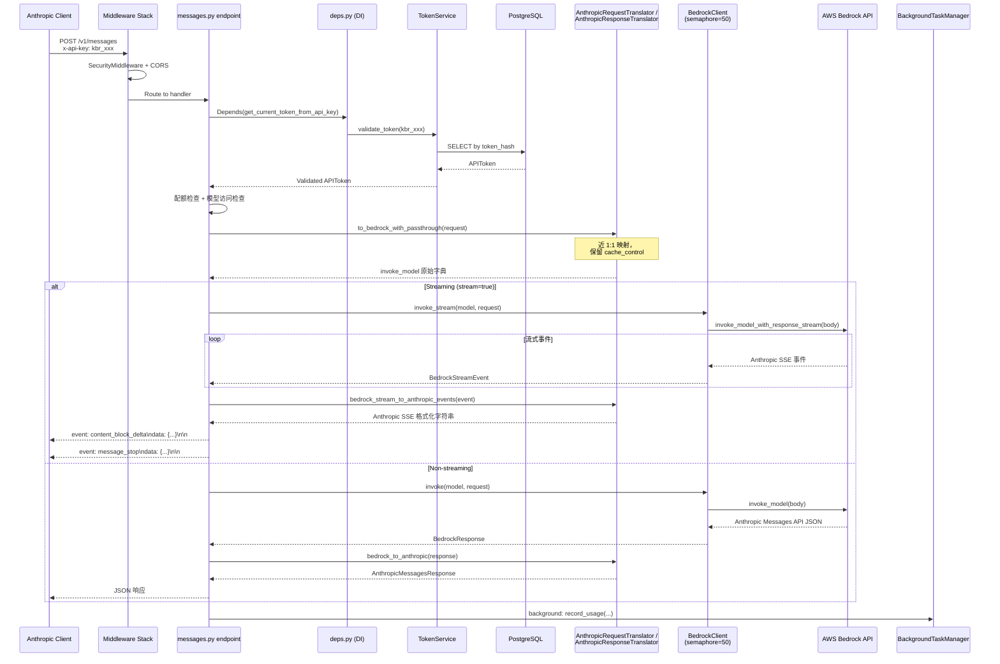
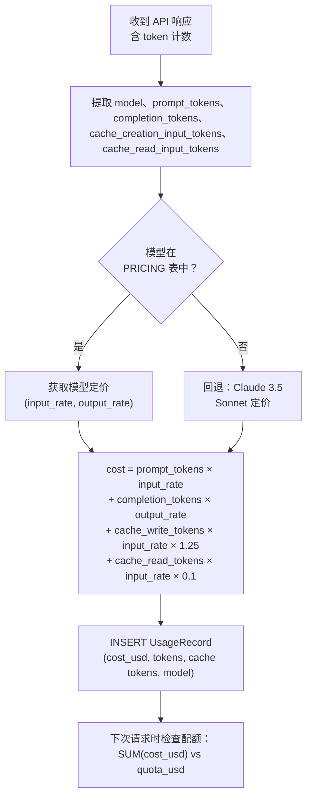

# 架构文档

Kolya BR Proxy 综合架构文档 -- 一个提供 OpenAI 兼容 API 和 Anthropic Messages API 访问 AWS Bedrock 模型（Claude、Nova、DeepSeek、Mistral、Llama 等）的 AI 网关。

---

## 目录

1. [系统架构概览](#1-系统架构概览)
2. [后端分层架构](#2-后端分层架构)
3. [数据库 ER 图](#3-数据库-er-图)
4. [前端架构](#4-前端架构)
5. [基础设施架构](#5-基础设施架构)
6. [认证流程](#6-认证流程)
7. [请求处理流程](#7-请求处理流程)
8. [计费模型](#8-计费模型)

---

## 1. 系统架构概览

系统采用经典三层架构：Nginx 托管的 Vue 3 前端、运行在 Uvicorn 上的 FastAPI 后端，以及作为上游 LLM 提供者的 AWS Bedrock。所有组件运行在 AWS EKS 集群内，使用 PostgreSQL 进行持久化存储、Redis 进行分布式限流，并通过 External Secrets Operator（ESO）管理密钥。



### 关键设计决策

| 决策 | 理由 |
|------|------|
| 双 API 兼容 | OpenAI 兼容（`/v1/chat/completions`）和 Anthropic Messages API（`/v1/messages`）；客户端只需修改 `base_url` 和 `api_key` |
| 可配置 API 密钥前缀 | 默认 `kbr_` 前缀；可选 `sk-ant-api03` 前缀以兼容 Claude Code / Anthropic SDK |
| 剥离历史 thinking blocks | Bedrock 不支持 adaptive 模式的 signature-only thinking blocks，发送前自动从对话历史中移除 |
| 单例 `BedrockClient` | 每进程一个共享 aioboto3 会话 + 连接池 |
| 异步信号量 (50) | 反压匹配连接池大小；防止请求排队 |
| 面板用 JWT，网关用 API 密钥 | 分离认证关注点；API 密钥长期有效，JWT 短期有效 |
| 后台使用量记录 | `record_usage` 作为后台任务运行，避免阻塞响应 |

---

## 2. 后端分层架构

后端分为四层：API 层（路由 + 验证）、中间件层（安全 + CORS）、服务层（业务逻辑）和数据层（SQLAlchemy 模型）。入口点是 `backend/main.py`，通过 `create_app()` 工厂函数和 `lifespan` 上下文管理器初始化 FastAPI 应用。



### 中间件栈顺序

中间件在 `backend/main.py` 的 `create_app()` 中注册。FastAPI 按注册的逆序处理中间件（最后添加 = 最外层）。入站请求的有效处理顺序为：

1. **Cache-Control** -- 为每个响应添加 `no-cache, no-store` 头
2. **SecurityMiddleware** -- 来源验证、CSRF 保护（`X-Requested-With`）、安全响应头（`X-Content-Type-Options`、`X-Frame-Options`、CSP）
3. **CORSMiddleware** -- 处理 `OPTIONS` 预检请求，设置 `Access-Control-*` 头

### 生命周期事件

```python
# backend/main.py
@asynccontextmanager
async def lifespan(app: FastAPI):
    await init_db()                   # 初始化数据库连接池
    BedrockClient.get_instance()      # 创建 Bedrock 客户端单例
    yield
    # 关闭：清理资源
```

启动时初始化数据库连接池和 Bedrock 客户端单例；关闭时清理资源。

---

## 3. 数据库 ER 图

所有模型使用 UUID 主键，定义在 `backend/app/models/`。通过 SQLAlchemy ORM 实施关系约束，适当位置使用级联删除。



### 关键模型说明

- **User.auth_method**：枚举值包括 `MICROSOFT`、`COGNITO`。所有用户通过 OAuth 认证，`password_hash` 为 NULL。
- **APIToken**：同时存储 `token_hash`（SHA256，用于查找）和 `encrypted_token`（Fernet AES，用于恢复）。`quota_usd` 字段限制每个令牌的总消费。模型访问通过关联的 `Model` 表控制，而非数组列。
- **Model**：每行将一个 Bedrock 模型名称关联到一个 APIToken。令牌只能访问 `is_active=True` 且 `is_deleted=False` 的模型。
- **RefreshToken.family_id**：将相关令牌分组用于盗用检测。如果已撤销的令牌被重用，整个族群将被撤销。

---

## 4. 前端架构

前端是基于 Quasar 框架（暗色主题）构建的 Vue 3 SPA。使用 Pinia 存储进行状态管理，Vue Router 进行导航并带有认证守卫，以及带有自动 401 刷新拦截器的 Axios。



### 路由结构

| 路径 | 页面 | 需要认证 | 描述 |
|------|------|----------|------|
| `/login` | LoginPage | 否 | 用户登录（OAuth 提供商选择） |
| `/auth/cognito/callback` | CognitoCallbackPage | 否 | Cognito OAuth 回调 |
| `/auth/microsoft/callback` | MicrosoftCallbackPage | 否 | Microsoft OAuth 回调 |
| `/` | DashboardPage | 是 | 概览，使用统计 |
| `/tokens` | TokensPage | 是 | API 密钥管理 |
| `/models` | ModelsPage | 是 | 模型配置 |
| `/playground` | PlaygroundPage | 是 | 测试对话 |
| `/monitor` | MonitorPage | 是 | 使用量图表与分析 |
| `/settings` | SettingsPage | 是 | 账户设置 |

### 侧边栏导航

`MainLayout.vue` 渲染持久左侧抽屉，包含以下菜单项：仪表板、API 密钥、模型、Playground、监控、设置。顶部栏显示应用标题和用户菜单（邮箱、余额、设置、登出）。

---

## 5. 基础设施架构

基础设施使用 Terraform 定义（`iac/`）。所有配置集中在 `iac/terraform.tfvars` 作为唯一来源（账号、区域、域名、功能开关）。`deploy-all.sh` 脚本编排完整部署流程（Steps 0-5），`destroy.sh` 处理安全销毁。它配置 VPC、带有 Karpenter 自动扩缩的 EKS 集群、Aurora PostgreSQL、Redis 分布式限流，以及可选的 WAF / Global Accelerator。密钥通过 AWS Secrets Manager + External Secrets Operator（ESO）管理。



### 密钥管理（ESO + AWS Secrets Manager）

密钥存储在 **AWS Secrets Manager** 中，由 **External Secrets Operator（ESO）** 自动同步到 Kubernetes Secrets。这取代了本地 `secrets.yaml` 文件，确保密钥不存在于版本控制中。

| 组件 | 角色 |
|------|------|
| AWS Secrets Manager | 所有密钥的单一事实来源（数据库凭证、JWT 密钥、OAuth 客户端密钥等） |
| External Secrets Operator（ESO） | 运行在集群内，监听 `ExternalSecret` CRD，从 AWS Secrets Manager 同步密钥到 K8s Secrets |
| Pod Identity | ESO 通过 EKS Pod Identity 认证 AWS Secrets Manager（无需静态 AWS 凭证） |
| `deploy-all.sh` Step 4 | 通过 `aws secretsmanager put-secret-value` 推送密钥（保留已有值） |

**同步行为：**
- `refreshInterval: 1h` -- ESO 每小时重新从 Secrets Manager 拉取密钥
- 密钥以标准 Kubernetes Secrets 形式创建，Pod 通过 `envFrom` 或 `env` 引用消费
- AWS Secrets Manager 中的密钥轮换会在刷新间隔内自动生效

### Redis 分布式限流

**Redis standalone** 实例运行在 `kbp`（kolya-br-proxy）命名空间中，为所有后端 Pod 提供分布式限流。

| 方面 | 详情 |
|------|------|
| 部署方式 | Redis standalone，部署在 `kbp` 命名空间（Kubernetes Deployment + Service） |
| 用途 | 通过原子 Lua 脚本实现全局令牌桶限流 |
| 降级策略 | Redis 不可用时，每个 Pod 回退到本地内存 `LocalTokenBucket`（按 Pod 限流，而非跳过限流） |
| 访问方式 | 后端 Pod 通过 Kubernetes Service DNS 连接（`redis.kbp.svc.cluster.local`） |

### 配置：`terraform.tfvars`

所有部署配置集中在 `iac/terraform.tfvars`。`deploy-all.sh` 和 `destroy.sh` 均从此文件读取和写入。

| 键 | 说明 |
|------|------|
| `account` / `region` | AWS 账号 ID 和目标区域 |
| `frontend_domain` / `api_domain` | 域名（如 `kbp.kolya.fun`、`api.kbp.kolya.fun`） |
| `project_name` / `project_name_alias` | 资源命名（部分资源用全名，部分用别名） |
| `enable_waf` | WAF 开关（Step 4 ALB 就绪后自动启用） |
| `enable_global_accelerator` | Global Accelerator 开关（Step 5） |
| `enable_cognito` | 认证方式开关（Step 0 选择） |
| `cognito_allowed_email_domains` | Cognito 邮箱域名白名单 |

### 部署流水线：`deploy-all.sh`

| 步骤 | 命令 | 功能 |
|------|------|------|
| 0 | `--step 0` | 自动检测账号/区域、选择认证方式、配置域名 → 写入 `terraform.tfvars` |
| 1 | `--step 1` | `terraform init` + `plan` + `apply`（VPC、EKS、RDS、Cognito 等） |
| 2 | `--step 2` | 部署 Helm charts（ALB Controller、Karpenter、Metrics Server） |
| 3 | `--step 3` | 构建 Docker 镜像推送到 ECR（域名从 tfvars 读取） |
| 4 | `--step 4` | 部署 K8s 应用（从 tfvars 生成配置、推送密钥到 SM、自动启用 WAF） |
| 5 | `--step 5` | 启用/禁用 Global Accelerator |

### 销毁流程：`destroy.sh`

1. 验证 AWS 身份，确认目标（账号、区域、workspace）
2. 初始化 Terraform，选择 workspace
3. 通过 `terraform apply` 禁用 WAF/GA（其 `data "aws_lb"` 查找需要 ALB 存在）
4. 清理 K8s 资源（先删 Ingress → 触发 ALB 删除，再删 ExternalSecrets、命名空间）
5. `terraform destroy` 销毁剩余基础设施

> **重要：** K8s 资源（特别是 Ingress/ALB）必须在 `terraform destroy` 前删除，否则 ALB 和 target group 会阻塞 Terraform。

### Terraform 模块

| 模块 | 源路径 | 用途 |
|------|--------|------|
| `vpc` | `./modules/vpc` | VPC 含公私子网、IGW、NAT、安全组 |
| `rds_aurora_postgresql` | `./modules/rds-aurora-postgresql` | Aurora PostgreSQL 含加密、备份、监控 |
| `eks_karpenter` | `./modules/eks-karpenter` | EKS 集群 + Karpenter 节点自动扩缩 |
| `eks_addons` | `./modules/eks-addons` | Karpenter Helm chart、AWS LB 控制器 |
| `cognito` | `./modules/cognito` | Cognito User Pool & App Client（callback URLs 从 `frontend_domain` 自动派生） |
| `waf` | `./modules/waf` | Web Application Firewall（ALB 就绪后自动启用） |
| `global_accelerator` | `./modules/global-accelerator` | 可选 GA 用于全球边缘路由 |

### 环境差异

| 设置 | 生产 | 非生产 |
|------|------|--------|
| `deletion_protection` | `true` | `false` |
| `backup_retention_period` | 7 天 | 1 天 |
| `performance_insights` | 启用 | 禁用 |
| `monitoring_interval` | 60s | 0（禁用） |
| `skip_final_snapshot` | `false` | `true` |
| `apply_immediately` | `false` | `true` |
| `flow_logs` (GA) | 启用 | 禁用 |

---

## 6. 认证流程

系统支持两种 OAuth 认证方式：**AWS Cognito** 和 **Microsoft Entra ID**（通过 `deploy-all.sh --step 0` 选择）。不支持本地用户名/密码认证。管理面板使用 JWT（访问令牌 + 刷新令牌），而网关 API 使用 API 密钥（`kbr_` 前缀）—— OpenAI 兼容端点通过 `Authorization: Bearer` 传递，Anthropic 端点通过 `x-api-key` 头传递。两种认证方式验证相同的 `kbr_` 令牌。Cognito 回调 URL 从 `terraform.tfvars` 中的 `frontend_domain` 自动派生。

### 6.1 OAuth 流程（Cognito / Microsoft）



### 6.2 API 密钥认证（网关）

相同的 `kbr_` API 密钥同时适用于 OpenAI 兼容和 Anthropic 端点，唯一区别是请求头格式：

- **OpenAI 路径**：`Authorization: Bearer kbr_xxx`（从 Bearer token 提取）
- **Anthropic 路径**：`x-api-key: kbr_xxx`（从 `x-api-key` 头提取）

两条路径使用相同的验证逻辑（Redis 缓存 → 数据库降级）。



### 令牌类型对比

| 属性 | JWT 访问令牌 | JWT 刷新令牌 | API 密钥 (`kbr_`) |
|------|-------------|-------------|-------------------|
| 有效期 | 30 分钟 | 7 天 | 直到过期或撤销 |
| 使用者 | 管理面板 | 管理面板（刷新） | OpenAI / Anthropic 客户端 |
| 存储 | localStorage | HttpOnly cookie (`kbr_refresh_token`, Path=/admin/auth) | 客户端配置 |
| 验证 | JWT 解码 + 签名 | 数据库查找（哈希 + 族群） | 数据库查找（SHA256 哈希） |
| 轮换 | 刷新时 | 每次使用（签发新令牌） | 手动 |

---

## 7. 请求处理流程

本节详细描述网关请求的完整生命周期。代理支持两条 API 路径：

- **OpenAI 路径**（`/v1/chat/completions`）：在 OpenAI 和 Bedrock 格式之间进行完整转换
- **Anthropic 路径**（`/v1/messages`）：近乎直通，因为 Bedrock InvokeModel 原生使用 Anthropic Messages API 格式

### 7.1 OpenAI 路径时序图



### 7.2 Anthropic 路径时序图

Anthropic 路径是近乎直通的：由于 Bedrock 的 InvokeModel API 原生接受 Anthropic Messages API 格式，只需极少转换。与 OpenAI 路径的关键区别：

- 通过 `x-api-key` 头认证，而非 `Authorization: Bearer`
- 响应中保留 thinking blocks（OpenAI 路径会跳过它们）
- 流式使用 Anthropic SSE 格式（`event: type\ndata: {json}\n\n`）而非 OpenAI 格式（`data: {json}\n\n`）



### 7.3 请求/响应转换

代理在客户端 API 格式和 Bedrock 之间执行转换：

- **OpenAI 路径**：三阶段转换（OpenAI → `BedrockRequest` → Bedrock API → `BedrockResponse` → OpenAI）。包括消息转换、工具调用映射、参数翻译和自动修正。
- **Anthropic 路径**：近乎直通（Anthropic → 原始字典 → `invoke_model`）。由于 Bedrock 原生使用 Anthropic Messages API 格式处理 Claude 模型，只需极少转换。保留 `cache_control` 标记和 thinking blocks。

对于非 Anthropic 模型（Nova、DeepSeek、Mistral、Llama 等），两条路径都通过 `converse`/`converse_stream` 使用 Converse API。

完整的转换管线文档请参阅 **[请求转换管线](request-translation.zh.md)**。

---

## 8. 计费模型

成本按每次请求基于各模型的实际 AWS Bedrock 定价计算。`backend/app/services/pricing.py` 中的 `ModelPricing` 类维护一个按令牌计费的价格表。

### 8.1 成本计算流程



> **Prompt Cache 计价**：开启 prompt caching 后，cache 写入 token 按 1.25x、cache 读取 token 按 0.1x 基础 input 价格计费。详见[动态价格系统](pricing-system.zh.md#prompt-cache-差异化计价)。

### 8.2 支持的模型定价

| 模型 | 输入（每 1M tokens） | 输出（每 1M tokens） | 典型用途 |
|------|---------------------|---------------------|----------|
| Claude 3.5 Sonnet v2 | $3.00 | $15.00 | 均衡性能 |
| Claude 3.5 Sonnet | $3.00 | $15.00 | 均衡性能 |
| Claude 3 Sonnet | $3.00 | $15.00 | 标准任务 |
| Claude 3 Haiku | $0.25 | $1.25 | 快速低成本 |
| Claude 3 Opus | $15.00 | $75.00 | 最高智能 |
| Mistral Large | $0.50 | $1.50 | 欧洲替代方案 |
| Mistral Small | $1.00 | $3.00 | 轻量级任务 |
| Llama 3 70B | $2.65 | $3.50 | 开源大模型 |
| Llama 3 8B | $0.30 | $0.60 | 开源小模型 |

### 8.3 计算示例

**请求**：Claude 3 Haiku，10,000 输入 tokens，5,000 输出 tokens

```
input_cost  = 10,000 * ($0.25 / 1,000,000) = $0.0025
output_cost =  5,000 * ($1.25 / 1,000,000) = $0.00625
total_cost  = $0.0025 + $0.00625 = $0.00875
```

### 8.4 令牌配额系统

每个 API 令牌（`APIToken.quota_usd`）可以有可选的消费限额。配额检查在每个请求开始时进行：

1. 查询该令牌的 `usage_records` 中 `SUM(cost_usd)`
2. 与 `quota_usd` 比较
3. 若 `total_used >= quota_usd`，返回 **HTTP 429** 并提示：`Token quota exceeded. Used: $X.XX, Quota: $Y.YY`

使用量记录通过 `BackgroundTaskManager` **异步** 执行，以避免阻塞对客户端的响应。成本使用 `ModelPricing.calculate_cost()` 计算，若模型不在价格表中则回退到 Claude 3.5 Sonnet 定价。

### 8.5 成本免责声明

显示的成本是基于令牌使用量的估算值。实际 AWS 账单可能因价格更新、区域差异、额外 AWS 费用和令牌计数的舍入差异而有所不同。

---

## 相关文档

| 文档 | 说明 |
|------|------|
| [请求转换管线](request-translation.zh.md) | 完整的请求/响应转换管线（OpenAI → Bedrock → Anthropic） |
| [动态价格系统](pricing-system.zh.md) | 价格获取、cache 差异化计费、价格表展示 |
| [API 参考](api-reference.zh.md) | 完整的端点文档及请求/响应示例 |
| [OAuth 配置](oauth-setup.zh.md) | Microsoft 和 Cognito OAuth 配置 |
| [部署指南](deployment.zh.md) | 生产和非生产环境部署指南 |
