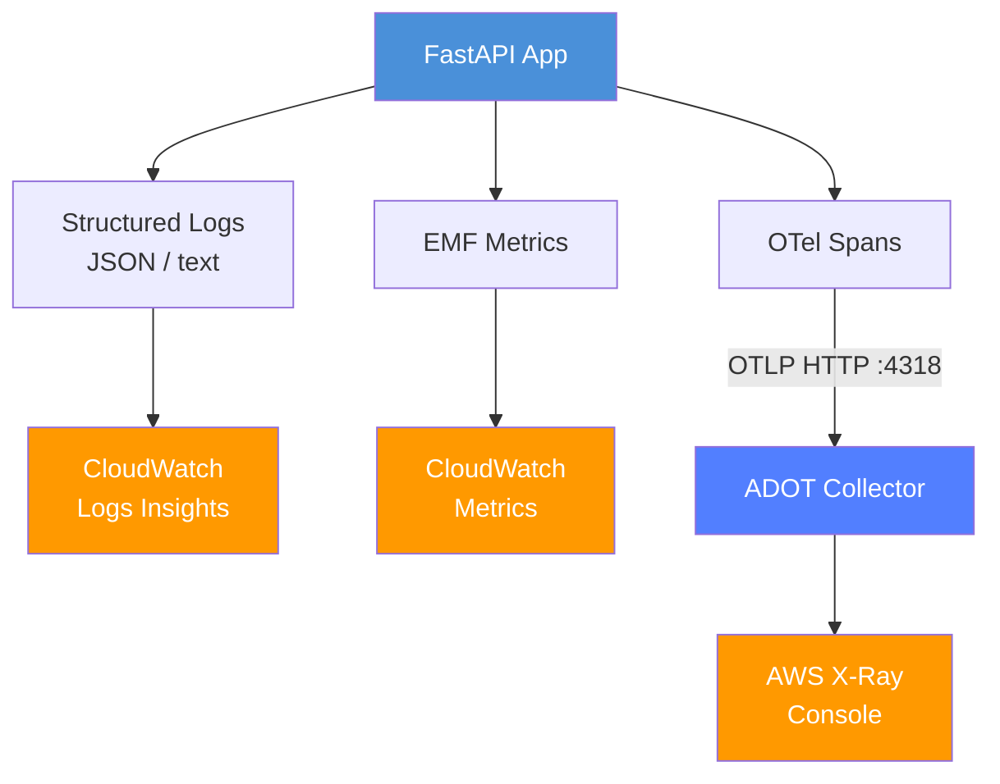
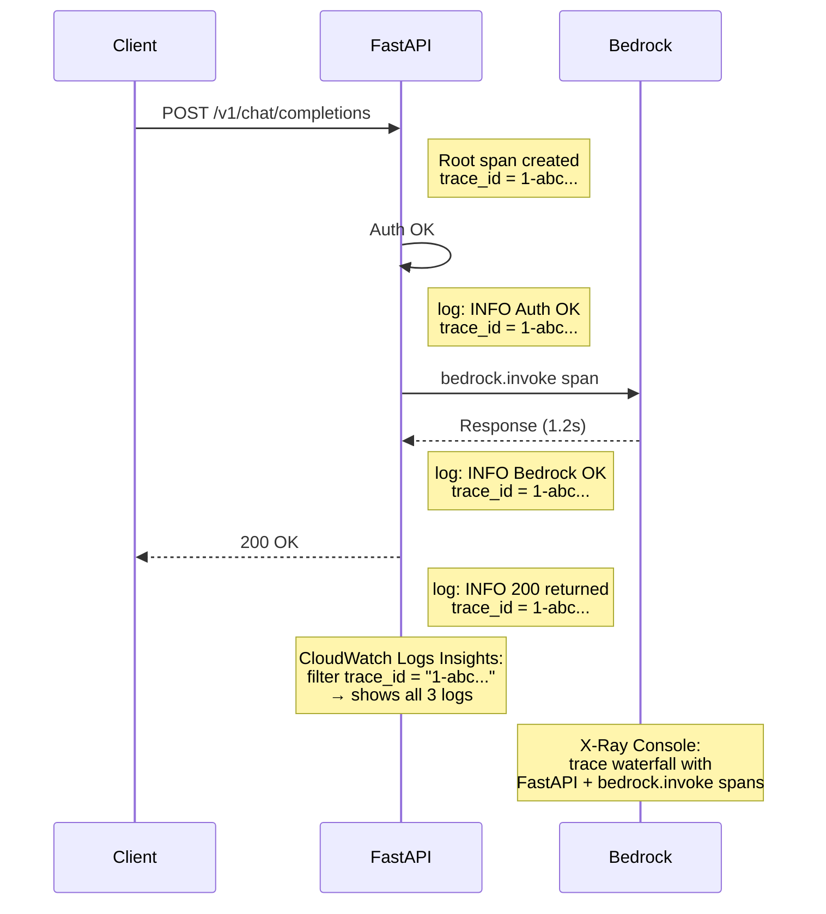

# Observability

This document covers the structured logging, CloudWatch EMF metrics, and AWS X-Ray tracing capabilities of the system.

## Table of Contents

- [Overview](#overview)
- [Configuration](#configuration)
- [Structured Logging](#structured-logging)
- [CloudWatch EMF Metrics](#cloudwatch-emf-metrics)
- [AWS X-Ray Tracing](#aws-x-ray-tracing)
- [Log-Trace Correlation](#log-trace-correlation)
- [Deployment Configuration](#deployment-configuration)
- [Troubleshooting](#troubleshooting)

---

## Overview

All observability features are **disabled by default** and controlled via environment variables. Local development has zero overhead; production enables features progressively.

```
Local dev:   no env vars needed → text logs, no metrics, no tracing
Staging:     KBR_LOG_FORMAT=json, KBR_LOG_LEVEL=DEBUG
Production:  KBR_LOG_FORMAT=json, KBR_ENABLE_METRICS=true, KBR_OTEL_EXPORTER=xray
```

### Architecture



---

## Configuration

All settings use the `KBR_` prefix and are defined in `backend/app/core/config.py`:

| Environment Variable | Default | Description |
|---------------------|---------|-------------|
| `KBR_LOG_LEVEL` | `INFO` | Log verbosity: `DEBUG`, `INFO`, `WARNING`, `ERROR` |
| `KBR_LOG_FORMAT` | `text` | Output format: `text` (human-readable) or `json` (CloudWatch) |
| `KBR_ENABLE_METRICS` | `false` | Enable CloudWatch Embedded Metrics Format emission |
| `KBR_OTEL_EXPORTER` | `""` (empty) | OpenTelemetry exporter: `""` (disabled), `xray`, `otlp` |

**Changing any setting requires a service restart** (pod rolling update in Kubernetes).

### Configuration Files

| File | Purpose |
|------|---------|
| `backend/app/core/config.py` | Settings definitions with validation |
| `backend/app/core/json_formatter.py` | JSON formatter + `configure_logging()` |
| `backend/app/core/metrics.py` | EMF metric emission functions |
| `backend/app/core/tracing.py` | OpenTelemetry initialization |
| `backend/app/core/log_context.py` | Per-request context injection (token_name, trace_id) |
| `backend/app/middleware/observability.py` | ASGI middleware for HTTP-level metrics |

---

## Structured Logging

### Text Format (default)

```
2026-04-11 12:00:00 - app.services.bedrock - INFO - [alice-key] Bedrock invocation successful...
```

### JSON Format (`KBR_LOG_FORMAT=json`)

```json
{
  "timestamp": "2026-04-11T12:00:00.123456+00:00",
  "level": "INFO",
  "logger": "app.services.bedrock",
  "message": "Bedrock invocation successful",
  "token_name": "alice-key",
  "token_id": "42",
  "trace_id": "1-abc-def0123456789",
  "span_id": "abcdef0123456789",
  "model": "us.anthropic.claude-sonnet-4-20250514-v1:0",
  "duration": 1.234,
  "input_tokens": 500,
  "output_tokens": 200
}
```

Key features:
- **Auto-collected extra fields**: All `logger.info("msg", extra={...})` fields are included automatically — no code changes needed
- **Per-API-key context**: `token_name` and `token_id` injected via `contextvars` on every log record
- **Trace correlation**: `trace_id` and `span_id` from OpenTelemetry (when tracing is enabled)
- **Health check filtering**: `/health/*` access logs are suppressed to reduce noise

### CloudWatch Logs Insights Queries

```sql
-- Find all logs for a specific API key
fields @timestamp, level, message, model, duration
| filter token_name = "alice-key"
| sort @timestamp desc

-- Slow requests (> 5 seconds)
fields @timestamp, token_name, model, duration
| filter duration > 5
| sort duration desc

-- Error logs with stack traces
fields @timestamp, logger, message, exception
| filter level = "ERROR"
| sort @timestamp desc

-- Correlate logs with a specific X-Ray trace
fields @timestamp, level, message
| filter trace_id = "1-abc-def0123456789"
| sort @timestamp asc
```

---

## CloudWatch EMF Metrics

CloudWatch Embedded Metrics Format emits metrics as structured JSON log lines. CloudWatch automatically extracts them as custom metrics — no agent or sidecar needed.

### Metrics Catalog

All metrics use the namespace `KolyaBRProxy`.

#### Request Metrics (per API call)

| Metric | Unit | Dimensions | Description |
|--------|------|------------|-------------|
| `RequestDuration` | Seconds | Endpoint, Model, Streaming | End-to-end request duration (includes proxy overhead + Bedrock call) |
| `RequestCount` | Count | Endpoint, Model, Streaming | Number of requests |
| `TokensInput` | Count | Endpoint, Model, Streaming | Input token count |
| `TokensOutput` | Count | Endpoint, Model, Streaming | Output token count |
| `CacheWriteTokens` | Count | Endpoint, Model, Streaming | Prompt cache write tokens (only emitted when > 0) |
| `CacheReadTokens` | Count | Endpoint, Model, Streaming | Prompt cache read tokens (only emitted when > 0) |
| `TimeToFirstToken` | Seconds | Endpoint, Model, Streaming | Time from request start to first content delta (streaming only) |

#### Bedrock Call Metrics (per AWS API call)

| Metric | Unit | Dimensions | Description |
|--------|------|------------|-------------|
| `BedrockCallDuration` | Seconds | Model, Region, API | Duration of the Bedrock API call itself |

**Key relationship**: `RequestDuration` contains `BedrockCallDuration`. The difference is proxy overhead (auth, translation, SSE framing).

```mermaid
gantt
    title Request Duration Breakdown
    dateFormat X
    axisFormat %s

    section RequestDuration
    Auth + Translation       :a1, 0, 50
    BedrockCallDuration      :crit, a2, 50, 900
    SSE Framing + Response   :a3, 950, 50
```



#### Stream Failover Metrics

| Metric | Unit | Dimensions | Description |
|--------|------|------------|-------------|
| `FailoverTriggered` | Count | Level, PrimaryModel | Failover event counter |
| `StreamFailoverDuration` | Seconds | Level, PrimaryModel | Time from first failure to successful fallback (or final failure) |

Failover levels:
- **L1**: Same model, different region (transparent to client)
- **L2**: Different model (client notified via `x-actual-model` SSE comment)

#### HTTP Metrics (from middleware)

| Metric | Unit | Dimensions | Description |
|--------|------|------------|-------------|
| `HttpRequestDuration` | Seconds | Method, Path | HTTP request duration for all endpoints |
| `HttpRequestCount` | Count | Method, Path | HTTP request count |

### Emission Points

| Location | Metrics Emitted |
|----------|----------------|
| `chat.py` (non-streaming) | RequestDuration, TokensInput/Output, CacheTokens |
| `chat.py` (streaming) | RequestDuration, TokensInput/Output, CacheTokens, TTFT |
| `messages.py` (non-streaming) | RequestDuration, TokensInput/Output, CacheTokens |
| `messages.py` (streaming) | RequestDuration, TokensInput/Output, CacheTokens, TTFT |
| `bedrock.py` (_invoke_inner) | BedrockCallDuration |
| `bedrock.py` (_invoke_stream_inner) | BedrockCallDuration |
| `bedrock.py` (invoke_stream failover) | FailoverTriggered, StreamFailoverDuration |
| `observability.py` (middleware) | HttpRequestDuration, HttpRequestCount |

### TTFT (Time To First Token)

Measured at the first `content_block_delta` event in streaming generators:

```python
if ttft is None:
    ttft = time.time() - start_time
```

This captures the time from request receipt to the first actual content token reaching the client (excludes `message_start` and `content_block_start` events).

---

## AWS X-Ray Tracing

### Exporter Options

| `KBR_OTEL_EXPORTER` | Target | Use Case |
|---------------------|--------|----------|
| `""` (empty) | Disabled | Local development |
| `xray` | `localhost:4318` (ADOT collector) | Production with ADOT DaemonSet |
| `otlp` | `OTEL_EXPORTER_OTLP_ENDPOINT` env | Custom OTLP endpoint (e.g., Jaeger) |

### What Gets Traced

1. **Auto-instrumented** (via `FastAPIInstrumentor`):
   - All FastAPI route handlers — one span per HTTP request
   - Includes HTTP method, path, status code, duration

2. **Manual spans** in `bedrock.py`:
   - `bedrock.invoke` — non-streaming Bedrock API call
   - `bedrock.invoke_stream` — streaming Bedrock API call

Span attributes:

| Attribute | Description |
|-----------|-------------|
| `bedrock.model` | User-facing model name |
| `bedrock.model_id` | Resolved Bedrock model ID |
| `bedrock.region` | Target AWS region |
| `bedrock.api` | API used: `invoke_model`, `converse`, `invoke_model_stream`, `converse_stream` |
| `bedrock.attempt` | Retry attempt number |
| `bedrock.input_tokens` | Input token count (set after response) |
| `bedrock.output_tokens` | Output token count (set after response) |
| `bedrock.duration_s` | Call duration in seconds |

### Local Testing with Jaeger

```bash
# Start Jaeger all-in-one (OTLP HTTP on 4318, UI on 16686)
docker run -d --name jaeger \
  -p 4318:4318 \
  -p 16686:16686 \
  jaegertracing/all-in-one:latest

# Start the app with OTLP exporter
KBR_OTEL_EXPORTER=otlp \
OTEL_EXPORTER_OTLP_ENDPOINT=http://localhost:4318 \
python -m uvicorn main:app
```

Then open `http://localhost:16686` to view traces.

---

## Log-Trace Correlation

When tracing is enabled, every log record automatically includes `trace_id` and `span_id` from the current OpenTelemetry span context. This is injected by `RequestContextFilter` in `log_context.py`.

### Correlation Workflow

1. Request arrives → FastAPI auto-instrumentation creates a root span
2. Every log within that request context includes the same `trace_id`
3. In CloudWatch, use Logs Insights to filter by `trace_id`
4. Click through to X-Ray console for the full trace waterfall



---

## Deployment Configuration

### Kubernetes ConfigMap

```yaml
# k8s/application/backend-configmap.yaml
KBR_LOG_FORMAT: "json"
KBR_LOG_LEVEL: "INFO"
KBR_ENABLE_METRICS: "true"
KBR_OTEL_EXPORTER: "xray"
```

### ADOT Collector DaemonSet

The AWS Distro for OpenTelemetry (ADOT) collector receives OTLP spans on port 4318 and exports them to X-Ray:

```yaml
# k8s/infrastructure/adot-collector.yaml
apiVersion: apps/v1
kind: DaemonSet
metadata:
  name: adot-collector
spec:
  template:
    spec:
      containers:
        - name: collector
          image: public.ecr.aws/aws-observability/aws-otel-collector:latest
          ports:
            - containerPort: 4318  # OTLP HTTP receiver
```

### Required IAM Permissions

The backend pod's service account needs:

```json
{
  "Effect": "Allow",
  "Action": [
    "xray:PutTraceSegments",
    "xray:PutTelemetryRecords",
    "xray:GetSamplingRules",
    "xray:GetSamplingTargets"
  ],
  "Resource": "*"
}
```

### Health Check Endpoint

`GET /health/metrics` returns current observability configuration:

```json
{
  "service": "kolya-br-proxy",
  "timestamp": "2026-04-11T12:00:00",
  "version": "1.0.0",
  "observability": {
    "log_level": "INFO",
    "log_format": "json",
    "metrics_enabled": true,
    "tracing_exporter": "xray"
  }
}
```

---

## Troubleshooting

### Metrics not appearing in CloudWatch

1. Verify `KBR_ENABLE_METRICS=true` is set
2. Check `GET /health/metrics` — `metrics_enabled` should be `true`
3. Ensure the EMF log group `/kbp/backend/metrics` exists or auto-creates
4. Check pod IAM role has `cloudwatch:PutMetricData` permission

### Traces not appearing in X-Ray

1. Verify `KBR_OTEL_EXPORTER=xray` is set
2. ADOT collector DaemonSet must be running and healthy
3. Check collector can reach `localhost:4318` from the app pod
4. Verify pod IAM role has `xray:PutTraceSegments` permission
5. Check ADOT collector logs for export errors

### JSON logs not showing extra fields

- Extra fields must be passed via `logger.info("msg", extra={"key": value})`
- Non-serializable values are automatically converted to strings
- Fields in `_BUILTIN_ATTRS` (Python LogRecord internals) are excluded by design

### Log level not taking effect

- `KBR_LOG_LEVEL` requires a restart — it's read once at startup by `configure_logging()`
- Valid values: `DEBUG`, `INFO`, `WARNING`, `ERROR` (case-insensitive)
- Third-party libraries (uvicorn, sqlalchemy) respect the root logger level
