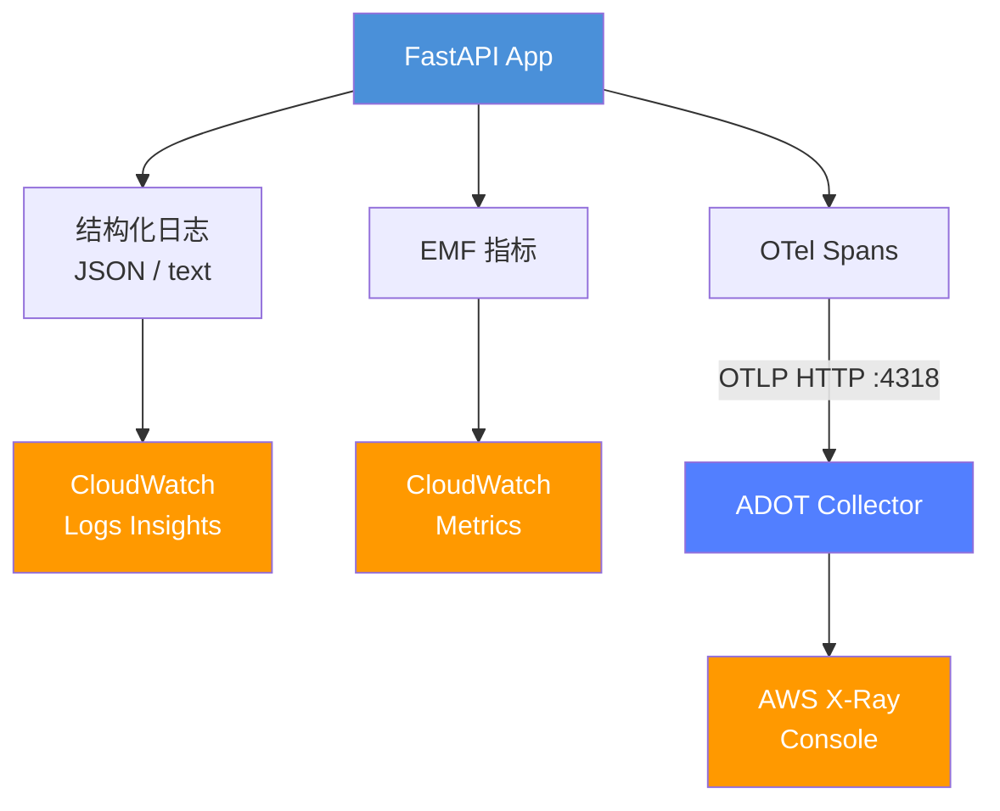
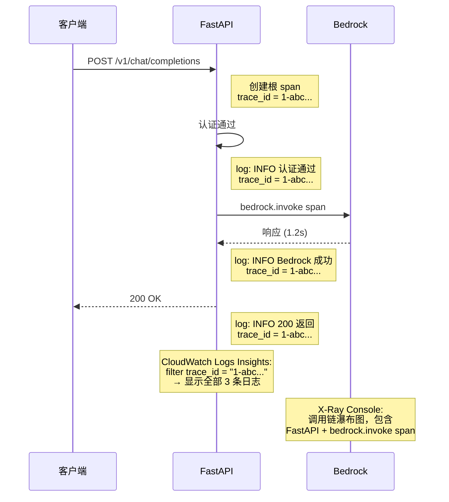

# 可观测性

本文档介绍系统的结构化日志、CloudWatch EMF 指标和 AWS X-Ray 链路追踪能力。

## 目录

- [概述](#概述)
- [配置项](#配置项)
- [结构化日志](#结构化日志)
- [CloudWatch EMF 指标](#cloudwatch-emf-指标)
- [AWS X-Ray 链路追踪](#aws-x-ray-链路追踪)
- [日志-追踪关联](#日志-追踪关联)
- [部署配置](#部署配置)
- [常见问题排查](#常见问题排查)

---

## 概述

所有可观测性功能**默认关闭**，通过环境变量控制。本地开发零开销，生产环境按需开启。

```
本地开发:   无需设置 → 文本日志，无指标，无追踪
预发布:     KBR_LOG_FORMAT=json, KBR_LOG_LEVEL=DEBUG
生产环境:   KBR_LOG_FORMAT=json, KBR_ENABLE_METRICS=true, KBR_OTEL_EXPORTER=xray
```

### 架构



---

## 配置项

所有设置使用 `KBR_` 前缀，定义在 `backend/app/core/config.py`：

| 环境变量 | 默认值 | 说明 |
|---------|--------|------|
| `KBR_LOG_LEVEL` | `INFO` | 日志级别：`DEBUG`、`INFO`、`WARNING`、`ERROR` |
| `KBR_LOG_FORMAT` | `text` | 输出格式：`text`（人类可读）或 `json`（CloudWatch） |
| `KBR_ENABLE_METRICS` | `false` | 启用 CloudWatch Embedded Metrics Format 指标 |
| `KBR_OTEL_EXPORTER` | `""`（空） | OpenTelemetry 导出器：`""`（禁用）、`xray`、`otlp` |

**修改任何设置需要重启服务**（Kubernetes 中通过 Pod 滚动更新）。

### 相关文件

| 文件 | 用途 |
|------|------|
| `backend/app/core/config.py` | 设置定义与校验 |
| `backend/app/core/json_formatter.py` | JSON 格式化器 + `configure_logging()` |
| `backend/app/core/metrics.py` | EMF 指标发射函数 |
| `backend/app/core/tracing.py` | OpenTelemetry 初始化 |
| `backend/app/core/log_context.py` | 请求级上下文注入（token_name、trace_id） |
| `backend/app/middleware/observability.py` | ASGI 中间件，采集 HTTP 级别指标 |

---

## 结构化日志

### 文本格式（默认）

```
2026-04-11 12:00:00 - app.services.bedrock - INFO - [alice-key] Bedrock invocation successful...
```

### JSON 格式（`KBR_LOG_FORMAT=json`）

```json
{
  "timestamp": "2026-04-11T12:00:00.123456+00:00",
  "level": "INFO",
  "logger": "app.services.bedrock",
  "message": "Bedrock invocation successful",
  "token_name": "alice-key",
  "token_id": "42",
  "trace_id": "1-abc-def0123456789",
  "span_id": "abcdef0123456789",
  "model": "us.anthropic.claude-sonnet-4-20250514-v1:0",
  "duration": 1.234,
  "input_tokens": 500,
  "output_tokens": 200
}
```

主要特性：
- **自动采集 extra 字段**：所有 `logger.info("msg", extra={...})` 中的字段自动包含，无需改动代码
- **按 API Key 区分**：`token_name` 和 `token_id` 通过 `contextvars` 注入每条日志
- **追踪关联**：`trace_id` 和 `span_id` 来自 OpenTelemetry（启用追踪时）
- **健康检查过滤**：`/health/*` 访问日志自动过滤，减少噪音

### CloudWatch Logs Insights 查询示例

```sql
-- 查找特定 API Key 的所有日志
fields @timestamp, level, message, model, duration
| filter token_name = "alice-key"
| sort @timestamp desc

-- 慢请求（> 5 秒）
fields @timestamp, token_name, model, duration
| filter duration > 5
| sort duration desc

-- 错误日志及堆栈
fields @timestamp, logger, message, exception
| filter level = "ERROR"
| sort @timestamp desc

-- 根据 X-Ray trace_id 关联日志
fields @timestamp, level, message
| filter trace_id = "1-abc-def0123456789"
| sort @timestamp asc
```

---

## CloudWatch EMF 指标

CloudWatch Embedded Metrics Format 将指标以结构化 JSON 日志行形式输出，CloudWatch 自动提取为自定义指标 — 无需额外 agent 或 sidecar。

### 指标目录

所有指标使用命名空间 `KolyaBRProxy`。

#### 请求指标（每次 API 调用）

| 指标 | 单位 | 维度 | 说明 |
|------|------|------|------|
| `RequestDuration` | Seconds | Endpoint, Model, Streaming | 端到端请求耗时（包含代理开销 + Bedrock 调用） |
| `RequestCount` | Count | Endpoint, Model, Streaming | 请求计数 |
| `TokensInput` | Count | Endpoint, Model, Streaming | 输入 token 数 |
| `TokensOutput` | Count | Endpoint, Model, Streaming | 输出 token 数 |
| `CacheWriteTokens` | Count | Endpoint, Model, Streaming | Prompt Cache 写入 token 数（> 0 时才发射） |
| `CacheReadTokens` | Count | Endpoint, Model, Streaming | Prompt Cache 读取 token 数（> 0 时才发射） |
| `TimeToFirstToken` | Seconds | Endpoint, Model, Streaming | 从请求开始到第一个内容 delta 的时间（仅流式） |

#### Bedrock 调用指标（每次 AWS API 调用）

| 指标 | 单位 | 维度 | 说明 |
|------|------|------|------|
| `BedrockCallDuration` | Seconds | Model, Region, API | Bedrock API 调用本身的耗时 |

**关键关系**：`RequestDuration` 包含 `BedrockCallDuration`，两者之差即为代理开销（认证、格式转换、SSE 封装等）。

```mermaid
gantt
    title 请求耗时分解
    dateFormat X
    axisFormat %s

    section RequestDuration
    认证 + 格式转换            :a1, 0, 50
    BedrockCallDuration      :crit, a2, 50, 900
    SSE 封装 + 响应            :a3, 950, 50
```



#### 流式故障转移指标

| 指标 | 单位 | 维度 | 说明 |
|------|------|------|------|
| `FailoverTriggered` | Count | Level, PrimaryModel | 故障转移事件计数 |
| `StreamFailoverDuration` | Seconds | Level, PrimaryModel | 从首次失败到成功回退（或最终失败）的耗时 |

故障转移级别：
- **L1**：同模型不同区域（对客户端透明）
- **L2**：不同模型（通过 `x-actual-model` SSE 注释通知客户端）

#### HTTP 指标（来自中间件）

| 指标 | 单位 | 维度 | 说明 |
|------|------|------|------|
| `HttpRequestDuration` | Seconds | Method, Path | 所有端点的 HTTP 请求耗时 |
| `HttpRequestCount` | Count | Method, Path | HTTP 请求计数 |

### 埋点位置

| 位置 | 发射的指标 |
|------|-----------|
| `chat.py`（非流式） | RequestDuration、TokensInput/Output、CacheTokens |
| `chat.py`（流式） | RequestDuration、TokensInput/Output、CacheTokens、TTFT |
| `messages.py`（非流式） | RequestDuration、TokensInput/Output、CacheTokens |
| `messages.py`（流式） | RequestDuration、TokensInput/Output、CacheTokens、TTFT |
| `bedrock.py`（_invoke_inner） | BedrockCallDuration |
| `bedrock.py`（_invoke_stream_inner） | BedrockCallDuration |
| `bedrock.py`（invoke_stream 故障转移） | FailoverTriggered、StreamFailoverDuration |
| `observability.py`（中间件） | HttpRequestDuration、HttpRequestCount |

### TTFT（首 Token 响应时间）

在流式生成器中，首个 `content_block_delta` 事件到达时测量：

```python
if ttft is None:
    ttft = time.time() - start_time
```

捕获的是从请求到达到第一个实际内容 token 到达客户端的时间（不包括 `message_start` 和 `content_block_start` 事件）。

---

## AWS X-Ray 链路追踪

### 导出器选项

| `KBR_OTEL_EXPORTER` | 目标 | 使用场景 |
|---------------------|------|---------|
| `""`（空） | 禁用 | 本地开发 |
| `xray` | `localhost:4318`（ADOT collector） | 生产环境，配合 ADOT DaemonSet |
| `otlp` | `OTEL_EXPORTER_OTLP_ENDPOINT` 环境变量 | 自定义 OTLP 端点（如 Jaeger） |

### 追踪内容

1. **自动埋点**（通过 `FastAPIInstrumentor`）：
   - 所有 FastAPI 路由处理器 — 每个 HTTP 请求一个 span
   - 包含 HTTP 方法、路径、状态码、耗时

2. **手动 span**（`bedrock.py`）：
   - `bedrock.invoke` — 非流式 Bedrock API 调用
   - `bedrock.invoke_stream` — 流式 Bedrock API 调用

Span 属性：

| 属性 | 说明 |
|------|------|
| `bedrock.model` | 用户面模型名称 |
| `bedrock.model_id` | 解析后的 Bedrock 模型 ID |
| `bedrock.region` | 目标 AWS 区域 |
| `bedrock.api` | 使用的 API：`invoke_model`、`converse`、`invoke_model_stream`、`converse_stream` |
| `bedrock.attempt` | 重试次数 |
| `bedrock.input_tokens` | 输入 token 数（响应后设置） |
| `bedrock.output_tokens` | 输出 token 数（响应后设置） |
| `bedrock.duration_s` | 调用耗时（秒） |

### 本地测试（Jaeger）

```bash
# 启动 Jaeger（OTLP HTTP 端口 4318，UI 端口 16686）
docker run -d --name jaeger \
  -p 4318:4318 \
  -p 16686:16686 \
  jaegertracing/all-in-one:latest

# 启动应用，使用 OTLP 导出器
KBR_OTEL_EXPORTER=otlp \
OTEL_EXPORTER_OTLP_ENDPOINT=http://localhost:4318 \
python -m uvicorn main:app
```

打开 `http://localhost:16686` 查看追踪。

---

## 日志-追踪关联

启用追踪后，每条日志自动包含当前 OpenTelemetry span 的 `trace_id` 和 `span_id`。由 `log_context.py` 中的 `RequestContextFilter` 注入。

### 关联流程

1. 请求到达 → FastAPI 自动埋点创建根 span
2. 该请求上下文内的所有日志包含相同的 `trace_id`
3. 在 CloudWatch 中，通过 Logs Insights 按 `trace_id` 过滤
4. 点击跳转到 X-Ray 控制台查看完整调用链瀑布图



---

## 部署配置

### Kubernetes ConfigMap

```yaml
# k8s/application/backend-configmap.yaml
KBR_LOG_FORMAT: "json"
KBR_LOG_LEVEL: "INFO"
KBR_ENABLE_METRICS: "true"
KBR_OTEL_EXPORTER: "xray"
```

### ADOT Collector DaemonSet

AWS Distro for OpenTelemetry (ADOT) collector 在端口 4318 接收 OTLP span 并导出到 X-Ray：

```yaml
# k8s/infrastructure/adot-collector.yaml
apiVersion: apps/v1
kind: DaemonSet
metadata:
  name: adot-collector
spec:
  template:
    spec:
      containers:
        - name: collector
          image: public.ecr.aws/aws-observability/aws-otel-collector:latest
          ports:
            - containerPort: 4318  # OTLP HTTP receiver
```

### 所需 IAM 权限

后端 Pod 的 ServiceAccount 需要：

```json
{
  "Effect": "Allow",
  "Action": [
    "xray:PutTraceSegments",
    "xray:PutTelemetryRecords",
    "xray:GetSamplingRules",
    "xray:GetSamplingTargets"
  ],
  "Resource": "*"
}
```

### 健康检查端点

`GET /health/metrics` 返回当前可观测性配置：

```json
{
  "service": "kolya-br-proxy",
  "timestamp": "2026-04-11T12:00:00",
  "version": "1.0.0",
  "observability": {
    "log_level": "INFO",
    "log_format": "json",
    "metrics_enabled": true,
    "tracing_exporter": "xray"
  }
}
```

---

## 常见问题排查

### 指标未出现在 CloudWatch 中

1. 确认 `KBR_ENABLE_METRICS=true` 已设置
2. 检查 `GET /health/metrics` — `metrics_enabled` 应为 `true`
3. 确保 EMF 日志组 `/kbp/backend/metrics` 存在或自动创建
4. 检查 Pod IAM 角色有 `cloudwatch:PutMetricData` 权限

### 追踪未出现在 X-Ray 中

1. 确认 `KBR_OTEL_EXPORTER=xray` 已设置
2. ADOT Collector DaemonSet 必须运行正常
3. 检查应用 Pod 能访问 `localhost:4318`
4. 确认 Pod IAM 角色有 `xray:PutTraceSegments` 权限
5. 检查 ADOT Collector 日志是否有导出错误

### JSON 日志没有 extra 字段

- extra 字段必须通过 `logger.info("msg", extra={"key": value})` 传入
- 不可序列化的值会自动转为字符串
- `_BUILTIN_ATTRS` 中的字段（Python LogRecord 内部属性）按设计排除

### 日志级别不生效

- `KBR_LOG_LEVEL` 需要重启 — 仅在启动时由 `configure_logging()` 读取一次
- 有效值：`DEBUG`、`INFO`、`WARNING`、`ERROR`（不区分大小写）
- 第三方库（uvicorn、sqlalchemy）遵循 root logger 的级别设置
