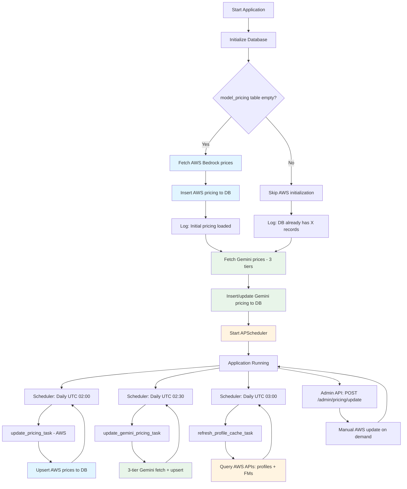

# Dynamic Pricing System

## Overview

This system implements dynamic fetching of model pricing from multiple sources and automatic database updates. Pricing data is used to calculate API call costs.

Two independent pricing subsystems run in parallel:
- **AWS Bedrock pricing** — for all models accessed via AWS Bedrock
- **Google Gemini pricing** — for models accessed directly via the Gemini API (stored with `region="global"`)

---

## Database Table: `model_pricing`

Stores model pricing information:

| Column | Description |
|--------|-------------|
| `model_id` | Model identifier (e.g. `amazon.nova-lite-v1:0`, `gemini-2.5-pro`) |
| `region` | AWS region, cross-region prefix (`us.`, `global.`), or `"global"` for Gemini |
| `input_price_per_token` | Input token unit price (USD) |
| `output_price_per_token` | Output token unit price (USD) |
| `cached_input_price_per_token` | Context cache read price (USD), NULL if not supported |
| `currency` | Currency (USD) |
| `source` | Data source — see values below |
| `last_updated` | Last update timestamp |
| `created_at` | Creation timestamp |

**`source` field values:**

| Value | Meaning |
|-------|---------|
| `api` | AWS Price List API |
| `aws-scraper` | AWS Bedrock pricing page scraper |
| `gemini-scraper` | Any of the three Gemini pricing tiers (unified label) |

---

## AWS Bedrock Pricing

### Fetch Strategy

The system uses a **dual-source strategy with deduplication** to fetch complete Bedrock model pricing:

1. **AWS Price List API (Primary Source)** — `source: "api"`
   - Coverage: Amazon Nova, Meta Llama, Mistral, DeepSeek, Google Gemma, MiniMax, Moonshot (Kimi), NVIDIA Nemotron, OpenAI (gpt-oss), Qwen models
   - Advantages: Official API, accurate, structured data
   - Regions: Supports all AWS regions with specific pricing
   - URL: `https://pricing.us-east-1.amazonaws.com`
   - Supports both Standard (on-demand) and Cross-Region inference pricing
   - Unmatched model names are logged as warnings for visibility

2. **AWS Bedrock Pricing Page Scraper (Secondary Source)** — `source: "aws-scraper"`
   - Coverage: Anthropic Claude and other models NOT available in the Price List API
   - Method: No browser automation required. Combines two public data sources:
     1. **Static HTML** from `https://aws.amazon.com/bedrock/pricing/` — contains `data-pricing-markup` attributes with embedded table templates. Price cells use `{priceOf!dataset/dataset!HASH}` token references.
     2. **JSON pricing endpoints** at `b0.p.awsstatic.com/pricing/2.0/meteredUnitMaps/`:
        - `bedrockfoundationmodels.json` — Anthropic Claude models (values are per-1M-token)
        - `bedrock.json` — other providers (values are per-1000-token; refs include `!*!1000` multiplier)
   - Only On-Demand text-inference sections are processed (headers must contain "input token" and "output token")
   - Reserved Tier, training, image generation, and embedding sections are skipped
   - Cross-region sections detected by heading: "Global Cross-region" → `global.` prefix, "Geo"/"In-region" → geo prefix (e.g. `us.`)

**Update Flow (Sequential with Deduplication):**
1. Fetch from AWS Price List API → save with `source: "api"`
2. Collect all base model IDs found in step 1
3. Extract pricing from AWS Bedrock pricing page (static HTML + JSON)
4. Only save scraped models whose base ID was **NOT** already found in API results → save with `source: "aws-scraper"`

This ensures API data always takes priority and scraped data only fills in the gaps.

**Example Statistics:**
```json
{
  "updated": 77,
  "api_count": 48,
  "scraper_count": 29,
  "failed": 0,
  "source": "api+aws-scraper"
}
```

### Supported Providers (19 total)

| Provider | Price List API | Page Scraper | Notes |
|----------|:-:|:-:|-------|
| AI21 Labs | — | Yes | Jamba, Jurassic-2 |
| Amazon | Yes | Yes | Nova, Titan Text |
| Anthropic | — | Yes | Claude 4.x, 3.x, 2.x, Instant |
| Cohere | — | Yes | Command R/R+ |
| DeepSeek | Yes | Yes | R1, V3.1 |
| Google | Yes | — | Gemma 3 (4B, 12B, 27B) — Bedrock only; Gemini models use separate Gemini pricing |
| Luma AI | — | — | Video generation (per-second pricing) |
| Meta | Yes | Yes | Llama 3.x, 4.x |
| MiniMax AI | Yes | — | Minimax M2 |
| Mistral AI | Yes | Yes | Large, Small, Mixtral, Ministral, Pixtral, Magistral, Voxtral |
| Moonshot AI | Yes | — | Kimi K2 Thinking |
| NVIDIA | Yes | — | Nemotron Nano 2, 3 |
| OpenAI | Yes | Yes | gpt-oss-20b, gpt-oss-120b |
| Qwen | Yes | Yes | Qwen3, Qwen3 Coder, Qwen3 VL |
| Stability AI | — | — | Image generation (per-image pricing) |
| TwelveLabs | — | — | Video understanding (per-second pricing) |
| Writer | — | — | Palmyra X4/X5 (not yet in API) |
| Z AI | — | — | GLM-4.7 (not yet in API) |

> **Note:** Providers marked "—" in both columns may have non-token-based pricing (image/video) or are too new for the pricing APIs. All providers are available in the "Add Model" UI regardless of pricing data availability.

---

## Google Gemini Pricing

Gemini model prices are fetched independently from AWS pricing. All Gemini entries are stored with `region="global"` (Gemini API has no regional pricing) and `source="gemini-scraper"`.

### Three-Tier Fetch Strategy

Tiers run in order; each subsequent tier only fills in models not already found in earlier tiers. Results are merged and saved together.

#### Tier 1 — Google Official Pricing Page

- **URL:** `https://ai.google.dev/gemini-api/docs/pricing`
- **Method:** HTTP GET with Googlebot User-Agent (triggers SSR; plain `curl` UA gets empty body)
- **Parsing:** Locate `<h2>`/`<h3>` headings matching `"Gemini N.N …"`, then find the associated `<table>` containing "Input price" / "Output price" / "Caching price"
- **Coverage:** All currently-listed models (2.0+, 2.5+, 3.x preview) — ~17 models
- **Notes:** The page shows two rows per model (standard + batch half-price); only the first row (standard pricing) is taken

#### Tier 2 — LiteLLM Public Price Database

- **URL:** `https://raw.githubusercontent.com/BerriAI/litellm/main/model_prices_and_context_window.json`
- **Method:** Plain HTTP GET of a public GitHub raw JSON file — **no litellm package is installed**
- **Filter:** Keys starting with `gemini` (not `gemini/` duplicates); skips zero-price experimental models
- **Coverage:** Preview/dated variants not on the live Google page (e.g. `gemini-2.0-flash-001`, `gemini-2.5-flash-preview-09-2025`, `gemini-exp-1206`) — adds ~17 more models
- **Priority:** Only adds models not already found in Tier 1

#### Tier 3 — Built-in Static Legacy Table

Maintained manually in `backend/app/services/gemini_pricing_updater.py` (`_LEGACY_GEMINI_PRICING`).

**Only covers models that are no longer on the live Google pricing page AND have missing/zero prices in the LiteLLM JSON:**

| Model | Input $/1M | Output $/1M | Cache $/1M | Source verified |
|-------|-----------|------------|-----------|----------------|
| `gemini-1.5-pro` | $1.25 | $5.00 | $0.3125 | Google docs (archived) |
| `gemini-1.5-flash` | $0.075 | $0.30 | $0.01875 | Google docs (archived) |
| `gemini-1.5-flash-8b` | $0.0375 | $0.15 | $0.01 | Google docs (archived) |

> **Maintenance rule:** Only add models here when they are **deprecated from the live page** AND the LiteLLM JSON entry has zero or missing output prices. Do not add current models — they will be covered by Tier 1 or Tier 2 automatically.

### Typical Run Results

```
Gemini pricing tier-1 (Google):           17 models
Gemini pricing tier-2 (LiteLLM):          17 new models added
Gemini pricing tier-3 (static legacy):     3 models added
Gemini pricing saved:                      37 models total
```

---

## Automation Flow



**Scheduler schedule:**

| Job | Time (UTC) | Task |
|-----|-----------|------|
| AWS pricing update | Daily 02:00 | `update_pricing_task()` |
| Gemini pricing update | Daily 02:30 | `update_gemini_pricing_task()` |
| Inference profile cache refresh | Daily 03:00 | `refresh_profile_cache_task()` |

> The profile cache refresh at 03:00 UTC updates the list of available inference profiles and foundation models from AWS APIs. This cache is used by `resolve_model()` to dynamically route requests to the correct region, and by the admin model list endpoint to show only actually-callable models.

**Implementation files:**
- `backend/app/tasks/pricing_tasks.py` — `start_scheduler()`, `stop_scheduler()`, all task functions (pricing + profile cache)
- `backend/app/services/pricing_updater.py` — AWS pricing logic
- `backend/app/services/gemini_pricing_updater.py` — Gemini three-tier logic
- `backend/app/services/bedrock.py` — `_ProfileCache` class, `resolve_model()`, `refresh_profile_cache()`
- `backend/main.py` — lifespan startup/shutdown

**Three update methods:**

1. **Auto-initialization on Application Startup**
   - Checks if `model_pricing` table is empty → fetches AWS if empty
   - Always runs Gemini pricing initialization on every startup (no API key required)

2. **Scheduled Auto-update**
   - APScheduler runs AWS at 02:00 UTC, Gemini at 02:30 UTC daily
   - Uses upsert strategy (update if exists, insert if not)

3. **Manual Trigger (AWS only)**
   - Admin API: `POST /admin/pricing/update`
   - Requires admin privileges

---

## Price Calculation

### Basic Formula

```
total_cost = (prompt_tokens × input_price_per_token) + (completion_tokens × output_price_per_token)
```

### Prompt Cache Differentiated Pricing

When prompt caching is enabled (`KBR_PROMPT_CACHE_AUTO_INJECT=true`), Bedrock returns three categories of input tokens with different pricing:

| Token Type | Field | Pricing |
|------------|-------|---------|
| Regular input | `input_tokens` | 1.0x base input price |
| Cache write | `cache_creation_input_tokens` | 1.25x base input price (25% premium) |
| Cache read | `cache_read_input_tokens` | 0.1x base input price (90% discount) |

**Full Formula (with cache):**

```python
total_cost = (input_tokens × input_price)                          # Regular input
           + (completion_tokens × output_price)                    # Output
           + (cache_creation_input_tokens × input_price × 1.25)   # Cache write premium
           + (cache_read_input_tokens × input_price × 0.1)        # Cache read discount
```

**Example** — Claude Sonnet (input price = $3.00 / 1M tokens):

```
Request with 10,000 tokens:
  - 2,000 regular input tokens:     2,000 × $0.000003   = $0.006
  - 1,000 cache write tokens:       1,000 × $0.00000375 = $0.00375
  - 7,000 cache read tokens:        7,000 × $0.0000003  = $0.0021
  Total input cost: $0.01185  (vs. $0.03 without caching = 60% savings)
```

### Database Storage

Cache token counts are stored in `usage_records` for detailed cost analysis:

```python
class UsageRecord(Base):
    prompt_tokens = Column(Integer)                  # Regular input tokens
    completion_tokens = Column(Integer)              # Output tokens
    cache_creation_input_tokens = Column(Integer)    # Cache write tokens
    cache_read_input_tokens = Column(Integer)        # Cache read tokens
    cost_usd = Column(Numeric)                       # Total cost (includes cache pricing)
```

### OpenAI-Compatible Response

Cache details are returned in the `prompt_tokens_details` field (OpenAI compatible):

```json
{
  "usage": {
    "prompt_tokens": 2000,
    "completion_tokens": 500,
    "total_tokens": 2500,
    "prompt_tokens_details": {
      "cached_tokens": 7000,
      "cache_creation_tokens": 1000
    }
  }
}
```

### Implementation Location

- `app/services/pricing.py`: `ModelPricing.calculate_cost()` — applies cache multipliers
- `app/api/v1/endpoints/chat.py`: `record_usage()` — extracts and passes cache tokens
- `app/models/usage.py`: `UsageRecord` — stores cache token columns
- `app/services/translator.py`: `ResponseTranslator` — returns `prompt_tokens_details` in OpenAI format

### Error Handling

If model pricing is not found:
- Raises `ValueError` exception
- Returns HTTP 500 error
- Prompts administrator to update pricing data

---

## Monitor Section — Pricing Table Display

### Overview

The Monitor section provides a complete pricing table display with all models and their pricing information. A 6-hour caching mechanism is implemented for optimal performance. Gemini models appear in the table with `region="global"`.

### API Endpoints

#### 1. Get Complete Pricing Table

```http
GET /admin/monitor/pricing-table?force_refresh=false
Authorization: Bearer {admin_token}
```

**Query Parameters:**
- `force_refresh`: Force cache refresh (default: false)

**Response Example:**
```json
{
  "total_records": 218,
  "pricing_data": [
    {
      "model_id": "amazon.nova-lite-v1:0",
      "region": "us-east-1",
      "input_price_per_1m": "0.06",
      "output_price_per_1m": "0.24",
      "source": "api",
      "last_updated": "2026-04-01T02:00:00"
    },
    {
      "model_id": "gemini-2.5-pro",
      "region": "global",
      "input_price_per_1m": "1.25",
      "output_price_per_1m": "10.00",
      "source": "gemini-scraper",
      "last_updated": "2026-04-01T02:30:00"
    }
  ],
  "cache_info": {
    "cached_at": "2026-04-01T03:00:00",
    "cache_duration_hours": 6,
    "expires_at": "2026-04-01T09:00:00",
    "is_cached": true,
    "cache_age_seconds": 120
  }
}
```

#### 2. Get Pricing Summary Statistics

```http
GET /admin/monitor/pricing-summary
Authorization: Bearer {admin_token}
```

#### 3. Clear Pricing Table Cache

```http
POST /admin/monitor/clear-cache
Authorization: Bearer {admin_token}
```

Use after manual pricing updates to force the next request to read from the database.

### Caching Mechanism

- **Duration:** 6 hours (in-memory, application-level)
- **Auto-refresh:** Reloads from database when expired
- **Manual refresh:** `force_refresh=true` query param or `clear-cache` endpoint
- **Invalidation:** Application restart, 6-hour expiry, or manual clear

---

## Monitoring

### Verify System Status

```bash
# Total records and unique models
PGPASSWORD=root psql -h 127.0.0.1 -U root -d kbp -c \
  "SELECT COUNT(*) as total_records, COUNT(DISTINCT model_id) as unique_models FROM model_pricing;"

# Check Gemini models specifically
PGPASSWORD=root psql -h 127.0.0.1 -U root -d kbp -c \
  "SELECT model_id, input_price_per_token * 1e6 as input_per_1m,
          output_price_per_token * 1e6 as output_per_1m, source
   FROM model_pricing WHERE region = 'global' ORDER BY model_id;"

# Check for a specific model
PGPASSWORD=root psql -h 127.0.0.1 -U root -d kbp -c \
  "SELECT model_id, region,
   input_price_per_token * 1000000 as input_per_1m,
   output_price_per_token * 1000000 as output_per_1m,
   source FROM model_pricing
   WHERE model_id = 'amazon.nova-lite-v1:0' ORDER BY region;"
```

### Key Log Messages

**AWS pricing:**
```
Pricing database is empty, fetching initial pricing data from AWS...
Initial pricing data loaded: 77 models from api+aws-scraper
Pricing database already contains 218 records
Starting AWS pricing update task...
AWS pricing update completed: 77 models updated from api+aws-scraper, 0 failed
```

**Gemini pricing:**
```
Starting Gemini pricing update task...
Gemini pricing tier-1 (Google): 17 models
Gemini pricing tier-2 (LiteLLM): 17 new models added
Gemini pricing tier-3 (static legacy): 3 models added
Gemini pricing saved: 37 models total
Gemini pricing update completed: 37 models updated, 0 failed
```

---

## Troubleshooting

### Issue: Gemini pricing shows 0 rows in DB

**Check:**
```bash
kubectl logs -n <namespace> -l app=backend | grep -i gemini
```

**Common causes:**
1. All three tiers failed simultaneously (network outage)
2. `GEMINI_API_KEY` check was previously blocking initialization (fixed — no longer gated)

**Fix:** Restart the backend pod; Gemini pricing is initialized on every startup.

### Issue: Gemini prices not visible in Monitor page

The Monitor pricing table includes `region="global"` rows. Use the **Region** dropdown in the UI and select **All Regions** to see Gemini models alongside AWS models.

### Issue: AWS pricing initialization fails on startup

**Symptoms:**
```
WARNING - No pricing data was updated
```

**Possible Causes:**
1. AWS Price List API unavailable
2. Network connectivity issues
3. Web scraper parsing failure

**Solutions:**
1. Check network connection and IAM permissions
2. Review detailed error logs
3. Manually call `POST /admin/pricing/update`

### Issue: API call returns 500 "Pricing not available"

```json
{
  "detail": "Pricing not available for model: xxx. Please contact administrator to update pricing data."
}
```

**Cause:** No pricing row for this model in the database.

**Solutions:**
1. For AWS models: call `POST /admin/pricing/update`
2. For Gemini models: restart the backend pod (Gemini runs on startup)
3. Verify model ID is correct

### Issue: Scheduled task not executing

1. Check logs to confirm scheduler started
2. Wait for scheduled window (AWS: 02:00 UTC, Gemini: 02:30 UTC)
3. Verify APScheduler is running; restart application if needed

---

## Configuration

### Environment Variables

No extra configuration needed. Gemini pricing runs regardless of `GEMINI_API_KEY` — it scrapes the public Google pricing page.

| Variable | Effect on pricing |
|----------|------------------|
| `AWS_REGION` | Used for AWS Bedrock Price List API queries |
| `GEMINI_API_KEY` | Used for chat requests; **not required** for pricing updates |

### Dynamic Region Resolution for Pricing

When calculating cost, the `ModelPricing.calculate_cost()` method determines the pricing region dynamically via `BedrockClient.resolve_model()`. This ensures that models routed to the fallback region (e.g. `zai.glm-5` → `us-west-2`) look up prices under the correct region in the database.

### Customize Scheduler Times

Edit `backend/app/tasks/pricing_tasks.py`:

```python
# AWS pricing — default: daily 02:00 UTC
scheduler.add_job(update_pricing_task, trigger=CronTrigger(hour=2, minute=0), ...)

# Gemini pricing — default: daily 02:30 UTC
scheduler.add_job(update_gemini_pricing_task, trigger=CronTrigger(hour=2, minute=30), ...)

# Inference profile cache — default: daily 03:00 UTC
scheduler.add_job(refresh_profile_cache_task, trigger=CronTrigger(hour=3, minute=0), ...)
```

### Maintaining the Gemini Static Legacy Table

File: `backend/app/services/gemini_pricing_updater.py`, constant `_LEGACY_GEMINI_PRICING`.

**Add an entry only when ALL of the following are true:**
1. The model no longer appears on `https://ai.google.dev/gemini-api/docs/pricing`
2. The LiteLLM JSON entry has zero or missing output price
3. The model is still used in production (users have it configured)

**Do not add** current-generation models — they are covered automatically by Tier 1 and Tier 2.

---

## API Reference

### Update All AWS Model Pricing

```http
POST /admin/pricing/update
Authorization: Bearer {admin_token}
```

**Response:**
```json
{
  "message": "Pricing update completed",
  "stats": {
    "updated": 77,
    "failed": 0,
    "source": "api+aws-scraper"
  }
}
```

### Query Specific Model Pricing

```http
GET /admin/pricing/models/{model_id}
Authorization: Bearer {admin_token}
```

**Response:**
```json
{
  "model": "claude-3-5-sonnet-20241022",
  "region": "default",
  "input_price_per_1m": "3.00",
  "output_price_per_1m": "15.00",
  "input_price_per_1k": "0.003",
  "output_price_per_1k": "0.015"
}
```

### Get Pricing Table (Monitor)

```http
GET /admin/monitor/pricing-table?force_refresh=false
Authorization: Bearer {admin_token}
```

### Clear Monitor Cache

```http
POST /admin/monitor/clear-cache
Authorization: Bearer {admin_token}
```
