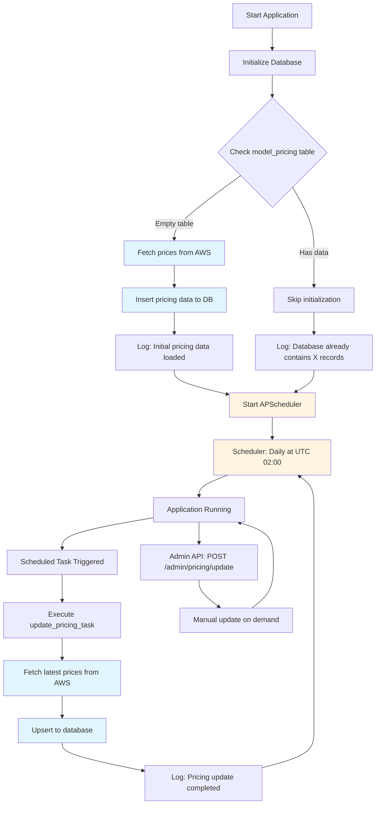

# Dynamic Pricing System

## Overview

This system implements dynamic fetching of AWS Bedrock model pricing and automatic database updates. Pricing data is used to calculate API call costs.

## Architecture

### Database Table: `model_pricing`

Stores model pricing information:
- `model_id`: Model identifier
- `region`: AWS region
- `input_price_per_token`: Input token unit price (USD)
- `output_price_per_token`: Output token unit price (USD)
- `currency`: Currency (USD)
- `source`: Data source (`api` = AWS Price List API, `aws-scraper` = AWS pricing page scraper)
- `last_updated`: Last update time
- `created_at`: Creation time

### Pricing Fetch Strategy

The system uses a **dual-source strategy with deduplication** to fetch complete model pricing:

1. **AWS Price List API (Primary Source)** — `source: "api"`
   - Coverage: Amazon Nova, Meta Llama, Mistral, DeepSeek, Google Gemma, MiniMax, Moonshot (Kimi), NVIDIA Nemotron, OpenAI (gpt-oss), Qwen models
   - Advantages: Official API, accurate, structured data
   - Regions: Supports all AWS regions with specific pricing
   - URL: `https://pricing.us-east-1.amazonaws.com`
   - Supports both Standard (on-demand) and Cross-Region inference pricing
   - Unmatched model names are logged as warnings for visibility

2. **AWS Bedrock Pricing Page Scraper (Secondary Source)** — `source: "aws-scraper"`
   - Coverage: Anthropic Claude and other models NOT available in the Price List API
   - Method: No browser automation required. Combines two public data sources:
     1. **Static HTML** from `https://aws.amazon.com/bedrock/pricing/` — contains `data-pricing-markup` attributes with embedded table templates. Price cells use `{priceOf!dataset/dataset!HASH}` token references.
     2. **JSON pricing endpoints** at `b0.p.awsstatic.com/pricing/2.0/meteredUnitMaps/`:
        - `bedrockfoundationmodels.json` — Anthropic Claude models (values are per-1M-token)
        - `bedrock.json` — other providers (values are per-1000-token; refs include `!*!1000` multiplier)
   - Only On-Demand text-inference sections are processed (headers must contain "input token" and "output token")
   - Reserved Tier, training, image generation, and embedding sections are skipped
   - Cross-region sections detected by heading: "Global Cross-region" → `global.` prefix, "Geo"/"In-region" → geo prefix (e.g. `us.`)

**Update Flow (Sequential with Deduplication):**
1. Fetch from AWS Price List API → save with `source: "api"`
2. Collect all base model IDs found in step 1
3. Extract pricing from AWS Bedrock pricing page (static HTML + JSON)
4. Only save scraped models whose base ID was **NOT** already found in API results → save with `source: "aws-scraper"`

This ensures API data always takes priority and scraped data only fills in the gaps.

**Example Statistics:**
```json
{
  "updated": 77,
  "api_count": 48,
  "scraper_count": 29,
  "failed": 0,
  "source": "api+aws-scraper",
  "sources": ["api", "aws-scraper"]
}
```

### Supported Providers (19 total)

| Provider | Price List API | Page Scraper | Notes |
|----------|:-:|:-:|-------|
| AI21 Labs | — | Yes | Jamba, Jurassic-2 |
| Amazon | Yes | Yes | Nova, Titan Text |
| Anthropic | — | Yes | Claude 4.x, 3.x, 2.x, Instant |
| Cohere | — | Yes | Command R/R+ |
| DeepSeek | Yes | Yes | R1, V3.1 |
| Google | Yes | — | Gemma 3 (4B, 12B, 27B) |
| Luma AI | — | — | Video generation (per-second pricing) |
| Meta | Yes | Yes | Llama 3.x, 4.x |
| MiniMax AI | Yes | — | Minimax M2 |
| Mistral AI | Yes | Yes | Large, Small, Mixtral, Ministral, Pixtral, Magistral, Voxtral |
| Moonshot AI | Yes | — | Kimi K2 Thinking |
| NVIDIA | Yes | — | Nemotron Nano 2, 3 |
| OpenAI | Yes | Yes | gpt-oss-20b, gpt-oss-120b |
| Qwen | Yes | Yes | Qwen3, Qwen3 Coder, Qwen3 VL |
| Stability AI | — | — | Image generation (per-image pricing) |
| TwelveLabs | — | — | Video understanding (per-second pricing) |
| Writer | — | — | Palmyra X4/X5 (not yet in API) |
| Z AI | — | — | GLM-4.7 (not yet in API) |

**Note:** Providers marked "—" in both columns may have non-token-based pricing (image/video) or are too new for the pricing APIs. All 19 providers are available in the "Add Model" UI regardless of pricing data availability.

### Automation Flow



**Scheduler Implementation Location:**
- File: `backend/app/tasks/pricing_tasks.py`
- Functions: `start_scheduler()`, `stop_scheduler()`, `update_pricing_task()`
- Startup: Called in `backend/main.py` lifespan function after database initialization
- Shutdown: Called in `backend/main.py` lifespan function during application shutdown

**Three Update Methods:**

1. **Auto-initialization on Application Startup**
   - Checks if `model_pricing` table is empty
   - If empty, automatically fetches prices from AWS and inserts
   - Logs show number of records fetched and data source

2. **Scheduled Auto-update**
   - APScheduler runs daily at UTC 02:00
   - Uses upsert strategy (update if exists, insert if not)
   - Update logs recorded in application logs

3. **Manual Trigger**
   - Admin API: `POST /admin/pricing/update`
   - Requires admin privileges
   - Returns update statistics

## Price Calculation

### Formula

```
total_cost = (prompt_tokens × input_price_per_token) + (completion_tokens × output_price_per_token)
```

### Implementation Location

- `app/services/pricing.py`: `ModelPricing.calculate_cost()`
- `app/api/v1/endpoints/chat.py`: `record_usage()` function call

### Error Handling

If model pricing is not found:
- Raises `ValueError` exception
- Returns HTTP 500 error
- Prompts administrator to update pricing data

## Deployment Guide

### Initial Deployment

1. **Run Database Migration**
   ```bash
   cd backend
   alembic upgrade head
   ```

2. **Start Application**
   ```bash
   python run_dev.py  # Development
   # or
   uvicorn main:app --host 0.0.0.0 --port 8000  # Production
   ```

3. **Auto-initialization**
   - Application automatically checks pricing table on startup
   - If empty, automatically fetches from AWS and populates
   - Check logs to confirm successful initialization

### Manual Price Update

To update prices immediately (without waiting for scheduled task):

```bash
curl -X POST http://localhost:8000/admin/pricing/update \
  -H "Authorization: Bearer YOUR_ADMIN_TOKEN"
```

### Query Specific Model Pricing

```bash
curl http://localhost:8000/admin/pricing/models/claude-3-5-sonnet-20241022 \
  -H "Authorization: Bearer YOUR_ADMIN_TOKEN"
```

## Monitor Section - Pricing Table Display

### Overview

The Monitor section provides a complete pricing table display with all models and their regional pricing information. A 6-hour caching mechanism is implemented for optimal performance.

### API Endpoints

#### 1. Get Complete Pricing Table

```http
GET /admin/monitor/pricing-table?force_refresh=false
Authorization: Bearer {admin_token}
```

**Query Parameters:**
- `force_refresh`: Force cache refresh (default: false)

**Response Example:**
```json
{
  "total_records": 181,
  "pricing_data": [
    {
      "model_id": "amazon.nova-lite-v1:0",
      "region": "us-east-1",
      "input_price_per_token": "0.0000000600",
      "output_price_per_token": "0.0000002400",
      "input_price_per_1k": "0.00006",
      "output_price_per_1k": "0.00024",
      "input_price_per_1m": "0.06",
      "output_price_per_1m": "0.24",
      "source": "api",
      "last_updated": "2026-02-20T04:49:28.362348"
    },
    {
      "model_id": "anthropic.claude-3-5-sonnet-20241022-v2:0",
      "region": "default",
      "input_price_per_token": "0.0000030000",
      "output_price_per_token": "0.0000150000",
      "input_price_per_1k": "0.003",
      "output_price_per_1k": "0.015",
      "input_price_per_1m": "3.00",
      "output_price_per_1m": "15.00",
      "source": "scraper",
      "last_updated": "2026-02-20T04:49:28.362348"
    }
  ],
  "cache_info": {
    "cached_at": "2026-02-20T05:00:00.000000",
    "cache_duration_hours": 6,
    "expires_at": "2026-02-20T11:00:00.000000",
    "is_cached": true,
    "cache_age_seconds": 120
  }
}
```

#### 2. Get Pricing Summary Statistics

```http
GET /admin/monitor/pricing-summary
Authorization: Bearer {admin_token}
```

**Response Example:**
```json
{
  "total_records": 181,
  "unique_models": 25,
  "unique_regions": 26,
  "data_sources": ["api", "scraper"],
  "models_list": [
    "amazon.nova-lite-v1:0",
    "amazon.nova-lite-v2:0",
    "amazon.nova-micro-v1:0",
    "amazon.nova-premier-v1:0",
    "amazon.nova-pro-v1:0",
    "anthropic.claude-3-5-sonnet-20240620-v1:0",
    "anthropic.claude-3-5-sonnet-20241022-v2:0",
    "meta.llama3-1-405b-instruct-v1:0",
    "..."
  ],
  "regions_list": [
    "ap-northeast-1",
    "ap-northeast-2",
    "ap-south-1",
    "default",
    "eu-central-1",
    "us-east-1",
    "us-west-2",
    "..."
  ]
}
```

#### 3. Clear Pricing Table Cache

```http
POST /admin/monitor/clear-cache
Authorization: Bearer {admin_token}
```

**Use Cases:**
- Force cache refresh after manual pricing updates
- Ensure next request fetches latest data

**Response:**
```json
{
  "success": true,
  "message": "Pricing cache cleared successfully"
}
```

### Caching Mechanism

**Cache Strategy:**
- Duration: 6 hours
- Storage: In-memory (application-level)
- Auto-refresh: Automatically reloads from database when expired
- Manual refresh: Use `force_refresh=true` or call `clear-cache` endpoint

**Cache Benefits:**
- Reduces database queries, improves response speed
- Lowers database load
- Pricing data changes infrequently, 6-hour cache is reasonable

**Cache Invalidation Scenarios:**
1. Application restart (memory cache lost)
2. Cache expires after 6 hours
3. Manual call to `clear-cache` endpoint
4. Using `force_refresh=true` parameter

### Usage Examples

#### Frontend Pricing Table Display

```javascript
// Fetch pricing table data
async function fetchPricingTable() {
  const response = await fetch('/admin/monitor/pricing-table', {
    headers: {
      'Authorization': `Bearer ${adminToken}`
    }
  });
  const data = await response.json();

  console.log(`Total records: ${data.total_records}`);
  console.log(`Cache status: ${data.cache_info.is_cached ? 'Cached' : 'Fresh'}`);
  console.log(`Cache age: ${data.cache_info.cache_age_seconds}s`);

  // Render pricing table
  renderPricingTable(data.pricing_data);
}

// Force refresh pricing table
async function refreshPricingTable() {
  const response = await fetch('/admin/monitor/pricing-table?force_refresh=true', {
    headers: {
      'Authorization': `Bearer ${adminToken}`
    }
  });
  const data = await response.json();
  renderPricingTable(data.pricing_data);
}
```

#### Clear Cache After Pricing Update

```bash
# 1. Update pricing
curl -X POST http://localhost:8000/admin/pricing/update \
  -H "Authorization: Bearer YOUR_ADMIN_TOKEN"

# 2. Clear cache
curl -X POST http://localhost:8000/admin/monitor/clear-cache \
  -H "Authorization: Bearer YOUR_ADMIN_TOKEN"

# 3. Get latest pricing table
curl http://localhost:8000/admin/monitor/pricing-table \
  -H "Authorization: Bearer YOUR_ADMIN_TOKEN"
```

### Performance Optimization

**Database Query Optimization:**
- Indexed fields: `model_id`, `region` have indexes
- Sort optimization: Ordered by `model_id` and `region`
- Single load: Avoids N+1 query problems

**Cache Optimization:**
- Memory cache: Fast access, no disk I/O
- 6-hour validity: Balances data freshness and performance
- Lazy loading: Data loaded only on first access

**Response Optimization:**
- Multiple price units included (per token, per 1K, per 1M)
- No additional frontend calculations needed
- Reduces client-side processing burden

## Monitoring

### Verify System Status

Check pricing data in database:

```bash
# View total records and model count
PGPASSWORD=root psql -h 127.0.0.1 -U root -d kbp -c \
  "SELECT COUNT(*) as total_records, COUNT(DISTINCT model_id) as unique_models FROM model_pricing;"

# View all model list
PGPASSWORD=root psql -h 127.0.0.1 -U root -d kbp -c \
  "SELECT DISTINCT model_id FROM model_pricing ORDER BY model_id;"

# View specific model pricing (e.g., Nova Lite)
PGPASSWORD=root psql -h 127.0.0.1 -U root -d kbp -c \
  "SELECT model_id, region,
   input_price_per_token * 1000000 as input_per_1m,
   output_price_per_token * 1000000 as output_per_1m,
   source
   FROM model_pricing
   WHERE model_id = 'amazon.nova-lite-v1:0'
   ORDER BY region;"
```

### Check Pricing Data

```sql
-- View all pricing records
SELECT model_id, region,
       input_price_per_token * 1000000 as input_per_1m,
       output_price_per_token * 1000000 as output_per_1m,
       source, last_updated
FROM model_pricing
ORDER BY last_updated DESC;

-- Count records
SELECT COUNT(*) FROM model_pricing;

-- View recent updates
SELECT model_id, last_updated
FROM model_pricing
ORDER BY last_updated DESC
LIMIT 10;
```

### Log Monitoring

Key log messages:
- `"Pricing database is empty, fetching initial pricing data from AWS..."` - Initial setup
- `"Initial pricing data loaded: X models from Y"` - Initialization complete
- `"Pricing database already contains X records"` - Data exists, skip initialization
- `"Pricing update task started"` - Scheduled update started
- `"Pricing update completed: X models updated"` - Scheduled update complete

## Troubleshooting

### Issue: Pricing initialization fails on application startup

**Symptoms:**
```
WARNING - No pricing data was updated
```

**Possible Causes:**
1. AWS Price List API unavailable
2. Network connectivity issues
3. Web scraper parsing failure

**Solutions:**
1. Check network connection
2. Review detailed error logs
3. Manually call admin API to retry

### Issue: API call returns 500 error "Pricing not available"

**Symptoms:**
```json
{
  "detail": "Pricing not available for model: xxx. Please contact administrator to update pricing data."
}
```

**Cause:**
No pricing data for this model in database

**Solutions:**
1. Call `POST /admin/pricing/update` to update prices
2. Verify model ID is correct
3. Check database to confirm pricing data exists

### Issue: Scheduled task not executing

**Check Methods:**
1. Review application logs to confirm scheduler started
2. Wait until UTC 02:00 to check for update logs
3. Verify APScheduler is running properly

**Solutions:**
1. Restart application
2. Manually trigger update to verify functionality
3. Check system time is correct

## Configuration

### Environment Variables

No additional configuration needed, system uses defaults:
- Update time: Daily at UTC 02:00
- Data sources: AWS Price List API (primary) + AWS pricing page scraper (secondary, fills gaps for models not in API)
- Region: Uses configured `AWS_REGION`

### Customize Update Time

Modify `app/tasks/pricing_tasks.py`:

```python
scheduler.add_job(
    update_pricing_task,
    trigger="cron",
    hour=2,  # Modify hour
    minute=0,
    id="pricing_update",
    replace_existing=True,
)
```

## API Reference

### Update All Model Pricing

```http
POST /admin/pricing/update
Authorization: Bearer {admin_token}
```

**Response:**
```json
{
  "message": "Pricing update completed",
  "stats": {
    "updated": 15,
    "failed": 0,
    "source": "api"
  }
}
```

### Query Specific Model Pricing

```http
GET /admin/pricing/models/{model_id}
Authorization: Bearer {admin_token}
```

**Response:**
```json
{
  "model": "claude-3-5-sonnet-20241022",
  "region": "default",
  "input_price_per_1m": "3.00",
  "output_price_per_1m": "15.00",
  "input_price_per_1k": "0.003",
  "output_price_per_1k": "0.015"
}
```
