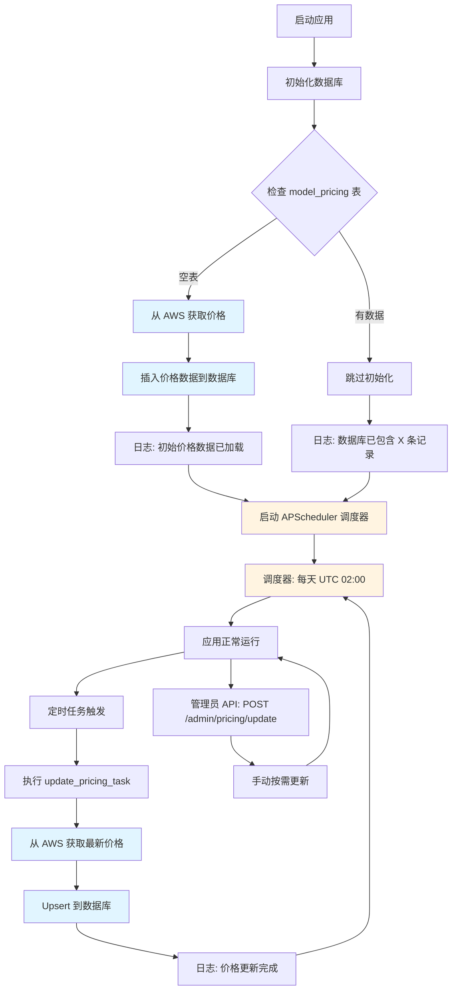

# 动态价格系统

## 概述

本系统实现了从 AWS 动态获取 Bedrock 模型价格，并自动更新到数据库。价格数据用于计算 API 调用成本。

## 架构

### 数据库表：`model_pricing`

存储模型价格信息：
- `model_id`: 模型标识符
- `region`: AWS 区域
- `input_price_per_token`: 输入 token 单价（USD）
- `output_price_per_token`: 输出 token 单价（USD）
- `currency`: 货币（USD）
- `source`: 数据来源（`api` = AWS Price List API，`aws-scraper` = AWS 定价页面爬虫）
- `last_updated`: 最后更新时间
- `created_at`: 创建时间

### 价格获取策略

系统使用**双数据源 + 去重**策略获取完整的模型价格：

1. **AWS Price List API（主数据源）** — `source: "api"`
   - 官方 API，数据最准确，结构化数据
   - URL: `https://pricing.us-east-1.amazonaws.com`
   - 覆盖模型：Amazon Nova、Meta Llama、Mistral、DeepSeek、Google Gemma、MiniMax、Moonshot (Kimi)、NVIDIA Nemotron、OpenAI (gpt-oss)、Qwen
   - 支持 Standard（按需）和 Cross-Region 推理定价
   - 未匹配的模型名称会以 warning 日志记录，便于发现新模型或名称变更

2. **AWS 定价页面爬虫（补充数据源）** — `source: "aws-scraper"`
   - 用于获取 Price List API 中没有的模型价格（如 Anthropic Claude）
   - **无需浏览器自动化**，结合两个公开数据源：
     1. **静态 HTML**：`https://aws.amazon.com/bedrock/pricing/` 中的 `data-pricing-markup` 属性包含表格模板，价格单元格使用 `{priceOf!dataset/dataset!HASH}` 引用
     2. **JSON 定价接口**：`b0.p.awsstatic.com/pricing/2.0/meteredUnitMaps/`
        - `bedrockfoundationmodels.json` — Anthropic Claude 模型（值为每百万 token 价格）
        - `bedrock.json` — 其他厂商（值为每千 token 价格，引用中含 `!*!1000` 乘数）
   - 仅处理按需文本推理部分（表头含 "input token" 和 "output token"）
   - 自动跳过预留定价、训练、图像生成、嵌入等部分
   - 跨区域部分通过标题识别："Global Cross-region" → `global.` 前缀，"Geo"/"In-region" → 地理前缀（如 `us.`）

**更新流程（顺序执行 + 去重）：**
1. 调用 AWS Price List API → 保存结果，`source: "api"`
2. 收集步骤 1 中所有基础 model ID
3. 从 AWS 定价页面提取价格（静态 HTML + JSON）
4. 仅保存在步骤 2 中**未出现**的模型 → `source: "aws-scraper"`

API 数据始终优先，爬虫数据仅填补空缺。

### 支持的厂商（共 19 个）

| 厂商 | Price List API | 页面爬虫 | 备注 |
|------|:-:|:-:|------|
| AI21 Labs | — | 是 | Jamba、Jurassic-2 |
| Amazon | 是 | 是 | Nova、Titan Text |
| Anthropic | — | 是 | Claude 4.x、3.x、2.x、Instant |
| Cohere | — | 是 | Command R/R+ |
| DeepSeek | 是 | 是 | R1、V3.1 |
| Google | 是 | — | Gemma 3 (4B, 12B, 27B) |
| Luma AI | — | — | 视频生成（按秒计价） |
| Meta | 是 | 是 | Llama 3.x、4.x |
| MiniMax AI | 是 | — | Minimax M2 |
| Mistral AI | 是 | 是 | Large、Small、Mixtral、Ministral、Pixtral、Magistral、Voxtral |
| Moonshot AI | 是 | — | Kimi K2 Thinking |
| NVIDIA | 是 | — | Nemotron Nano 2、3 |
| OpenAI | 是 | 是 | gpt-oss-20b、gpt-oss-120b |
| Qwen | 是 | 是 | Qwen3、Qwen3 Coder、Qwen3 VL |
| Stability AI | — | — | 图像生成（按图计价） |
| TwelveLabs | — | — | 视频理解（按秒计价） |
| Writer | — | — | Palmyra X4/X5（尚未入 API） |
| Z AI | — | — | GLM-4.7（尚未入 API） |

**注意：** 两列都标 "—" 的厂商可能采用非 token 计价（图像/视频），或太新尚未进入定价 API。无论是否有价格数据，所有 19 个厂商均可在"添加模型"界面中选择。

### 自动化流程



**调度器实现位置：**
- 文件：`backend/app/tasks/pricing_tasks.py`
- 函数：`start_scheduler()`, `stop_scheduler()`, `update_pricing_task()`
- 启动：在 `backend/main.py` 的 lifespan 函数中，数据库初始化后调用
- 关闭：在 `backend/main.py` 的 lifespan 函数中，应用关闭时调用

**三种更新方式：**

1. **应用启动时自动初始化**
   - 检查 `model_pricing` 表是否为空
   - 如果为空，自动从 AWS 获取价格并插入
   - 日志会显示获取的记录数和数据源

2. **定期自动更新**
   - APScheduler 每天 UTC 02:00 自动更新
   - 使用 upsert 策略（存在则更新，不存在则插入）
   - 更新日志记录在应用日志中

3. **手动触发更新**
   - 管理员 API: `POST /admin/pricing/update`
   - 需要管理员权限
   - 返回更新统计信息

## 价格计算

### 公式

```
总成本 = (输入tokens × 输入单价) + (输出tokens × 输出单价)
```

### 实现位置

- `app/services/pricing.py`: `ModelPricing.calculate_cost()`
- `app/api/v1/endpoints/chat.py`: `record_usage()` 函数调用

### 错误处理

如果找不到模型价格：
- 抛出 `ValueError` 异常
- 返回 HTTP 500 错误
- 提示管理员更新价格数据

## 部署说明

### 首次部署

1. **运行数据库迁移**
   ```bash
   cd backend
   alembic upgrade head
   ```

2. **启动应用**
   ```bash
   python run_dev.py  # 开发环境
   # 或
   uvicorn main:app --host 0.0.0.0 --port 8000  # 生产环境
   ```

3. **自动初始化**
   - 应用启动时会自动检查价格表
   - 如果为空，自动从 AWS 获取并填充
   - 查看日志确认初始化成功

### 手动更新价格

如果需要立即更新价格（不等待定时任务）：

```bash
curl -X POST http://localhost:8000/admin/pricing/update \
  -H "Authorization: Bearer YOUR_ADMIN_TOKEN"
```

### 查询特定模型价格

```bash
curl http://localhost:8000/admin/pricing/models/claude-3-5-sonnet-20241022 \
  -H "Authorization: Bearer YOUR_ADMIN_TOKEN"
```

## Monitor Section - 价格表展示

### 概述

Monitor section 提供了完整的价格表展示功能，包含所有模型在各个区域的价格信息。为了提高性能，系统实现了 6 小时缓存机制。

### API 端点

#### 1. 获取完整价格表

```http
GET /admin/monitor/pricing-table?force_refresh=false
Authorization: Bearer {admin_token}
```

**查询参数：**
- `force_refresh`: 是否强制刷新缓存（默认：false）

**响应示例：**
```json
{
  "total_records": 181,
  "pricing_data": [
    {
      "model_id": "amazon.nova-lite-v1:0",
      "region": "us-east-1",
      "input_price_per_token": "0.0000000600",
      "output_price_per_token": "0.0000002400",
      "input_price_per_1k": "0.00006",
      "output_price_per_1k": "0.00024",
      "input_price_per_1m": "0.06",
      "output_price_per_1m": "0.24",
      "source": "api",
      "last_updated": "2026-02-20T04:49:28.362348"
    },
    {
      "model_id": "anthropic.claude-3-5-sonnet-20241022-v2:0",
      "region": "default",
      "input_price_per_token": "0.0000030000",
      "output_price_per_token": "0.0000150000",
      "input_price_per_1k": "0.003",
      "output_price_per_1k": "0.015",
      "input_price_per_1m": "3.00",
      "output_price_per_1m": "15.00",
      "source": "scraper",
      "last_updated": "2026-02-20T04:49:28.362348"
    }
  ],
  "cache_info": {
    "cached_at": "2026-02-20T05:00:00.000000",
    "cache_duration_hours": 6,
    "expires_at": "2026-02-20T11:00:00.000000",
    "is_cached": true,
    "cache_age_seconds": 120
  }
}
```

#### 2. 获取价格摘要统计

```http
GET /admin/monitor/pricing-summary
Authorization: Bearer {admin_token}
```

**响应示例：**
```json
{
  "total_records": 181,
  "unique_models": 25,
  "unique_regions": 26,
  "data_sources": ["api", "scraper"],
  "models_list": [
    "amazon.nova-lite-v1:0",
    "amazon.nova-lite-v2:0",
    "amazon.nova-micro-v1:0",
    "amazon.nova-premier-v1:0",
    "amazon.nova-pro-v1:0",
    "anthropic.claude-3-5-sonnet-20240620-v1:0",
    "anthropic.claude-3-5-sonnet-20241022-v2:0",
    "meta.llama3-1-405b-instruct-v1:0",
    "..."
  ],
  "regions_list": [
    "ap-northeast-1",
    "ap-northeast-2",
    "ap-south-1",
    "default",
    "eu-central-1",
    "us-east-1",
    "us-west-2",
    "..."
  ]
}
```

#### 3. 清除价格表缓存

```http
POST /admin/monitor/clear-cache
Authorization: Bearer {admin_token}
```

**使用场景：**
- 手动更新价格后，强制刷新缓存
- 确保下次请求获取最新数据

**响应：**
```json
{
  "success": true,
  "message": "Pricing cache cleared successfully"
}
```

### 缓存机制

**缓存策略：**
- 缓存时长：6 小时
- 缓存位置：内存（应用级别）
- 自动刷新：缓存过期后自动从数据库重新加载
- 手动刷新：使用 `force_refresh=true` 或调用 `clear-cache` 端点

**缓存优势：**
- 减少数据库查询，提高响应速度
- 降低数据库负载
- 价格数据变化不频繁，6 小时缓存合理

**缓存失效场景：**
1. 应用重启（内存缓存丢失）
2. 缓存超过 6 小时自动失效
3. 手动调用 `clear-cache` 端点
4. 使用 `force_refresh=true` 参数

### 使用示例

#### 前端展示价格表

```javascript
// 获取价格表数据
async function fetchPricingTable() {
  const response = await fetch('/admin/monitor/pricing-table', {
    headers: {
      'Authorization': `Bearer ${adminToken}`
    }
  });
  const data = await response.json();

  console.log(`总记录数: ${data.total_records}`);
  console.log(`缓存状态: ${data.cache_info.is_cached ? '已缓存' : '新数据'}`);
  console.log(`缓存年龄: ${data.cache_info.cache_age_seconds}秒`);

  // 渲染价格表
  renderPricingTable(data.pricing_data);
}

// 强制刷新价格表
async function refreshPricingTable() {
  const response = await fetch('/admin/monitor/pricing-table?force_refresh=true', {
    headers: {
      'Authorization': `Bearer ${adminToken}`
    }
  });
  const data = await response.json();
  renderPricingTable(data.pricing_data);
}
```

#### 价格更新后清除缓存

```bash
# 1. 更新价格
curl -X POST http://localhost:8000/admin/pricing/update \
  -H "Authorization: Bearer YOUR_ADMIN_TOKEN"

# 2. 清除缓存
curl -X POST http://localhost:8000/admin/monitor/clear-cache \
  -H "Authorization: Bearer YOUR_ADMIN_TOKEN"

# 3. 获取最新价格表
curl http://localhost:8000/admin/monitor/pricing-table \
  -H "Authorization: Bearer YOUR_ADMIN_TOKEN"
```

### 性能优化

**数据库查询优化：**
- 使用索引：`model_id`, `region` 字段已建立索引
- 排序优化：按 `model_id` 和 `region` 排序
- 一次性加载：避免 N+1 查询问题

**缓存优化：**
- 内存缓存：快速访问，无需磁盘 I/O
- 6 小时有效期：平衡数据新鲜度和性能
- 懒加载：首次访问时才加载数据

**响应优化：**
- 包含多种价格单位（per token, per 1K, per 1M）
- 前端无需额外计算
- 减少客户端处理负担

## 监控

### 验证系统状态

检查数据库中的价格数据：

```bash
# 查看总记录数和模型数
PGPASSWORD=root psql -h 127.0.0.1 -U root -d kbp -c \
  "SELECT COUNT(*) as total_records, COUNT(DISTINCT model_id) as unique_models FROM model_pricing;"

# 查看所有模型列表
PGPASSWORD=root psql -h 127.0.0.1 -U root -d kbp -c \
  "SELECT DISTINCT model_id FROM model_pricing ORDER BY model_id;"

# 查看特定模型的价格（例如 Nova Lite）
PGPASSWORD=root psql -h 127.0.0.1 -U root -d kbp -c \
  "SELECT model_id, region,
   input_price_per_token * 1000000 as input_per_1m,
   output_price_per_token * 1000000 as output_per_1m,
   source
   FROM model_pricing
   WHERE model_id = 'amazon.nova-lite-v1:0'
   ORDER BY region;"
```

### 检查价格数据

```sql
-- 查看所有价格记录
SELECT model_id, region,
       input_price_per_token * 1000000 as input_per_1m,
       output_price_per_token * 1000000 as output_per_1m,
       source, last_updated
FROM model_pricing
ORDER BY last_updated DESC;

-- 统计记录数
SELECT COUNT(*) FROM model_pricing;

-- 查看最近更新
SELECT model_id, last_updated
FROM model_pricing
ORDER BY last_updated DESC
LIMIT 10;
```

### 日志监控

关键日志信息：
- `"Pricing database is empty, fetching initial pricing data from AWS..."` - 首次初始化
- `"Initial pricing data loaded: X models from Y"` - 初始化完成
- `"Pricing database already contains X records"` - 已有数据，跳过初始化
- `"Pricing update task started"` - 定时更新开始
- `"Pricing update completed: X models updated"` - 定时更新完成

## 故障排查

### 问题：应用启动时价格初始化失败

**症状：**
```
WARNING - No pricing data was updated
```

**可能原因：**
1. AWS Price List API 不可用
2. 网络连接问题
3. 网页爬虫解析失败

**解决方案：**
1. 检查网络连接
2. 查看详细错误日志
3. 手动调用管理员 API 重试

### 问题：API 调用返回 500 错误 "Pricing not available"

**症状：**
```json
{
  "detail": "Pricing not available for model: xxx. Please contact administrator to update pricing data."
}
```

**原因：**
数据库中没有该模型的价格数据

**解决方案：**
1. 调用 `POST /admin/pricing/update` 更新价格
2. 检查模型 ID 是否正确
3. 查看数据库确认价格数据存在

### 问题：定时任务没有执行

**检查方法：**
1. 查看应用日志，确认调度器已启动
2. 等待到 UTC 02:00 查看是否有更新日志
3. 检查 APScheduler 是否正常运行

**解决方案：**
1. 重启应用
2. 手动触发更新验证功能正常
3. 检查系统时间是否正确

## 配置

### 环境变量

无需额外配置，系统使用默认设置：
- 更新时间：每天 UTC 02:00
- 数据源：AWS Price List API（主）+ AWS 定价页面爬虫（补充，填补 API 中没有的模型）
- 区域：使用配置的 `AWS_REGION`

### 自定义更新时间

修改 `app/tasks/pricing_tasks.py`：

```python
scheduler.add_job(
    update_pricing_task,
    trigger="cron",
    hour=2,  # 修改小时
    minute=0,
    id="pricing_update",
    replace_existing=True,
)
```

## API 参考

### 更新所有模型价格

```http
POST /admin/pricing/update
Authorization: Bearer {admin_token}
```

**响应：**
```json
{
  "message": "Pricing update completed",
  "stats": {
    "updated": 15,
    "failed": 0,
    "source": "api"
  }
}
```

### 查询特定模型价格

```http
GET /admin/pricing/models/{model_id}
Authorization: Bearer {admin_token}
```

**响应：**
```json
{
  "model": "claude-3-5-sonnet-20241022",
  "region": "default",
  "input_price_per_1m": "3.00",
  "output_price_per_1m": "15.00",
  "input_price_per_1k": "0.003",
  "output_price_per_1k": "0.015"
}
```
