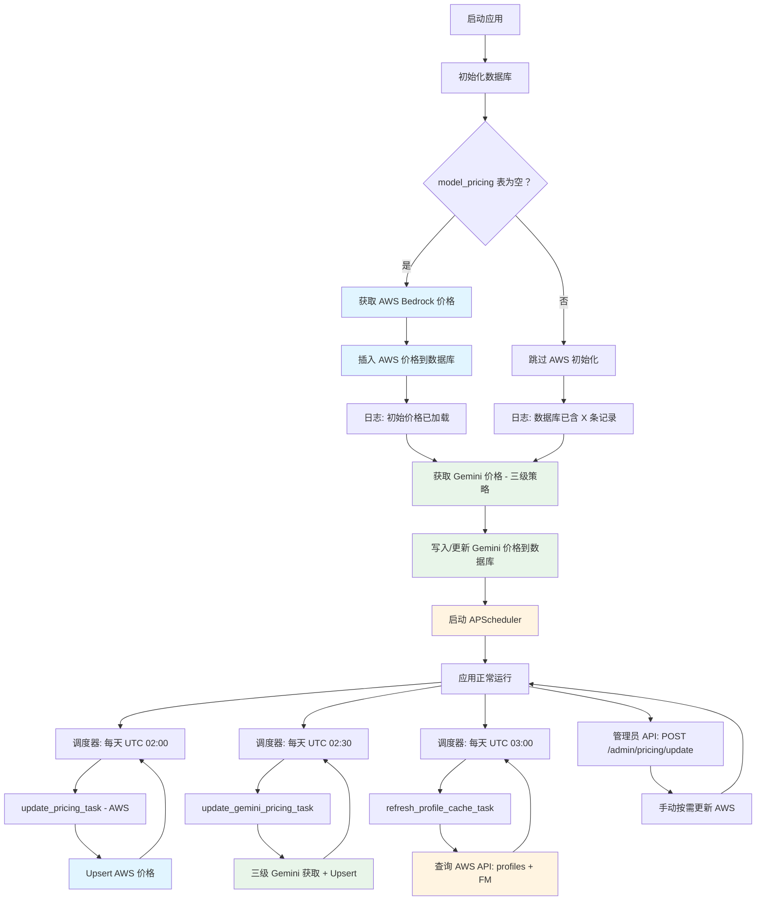

# 动态价格系统

## 概述

本系统从多个数据源动态获取模型价格，并自动更新到数据库。价格数据用于计算 API 调用成本。

系统包含两个独立的定价子系统并行运行：
- **AWS Bedrock 定价** — 覆盖所有通过 AWS Bedrock 调用的模型。同时也覆盖经 AWS "mantle" 推理引擎提供的 OpenAI GPT-5.5/5.4，价格从同一个 AWS 定价页面抓取（详见下文 **OpenAI mantle 定价**）。
- **Google Gemini 定价** — 覆盖通过 Gemini API 直接调用的模型（存储时 `region="global"`）

---

## 数据库表：`model_pricing`

存储模型价格信息：

| 字段 | 说明 |
|------|------|
| `model_id` | 模型标识符（如 `amazon.nova-lite-v1:0`、`gemini-2.5-pro`、`openai.gpt-5.5`） |
| `region` | AWS 区域、跨区域前缀（`us.`、`global.`），Gemini 模型为 `"global"`。mantle 模型使用不带前缀的普通 AWS 区域（如 `us-east-2`、`us-west-2`） |
| `input_price_per_token` | 输入 token 单价（USD） |
| `output_price_per_token` | 输出 token 单价（USD） |
| `cached_input_price_per_token` | 上下文缓存读取价格（USD），不支持则为 NULL。Gemini 缓存价格与 mantle 的 cached output 价格复用此列 |
| `currency` | 货币（USD） |
| `source` | 数据来源，见下表 |
| `last_updated` | 最后更新时间 |
| `created_at` | 创建时间 |

**`source` 字段取值：**

| 值 | 含义 |
|----|------|
| `api` | AWS Price List API |
| `aws-scraper` | AWS Bedrock 定价页面爬虫 |
| `scraper` | OpenAI mantle（GPT-5.5/5.4）从 AWS 定价页面抓取的条目 — 与 Bedrock 抓取同标签，因为来自同一页面 |
| `gemini-scraper` | Gemini 三级策略（统一标签） |

---

## AWS Bedrock 定价

### 获取策略

系统使用**双数据源 + 去重**策略获取完整的 Bedrock 模型价格：

1. **AWS Price List API（主数据源）** — `source: "api"`
   - 官方 API，数据最准确，结构化数据
   - URL: `https://pricing.us-east-1.amazonaws.com`
   - 覆盖模型：Amazon Nova、Meta Llama、Mistral、DeepSeek、Google Gemma、MiniMax、Moonshot (Kimi)、NVIDIA Nemotron、OpenAI (gpt-oss)、Qwen
   - 支持 Standard（按需）和 Cross-Region 推理定价
   - 未匹配的模型名称会以 warning 日志记录，便于发现新模型或名称变更

2. **AWS 定价页面爬虫（补充数据源）** — `source: "aws-scraper"`
   - 用于获取 Price List API 中没有的模型价格（如 Anthropic Claude）
   - **无需浏览器自动化**，结合两个公开数据源：
     1. **静态 HTML**：`https://aws.amazon.com/bedrock/pricing/` 中的 `data-pricing-markup` 属性包含表格模板，价格单元格使用 `{priceOf!dataset/dataset!HASH}` 引用
     2. **JSON 定价接口**：`b0.p.awsstatic.com/pricing/2.0/meteredUnitMaps/`
        - `bedrockfoundationmodels.json` — Anthropic Claude 模型（值为每百万 token 价格）
        - `bedrock.json` — 其他厂商（值为每千 token 价格，引用中含 `!*!1000` 乘数）
   - 仅处理按需文本推理部分（表头含 "input token" 和 "output token"）
   - 自动跳过预留定价、训练、图像生成、嵌入等部分
   - 跨区域部分通过标题识别："Global Cross-region" → `global.` 前缀，"Geo"/"In-region" → 地理前缀（如 `us.`）

**更新流程（顺序执行 + 去重）：**
1. 调用 AWS Price List API → 保存，`source: "api"`
2. 收集步骤 1 中所有基础 model ID
3. 从 AWS 定价页面提取价格（静态 HTML + JSON）
4. 仅保存步骤 2 中**未出现**的模型 → `source: "aws-scraper"`

API 数据始终优先，爬虫数据仅填补空缺。

**运行统计示例：**
```json
{
  "updated": 77,
  "api_count": 48,
  "scraper_count": 29,
  "failed": 0,
  "source": "api+aws-scraper"
}
```

### 支持的厂商（共 20 个）

| 厂商 | Price List API | 页面爬虫 | 备注 |
|------|:-:|:-:|------|
| AI21 Labs | — | 是 | Jamba、Jurassic-2 |
| Amazon | 是 | 是 | Nova、Titan Text |
| Anthropic | — | 是 | Claude 4.x、3.x、2.x、Instant |
| Cohere | — | 是 | Command R/R+ |
| DeepSeek | 是 | 是 | R1、V3.1 |
| Google | 是 | — | Gemma 3 (4B, 12B, 27B)，仅 Bedrock；Gemini 模型使用独立的 Gemini 定价系统 |
| Luma AI | — | — | 视频生成（按秒计价） |
| Meta | 是 | 是 | Llama 3.x、4.x |
| MiniMax AI | 是 | — | Minimax M2 |
| Mistral AI | 是 | 是 | Large、Small、Mixtral、Ministral、Pixtral、Magistral、Voxtral |
| Moonshot AI | 是 | — | Kimi K2 Thinking |
| NVIDIA | 是 | — | Nemotron Nano 2、3 |
| OpenAI | 是 | 是 | gpt-oss-20b、gpt-oss-120b |
| OpenAI (mantle) | — | 是 | 经 AWS "mantle" 推理引擎提供的 GPT-5.5、GPT-5.4 — 详见下文 **OpenAI mantle 定价** |
| Qwen | 是 | 是 | Qwen3、Qwen3 Coder、Qwen3 VL |
| Stability AI | — | — | 图像生成（按图计价） |
| TwelveLabs | — | — | 视频理解（按秒计价） |
| Writer | — | — | Palmyra X4/X5（尚未入 API） |
| Z AI | — | — | GLM-4.7（尚未入 API） |

> **注意：** 两列都标 "—" 的厂商可能采用非 token 计价（图像/视频），或太新尚未进入定价 API。无论是否有价格数据，所有厂商均可在"添加模型"界面中选择。

---

## Google Gemini 定价

Gemini 模型价格独立于 AWS 定价系统单独获取。所有 Gemini 记录存储时 `region="global"`（Gemini API 无区域差异定价），`source="gemini-scraper"`。

### 三级获取策略

三个 Tier 按顺序执行，后续 Tier 只补充前面 Tier 没有覆盖的模型，最终合并保存。

#### Tier 1 — Google 官方定价页面

- **URL：** `https://ai.google.dev/gemini-api/docs/pricing`
- **方式：** 使用 Googlebot User-Agent 发起 HTTP GET（触发 SSR；普通 UA 返回空内容）
- **解析：** 定位 `<h2>`/`<h3>` 中包含 `"Gemini N.N …"` 的标题，匹配后续包含 "Input price"/"Output price"/"Caching price" 的 `<table>`
- **覆盖：** 所有当前在售模型（2.0+、2.5+、3.x 预览版）— 约 17 个模型
- **说明：** 页面每个模型显示两行（标准价 + Batch 半价），仅取第一行（标准价）

#### Tier 2 — LiteLLM 公开价格数据库

- **URL：** `https://raw.githubusercontent.com/BerriAI/litellm/main/model_prices_and_context_window.json`
- **方式：** 普通 HTTP GET 获取 GitHub 公开 raw JSON 文件 — **不安装 litellm 包，无任何依赖**
- **过滤：** 只取 `gemini` 开头的键（排除 `gemini/` 前缀重复项），跳过价格为 0 的实验模型
- **覆盖：** 官方页面没有的预览/日期版变体（如 `gemini-2.0-flash-001`、`gemini-2.5-flash-preview-09-2025`、`gemini-exp-1206`）— 新增约 17 个模型
- **优先级：** 仅补充 Tier 1 未找到的模型

#### Tier 3 — 内置静态旧版价格表

在 `backend/app/services/gemini_pricing_updater.py` 中手动维护（`_LEGACY_GEMINI_PRICING` 常量）。

**仅覆盖已从 Google 官方定价页下线、且 LiteLLM JSON 中价格缺失/为零的老旧模型：**

| 模型 | 输入 $/1M | 输出 $/1M | 缓存 $/1M | 数据来源 |
|------|---------|---------|---------|---------|
| `gemini-1.5-pro` | $1.25 | $5.00 | $0.3125 | Google 文档（已归档） |
| `gemini-1.5-flash` | $0.075 | $0.30 | $0.01875 | Google 文档（已归档） |
| `gemini-1.5-flash-8b` | $0.0375 | $0.15 | $0.01 | Google 文档（已归档） |

> **维护原则：** 仅在以下全部条件满足时才添加新条目：（1）模型已从官方定价页下线；（2）LiteLLM JSON 中输出价格为零或缺失；（3）仍有用户在生产环境使用该模型。**不要添加当前在售模型**，它们会被 Tier 1 或 Tier 2 自动覆盖。

### 典型运行结果

```
Gemini pricing tier-1 (Google):           17 个模型
Gemini pricing tier-2 (LiteLLM):          新增 17 个模型
Gemini pricing tier-3 (static legacy):    新增 3 个模型
Gemini pricing saved:                      共 37 个模型
```

---

## OpenAI mantle 定价

OpenAI **GPT-5.5** 和 **GPT-5.4** 经 AWS "mantle" 推理引擎提供，价格与 Bedrock 模型在**同一个 AWS 定价页面**上发布。因此它不是一条独立的获取管线，而是在**现有 AWS 定价爬虫内部新增的增量分支** —— 完全不改动现有的 `data-pricing-markup` 解析路径。

厂商标记：`openai-mantle`。source 标签：`scraper`（与 AWS Bedrock 抓取完全相同，因为数据来自同一个页面）。

### 模型与价格

价格为每 1M tokens（input / cached output / output）：

| 模型 | `model_id` | 输入 $/1M | cached output $/1M | 输出 $/1M | 区域 |
|------|-----------|----------|--------------------|----------|------|
| GPT-5.5 | `openai.gpt-5.5` | $5.50 | $0.55 | $33.00 | 仅 `us-east-2` |
| GPT-5.4 | `openai.gpt-5.4` | $2.75 | $0.275 | $16.50 | `us-east-2`、`us-west-2` |

### 获取策略

- **数据源：** 复用 Bedrock 抓取已经获取的 `https://aws.amazon.com/bedrock/pricing/` HTML —— 不发起额外请求。
- **新增分支：** `backend/app/services/pricing_updater.py` 中的 `_scrape_openai_text_pricing(html)`。纯增量实现，现有基于 markup 的解析路径保持不变。
- **定位：** 含表头 `"Price per 1M input tokens"` 的纯文本 `<table>`。该表有 4 列：`OpenAI models | input | cached output | output`，值形如 `$ 5.50`。
- **解析：** 逐行解析，模型名称经 `MANTLE_PRICING_NAMES` 映射表映射到 `model_id`。

### 入库

- **按模型所在区域各写一条** —— `gpt-5.4` 写入 `us-east-2` 和 `us-west-2` 两条；`gpt-5.5` 仅写入 `us-east-2`。区域取自模型的可用区域列表，**而非** `settings.AWS_REGION`。
- **单位换算：** 单价 = `$/1M ÷ 1e6`。
- **cached output 价格**写入 `cached_input_price_per_token` 列（与 Gemini 复用同一列）。
- **source 标签：** `scraper`。

### 区域推断

`pricing.py` 中的区域推断对 mantle 模型**短路**：`resolve_mantle_region(model)` 在本地 `AWS_REGION` 处于模型可用区域列表时返回本地区域，否则返回首选区域。该区域与写入价格时使用的区域一致，因此 `calculate_cost()` 始终能查到匹配的价格行，不会抛出 `ValueError`。

### 安全 / 互不干扰

- **`update_all_pricing` 的 api_model_ids 过滤**不会误删 mantle 行：mantle 模型不在 Price List API 中、也没有 geo 前缀，因此落在该过滤器的删除集合之外。
- **`cleanup_stale_cross_region_entries`** 只删除带 geo 前缀的条目；mantle 行无前缀，因此不受影响。

### 典型运行结果

```
AWS pricing update completed: 77 models updated from api+aws-scraper, 0 failed
OpenAI mantle pricing (scraper): 2 models → 3 region rows (gpt-5.5: us-east-2; gpt-5.4: us-east-2, us-west-2)
```

---

## 自动化流程



**调度计划：**

| 任务 | 时间 (UTC) | 内容 |
|------|-----------|------|
| AWS 价格更新 | 每天 02:00 | `update_pricing_task()` |
| Gemini 价格更新 | 每天 02:30 | `update_gemini_pricing_task()` |
| Inference profile 缓存刷新 | 每天 03:00 | `refresh_profile_cache_task()` |

> 03:00 UTC 的 profile 缓存刷新从 AWS API 更新可用的 inference profiles 和 foundation models 列表。此缓存供 `resolve_model()` 动态路由请求到正确区域，也供管理面板的模型列表接口仅展示实际可调用的模型。

**实现文件：**
- `backend/app/tasks/pricing_tasks.py` — 调度器启停、所有任务函数（定价 + profile 缓存）
- `backend/app/services/pricing_updater.py` — AWS 定价逻辑
- `backend/app/services/gemini_pricing_updater.py` — Gemini 三级策略逻辑
- `backend/app/services/bedrock.py` — `_ProfileCache` 类、`resolve_model()`、`refresh_profile_cache()`
- `backend/main.py` — lifespan 启动/关闭

**三种更新方式：**

1. **应用启动时自动初始化**
   - 检查 `model_pricing` 表是否为空 → 为空则获取 AWS 价格
   - 每次启动都会运行 Gemini 价格初始化（无需 API Key）

2. **定期自动更新**
   - APScheduler：AWS 每天 UTC 02:00，Gemini 每天 UTC 02:30
   - 使用 upsert 策略（存在则更新，不存在则插入）

3. **手动触发（仅 AWS）**
   - 管理员 API：`POST /admin/pricing/update`
   - 需要管理员权限

---

## 价格计算

### 基础公式

```
总成本 = (输入tokens × 输入单价) + (输出tokens × 输出单价)
```

### Prompt Cache 差异化计价

开启 Prompt Caching（`KBR_PROMPT_CACHE_AUTO_INJECT=true`）后，Bedrock 返回三类 input token，分别按不同费率计费：

| Token 类型 | 字段 | 计费方式 |
|-----------|------|---------|
| 常规 input | `input_tokens` | 1.0x 基础 input 价格 |
| Cache 写入（5m TTL） | `cache_creation_input_tokens` | 1.25x 基础 input 价格（25% 溢价）— 默认 TTL |
| Cache 写入（1h TTL） | `cache_creation_input_tokens` | 2.0x 基础 input 价格（100% 溢价）— 扩展 TTL |
| Cache 读取 | `cache_read_input_tokens` | 0.1x 基础 input 价格（90% 折扣） |

> **TTL 说明**：缓存写入乘数取决于 `PROMPT_CACHE_TTL` 配置。默认 5 分钟 TTL 使用 1.25x 乘数；1 小时 TTL 使用 2.0x 乘数（更高溢价换取更长缓存时间，减少缓存未命中）。

**完整公式（含 cache）：**

```python
总费用 = (input_tokens × input_price)                          # 常规 input
       + (completion_tokens × output_price)                    # Output
       + (cache_creation_input_tokens × input_price × 1.25)   # Cache 写入溢价
       + (cache_read_input_tokens × input_price × 0.1)        # Cache 读取折扣
```

**示例** — Claude Sonnet（input 价格 = $3.00 / 1M tokens）：

```
请求包含 10,000 tokens：
  - 2,000 常规 input tokens：    2,000 × $0.000003   = $0.006
  - 1,000 cache 写入 tokens：    1,000 × $0.00000375 = $0.00375
  - 7,000 cache 读取 tokens：    7,000 × $0.0000003  = $0.0021
  总 input 费用：$0.01185（对比无缓存 $0.03，节省 60%）
```

### 数据库存储

Cache token 数量存储在 `usage_records` 表中：

```python
class UsageRecord(Base):
    prompt_tokens = Column(Integer)                  # 常规 input tokens
    completion_tokens = Column(Integer)              # Output tokens
    cache_creation_input_tokens = Column(Integer)    # Cache 写入 tokens
    cache_read_input_tokens = Column(Integer)        # Cache 读取 tokens
    cost_usd = Column(Numeric)                       # 总费用（含 cache 差异化计价）
```

### OpenAI 兼容响应格式

```json
{
  "usage": {
    "prompt_tokens": 2000,
    "completion_tokens": 500,
    "total_tokens": 2500,
    "prompt_tokens_details": {
      "cached_tokens": 7000,
      "cache_creation_tokens": 1000
    }
  }
}
```

### 实现位置

- `app/services/pricing.py`：`ModelPricing.calculate_cost()` — 应用 cache 价格乘数
- `app/api/v1/endpoints/chat.py`：`record_usage()` — 提取并传递 cache token 数
- `app/models/usage.py`：`UsageRecord` — 存储 cache token 列
- `app/services/translator.py`：`ResponseTranslator` — 返回 `prompt_tokens_details`

### 错误处理

找不到模型价格时：抛出 `ValueError`，返回 HTTP 500，提示管理员更新价格数据。

---

## Monitor Section — 价格表展示

### 概述

Monitor section 提供完整的价格表展示，包含所有模型（含 Gemini `region="global"` 行）及其价格信息，实现了 6 小时缓存机制。

### API 端点

#### 1. 获取完整价格表

```http
GET /admin/monitor/pricing-table?force_refresh=false
Authorization: Bearer {admin_token}
```

**响应示例：**
```json
{
  "total_records": 218,
  "pricing_data": [
    {
      "model_id": "amazon.nova-lite-v1:0",
      "region": "us-east-1",
      "input_price_per_1m": "0.06",
      "output_price_per_1m": "0.24",
      "source": "api",
      "last_updated": "2026-04-01T02:00:00"
    },
    {
      "model_id": "gemini-2.5-pro",
      "region": "global",
      "input_price_per_1m": "1.25",
      "output_price_per_1m": "10.00",
      "source": "gemini-scraper",
      "last_updated": "2026-04-01T02:30:00"
    }
  ],
  "cache_info": {
    "cached_at": "2026-04-01T03:00:00",
    "cache_duration_hours": 6,
    "expires_at": "2026-04-01T09:00:00",
    "is_cached": true,
    "cache_age_seconds": 120
  }
}
```

#### 2. 获取价格摘要统计

```http
GET /admin/monitor/pricing-summary
Authorization: Bearer {admin_token}
```

#### 3. 清除价格表缓存

```http
POST /admin/monitor/clear-cache
Authorization: Bearer {admin_token}
```

手动更新价格后调用，强制下次请求从数据库读取最新数据。

### 缓存机制

- **时长：** 6 小时（内存缓存，应用级别）
- **自动刷新：** 缓存过期后自动从数据库重新加载
- **手动刷新：** `force_refresh=true` 参数或调用 `clear-cache` 端点
- **失效场景：** 应用重启、6 小时到期、手动清除

---

## 监控

### 验证系统状态

```bash
# 查看总记录数和模型数
PGPASSWORD=root psql -h 127.0.0.1 -U root -d kbp -c \
  "SELECT COUNT(*) as total_records, COUNT(DISTINCT model_id) as unique_models FROM model_pricing;"

# 专项检查 Gemini 模型价格
PGPASSWORD=root psql -h 127.0.0.1 -U root -d kbp -c \
  "SELECT model_id, input_price_per_token * 1e6 as input_per_1m,
          output_price_per_token * 1e6 as output_per_1m, source
   FROM model_pricing WHERE region = 'global' ORDER BY model_id;"

# 查看特定模型的价格
PGPASSWORD=root psql -h 127.0.0.1 -U root -d kbp -c \
  "SELECT model_id, region,
   input_price_per_token * 1000000 as input_per_1m,
   output_price_per_token * 1000000 as output_per_1m,
   source FROM model_pricing
   WHERE model_id = 'amazon.nova-lite-v1:0' ORDER BY region;"
```

### 关键日志

**AWS 定价：**
```
Pricing database is empty, fetching initial pricing data from AWS...
Initial pricing data loaded: 77 models from api+aws-scraper
Starting AWS pricing update task...
AWS pricing update completed: 77 models updated from api+aws-scraper, 0 failed
OpenAI mantle pricing (scraper): 2 models → 3 region rows (gpt-5.5: us-east-2; gpt-5.4: us-east-2, us-west-2)
```

**Gemini 定价：**
```
Starting Gemini pricing update task...
Gemini pricing tier-1 (Google): 17 models
Gemini pricing tier-2 (LiteLLM): 17 new models added
Gemini pricing tier-3 (static legacy): 3 models added
Gemini pricing saved: 37 models total
Gemini pricing update completed: 37 models updated, 0 failed
```

---

## 故障排查

### 问题：Gemini 价格数据库为空（0 条记录）

**检查：**
```bash
kubectl logs -n <namespace> -l app=backend | grep -i gemini
```

**常见原因：**
1. 三个 Tier 同时失败（网络断连）
2. 旧版代码中 `GEMINI_API_KEY` 门控阻止了初始化（已修复，不再受 API Key 限制）

**修复：** 重启 backend pod，每次启动都会重新初始化 Gemini 价格。

### 问题：Monitor 页面看不到 Google 价格

Monitor 价格表包含 `region="global"` 的行。在 UI 右上角的 **Region** 下拉框中选择 **All Regions** 即可同时看到 AWS 和 Gemini 模型价格。

### 问题：AWS 价格初始化失败

**症状：**
```
WARNING - No pricing data was updated
```

**可能原因：**
1. AWS Price List API 不可用
2. 网络连接或 IAM 权限问题
3. 爬虫解析失败

**解决：** 检查网络和 IAM 权限，查看详细错误日志，手动调用 `POST /admin/pricing/update` 重试。

### 问题：API 调用返回 500 "Pricing not available"

```json
{
  "detail": "Pricing not available for model: xxx. Please contact administrator to update pricing data."
}
```

**原因：** 数据库中没有该模型的价格记录。

**解决：**
- AWS 模型：调用 `POST /admin/pricing/update`
- Gemini 模型：重启 backend pod（Gemini 在启动时自动初始化）
- 确认模型 ID 是否正确

### 问题：定时任务没有执行

1. 查看日志确认调度器已启动
2. 等待调度时间窗口（AWS：UTC 02:00，Gemini：UTC 02:30）
3. APScheduler 异常时重启应用

---

## 配置

### 环境变量

| 变量 | 对定价的影响 |
|------|-------------|
| `AWS_REGION` | 用于 AWS Bedrock Price List API 查询 |
| `GEMINI_API_KEY` | 用于 Gemini 对话请求；**价格更新不需要** |

Gemini 价格更新爬取公开的 Google 定价页面，无需 `GEMINI_API_KEY`。

### 动态区域解析（定价）

`ModelPricing.calculate_cost()` 通过 `BedrockClient.resolve_model()` 动态确定定价区域。这确保了路由到 fallback 区域的模型（如 `zai.glm-5` → `us-west-2`）使用数据库中正确区域的价格。

对于 OpenAI mantle 模型（`openai.gpt-5.5`、`openai.gpt-5.4`），该区域推断被 `resolve_mantle_region(model)` **短路**：当本地 `AWS_REGION` 处于模型可用区域列表时返回本地区域，否则返回模型的首选区域。由于这与写入价格时使用的区域一致，查价始终成功。

### 自定义调度时间

修改 `backend/app/tasks/pricing_tasks.py`：

```python
# AWS 价格 — 默认每天 UTC 02:00
scheduler.add_job(update_pricing_task, trigger=CronTrigger(hour=2, minute=0), ...)

# Gemini 价格 — 默认每天 UTC 02:30
scheduler.add_job(update_gemini_pricing_task, trigger=CronTrigger(hour=2, minute=30), ...)

# Inference profile 缓存 — 默认每天 UTC 03:00
scheduler.add_job(refresh_profile_cache_task, trigger=CronTrigger(hour=3, minute=0), ...)
```

### 维护 Gemini 静态旧版价格表

文件：`backend/app/services/gemini_pricing_updater.py`，常量 `_LEGACY_GEMINI_PRICING`。

**仅在以下全部条件满足时才添加新条目：**
1. 模型已从 `https://ai.google.dev/gemini-api/docs/pricing` 下线
2. LiteLLM JSON 中输出价格为零或缺失
3. 仍有用户在生产环境使用该模型

**不要添加当前在售模型**，它们由 Tier 1 和 Tier 2 自动覆盖。

---

## API 参考

### 更新所有 AWS 模型价格

```http
POST /admin/pricing/update
Authorization: Bearer {admin_token}
```

**响应：**
```json
{
  "message": "Pricing update completed",
  "stats": {
    "updated": 77,
    "failed": 0,
    "source": "api+aws-scraper"
  }
}
```

### 查询特定模型价格

```http
GET /admin/pricing/models/{model_id}
Authorization: Bearer {admin_token}
```

**响应：**
```json
{
  "model": "claude-3-5-sonnet-20241022",
  "region": "default",
  "input_price_per_1m": "3.00",
  "output_price_per_1m": "15.00",
  "input_price_per_1k": "0.003",
  "output_price_per_1k": "0.015"
}
```

### 获取价格表（Monitor）

```http
GET /admin/monitor/pricing-table?force_refresh=false
Authorization: Bearer {admin_token}
```

### 清除 Monitor 缓存

```http
POST /admin/monitor/clear-cache
Authorization: Bearer {admin_token}
```
