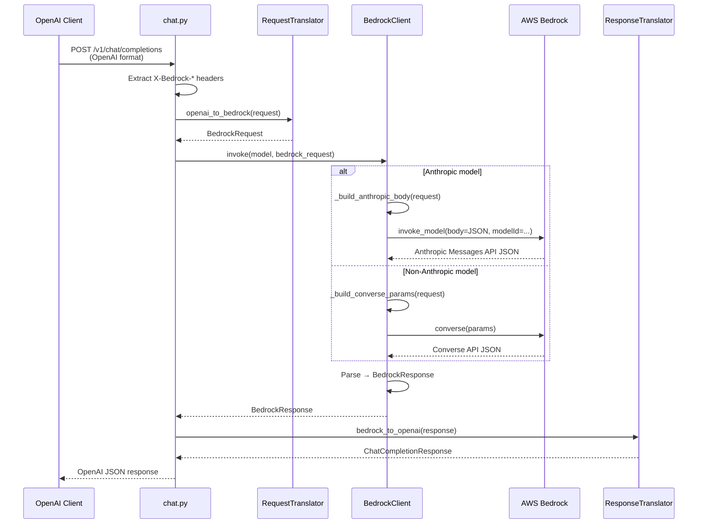
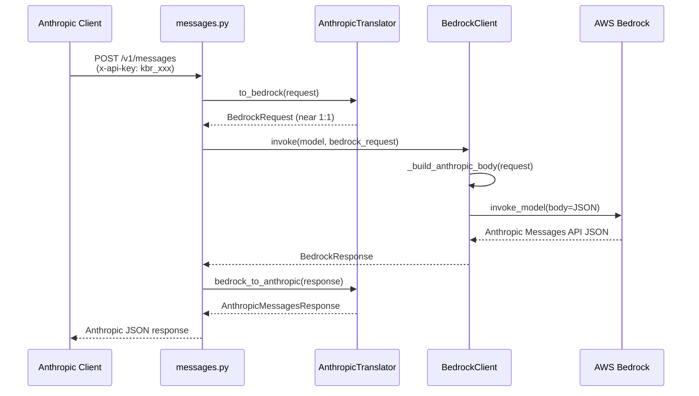
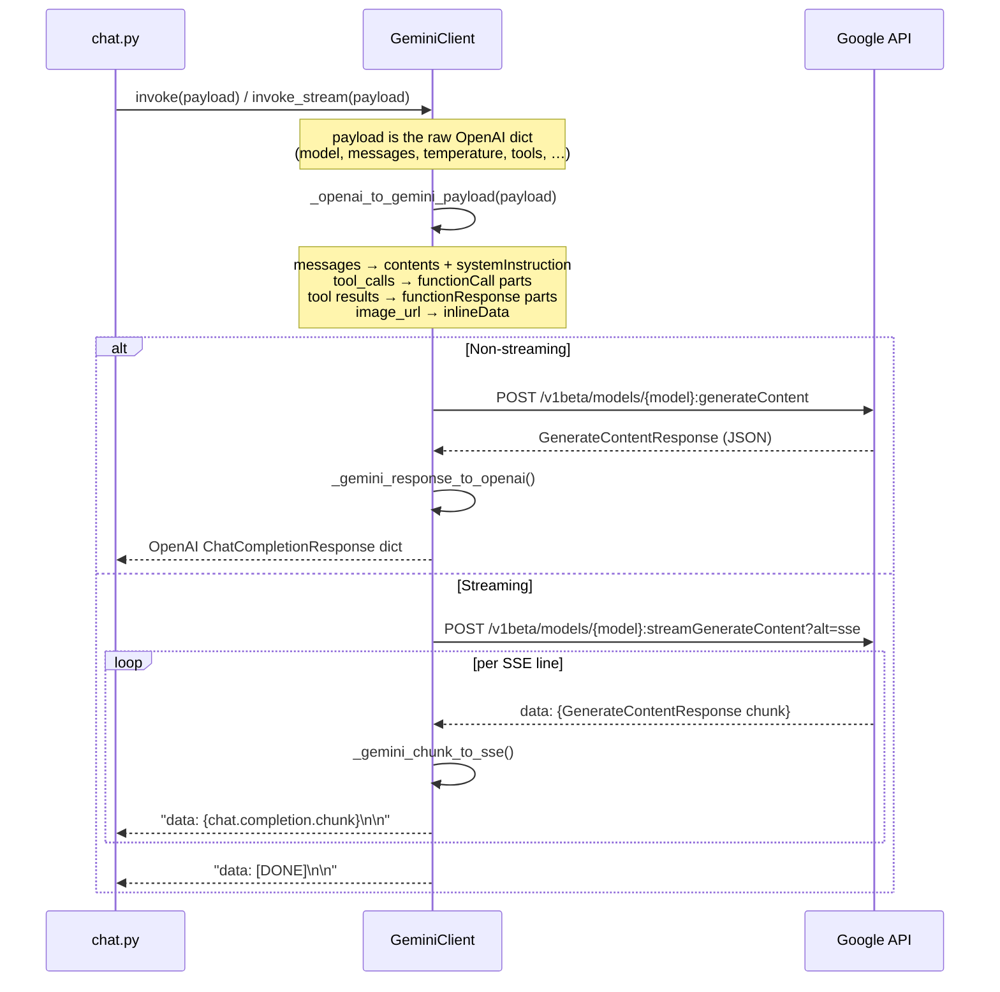
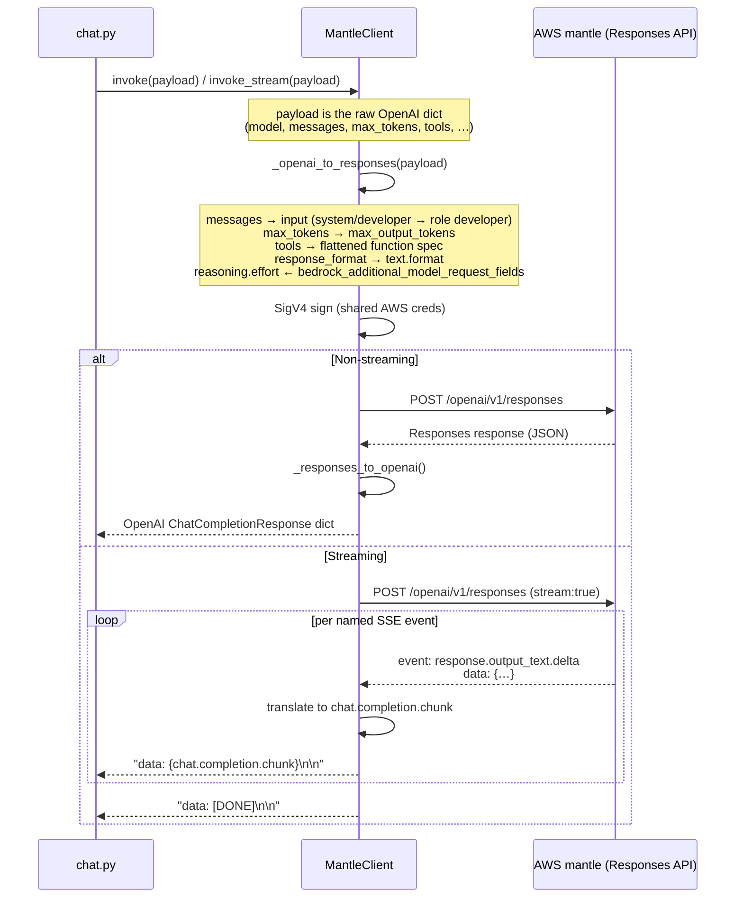

# Request Translation Pipeline

How Kolya BR Proxy translates requests into upstream LLM API calls, and converts responses back. The proxy supports three client-facing API formats:

- **OpenAI-compatible** (`POST /v1/chat/completions`) -- routes to AWS Bedrock (default), Google Gemini (model starts with `gemini-`), or AWS mantle / OpenAI Responses API (model is `openai.gpt-5.5` / `openai.gpt-5.4`)
- **Anthropic Messages API** (`POST /v1/messages`) -- near-passthrough to Bedrock InvokeModel; mantle models (`openai.gpt-5.5` / `openai.gpt-5.4`) are routed to the Responses API instead
- **OpenAI Responses API** (`POST /v1/responses`) -- native passthrough to AWS mantle for OpenAI GPT-5.5/5.4 only; zero protocol conversion

For Bedrock: Anthropic models use the InvokeModel API (native Messages API format), while non-Anthropic models (Nova, DeepSeek, Mistral, Llama, etc.) use the Converse API.

For Gemini: `GeminiClient` uses the native `generateContent` / `streamGenerateContent` API; OpenAI ↔ Gemini conversion happens entirely within the client layer.

For mantle (OpenAI GPT-5.5/5.4): `MantleClient` talks to the OpenAI Responses API served by AWS's "mantle" inference engine. Activation is an exact model-id match via `is_openai_mantle_model(model)`. Like Gemini, all translation happens inside the client, so `chat.py` always sees an OpenAI-format dict; the native `/v1/responses` endpoint bypasses translation entirely.

---

## Table of Contents

1. [Full Data Flow](#1-full-data-flow)
2. [Phase 1: OpenAI → BedrockRequest](#2-phase-1-openai--bedrockrequest)
3. [Phase 2: BedrockRequest → Anthropic Messages API Body](#3-phase-2-bedrockrequest--anthropic-messages-api-body)
4. [Phase 2b: BedrockRequest → Converse API (Non-Anthropic Models)](#4-phase-2b-bedrockrequest--converse-api-non-anthropic-models)
5. [Phase 3: Response → BedrockResponse → OpenAI](#5-phase-3-response--bedrockresponse--openai)
6. [Streaming Event Translation](#6-streaming-event-translation)
7. [Anthropic Messages API Path (Near-Passthrough)](#7-anthropic-messages-api-path-near-passthrough)
8. [Bedrock Extension Pass-through](#8-bedrock-extension-pass-through)
9. [Effort Parameter Auto-transform](#9-effort-parameter-auto-transform)
10. [Automatic Fixes](#10-automatic-fixes)
11. [Unsupported Parameters](#11-unsupported-parameters)
12. [Google Gemini Native API Path](#12-google-gemini-native-api-path)
13. [OpenAI mantle (Responses API) Path](#13-openai-mantle-responses-api-path)

---

## 1. Full Data Flow



---

## 2. Phase 1: OpenAI → BedrockRequest

**File**: `backend/app/services/translator.py` — `RequestTranslator.openai_to_bedrock()`

### 2.1 Message Conversion

| OpenAI Message | BedrockMessage | Notes |
|---|---|---|
| `role: "system"` | Extracted to `BedrockRequest.system` (top-level string) | Only the last system message is used |
| `role: "user"` (string content) | `role: "user", content: "..."` | Direct pass-through |
| `role: "user"` (array content) | `role: "user", content: [BedrockContentPart...]` | Multimodal: text + images |
| `role: "assistant"` (plain text) | `role: "assistant", content: "..."` | Direct pass-through |
| `role: "assistant"` (with `tool_calls`) | `role: "assistant", content: [tool_use blocks]` | Converted to `BedrockContentPart(type="tool_use")` |
| `role: "tool"` | `role: "user", content: [tool_result blocks]` | Multiple consecutive tool messages merged into one user message |

### 2.2 Image Handling

```
OpenAI: {"type": "image_url", "image_url": {"url": "data:image/png;base64,..."}}
                                    ↓
Bedrock: {"type": "image", "source": {"type": "base64", "media_type": "image/png", "data": "..."}}
```

URL-based images are fetched, base64-encoded, and converted to the Bedrock inline format.

### 2.3 Tool Call Conversion

```
OpenAI tool_calls:                          Bedrock content parts:
┌─────────────────────────┐                ┌───────────────────────────┐
│ id: "call_abc"          │                │ type: "tool_use"          │
│ type: "function"        │  ──────────▶   │ id: "call_abc"            │
│ function:               │                │ name: "get_weather"       │
│   name: "get_weather"   │                │ input: {"city": "London"} │
│   arguments: "{...}"    │                └───────────────────────────┘
└─────────────────────────┘
```

```
OpenAI tool message:                        Bedrock content part:
┌─────────────────────────┐                ┌─────────────────────────────┐
│ role: "tool"            │                │ type: "tool_result"         │
│ tool_call_id: "call_abc"│  ──────────▶   │ tool_use_id: "call_abc"     │
│ content: "Sunny, 22°C"  │                │ content: "Sunny, 22°C"      │
└─────────────────────────┘                └─────────────────────────────┘
```

### 2.4 Scalar Parameter Mapping

| OpenAI | BedrockRequest | Behavior |
|---|---|---|
| `temperature` | `temperature` | Direct mapping (0.0 - 1.0) |
| `top_p` | `top_p` | **Only if `temperature` is not set** (mutually exclusive on Bedrock) |
| `max_tokens` | `max_tokens` | Default 4096 if not set |
| `stop` (string or array) | `stop_sequences` (array) | String wrapped in array |
| `tools` | `tools` | `parameters` → `input_schema` |
| `tool_choice: "auto"` | `{"type": "auto"}` | |
| `tool_choice: "required"` | `{"type": "any"}` | OpenAI "required" = Anthropic "any" |
| `tool_choice: "none"` | `{"type": "none"}` | |
| `tool_choice: {function: {name}}` | `{"type": "tool", "name": ...}` | |
| `n` | Ignored | Warning logged if n ≠ 1 |
| `presence_penalty` | Ignored | Warning logged if ≠ 0 |
| `frequency_penalty` | Ignored | Warning logged if ≠ 0 |

### 2.5 Bedrock Extension Fields (Pass-through)

These fields from the OpenAI request body are passed directly to `BedrockRequest`:

| OpenAI Request Field | BedrockRequest Field |
|---|---|
| `bedrock_guardrail_config` | `guardrail_config` |
| `bedrock_additional_model_request_fields` | `additional_model_request_fields` |
| `bedrock_trace` | `trace` |
| `bedrock_performance_config` | `performance_config` |
| `bedrock_prompt_caching` | `prompt_caching` |
| `bedrock_prompt_variables` | `prompt_variables` |
| `bedrock_additional_model_response_field_paths` | `additional_model_response_field_paths` |
| `bedrock_request_metadata` | `request_metadata` |

These can also be set via `X-Bedrock-*` HTTP headers (headers override body):

| Header | Maps to |
|---|---|
| `X-Bedrock-Guardrail-Id` + `X-Bedrock-Guardrail-Version` | `bedrock_guardrail_config` |
| `X-Bedrock-Additional-Fields` (JSON) | `bedrock_additional_model_request_fields` |
| `X-Bedrock-Trace` | `bedrock_trace` |
| `X-Bedrock-Performance-Config` (JSON) | `bedrock_performance_config` |
| `X-Bedrock-Prompt-Caching` (JSON) | `bedrock_prompt_caching` |

---

## 3. Phase 2: BedrockRequest → Anthropic Messages API Body

**File**: `backend/app/services/bedrock.py` — `_build_anthropic_body()` + `_build_invoke_kwargs()`

This phase converts the internal `BedrockRequest` into the exact JSON body that Bedrock's `invoke_model` API expects (Anthropic Messages API format).

### 3.1 Body Construction

```python
# Final JSON body sent to invoke_model:
{
    "anthropic_version": "bedrock-2023-05-31",
    "max_tokens": 4096,
    "messages": [...],          # BedrockContentPart.model_dump(exclude_none=True)

    # Optional — included only if set:
    "system": "You are...",
    "temperature": 0.7,
    "top_p": 0.9,
    "stop_sequences": ["END"],
    "tools": [...],
    "tool_choice": {"type": "auto"},

    # From additional_model_request_fields (merged via body.update()):
    "thinking": {"type": "enabled", "budget_tokens": 5000},

    # Auto-transformed from "effort" (see Section 8):
    "anthropic_beta": ["effort-2025-11-24"],
    "output_config": {"effort": "medium"},

    # From prompt_caching (merged via body.update()):
    "prompt_caching": {...}
}
```

### 3.2 invoke_model Top-level Parameters

```python
# Keyword arguments for invoke_model() (everything except body):
{
    "modelId": "global.anthropic.claude-opus-4-6-v1",
    "contentType": "application/json",
    "accept": "application/json",

    # Optional — from guardrail_config:
    "guardrailIdentifier": "abc123",
    "guardrailVersion": "1",

    # Optional:
    "trace": "ENABLED",
    "performanceConfig": {...}
}
```

### 3.3 Why InvokeModel for Anthropic

The Converse API uses AWS-specific formats (camelCase fields, nested `inferenceConfig`). With `invoke_model`, the body is **native Anthropic Messages API format** — no field renaming needed. This enables direct pass-through of Anthropic-native parameters like `thinking` and `effort`.

| Aspect | Converse API | InvokeModel API |
|---|---|---|
| Body format | AWS-specific (camelCase) | Anthropic Messages API (snake_case) |
| `thinking` support | Via `additionalModelRequestFields` (limited) | Direct body field |
| `effort` support | Not supported | Supported via `output_config` + beta flag |
| Response format | `inputTokens`, `stopReason` | `input_tokens`, `stop_reason` |
| Tool use | `toolUse` / `toolResult` (camelCase) | `tool_use` / `tool_result` (snake_case) |
| Stream events | `contentBlockStart`, `contentBlockDelta` | `content_block_start`, `content_block_delta` |

---

## 4. Phase 2b: BedrockRequest → Converse API (Non-Anthropic Models)

**File**: `backend/app/services/bedrock.py` — `_build_converse_params()`

Non-Anthropic models (Amazon Nova, DeepSeek, Mistral, Llama, etc.) use the Bedrock Converse API, which is model-agnostic and handles format conversion automatically. The `BedrockClient.is_anthropic_model()` method detects the model type based on the `anthropic.` prefix (with optional geo-prefix like `us.`, `eu.`, etc.).

### 4.1 Converse API Parameter Mapping

```python
# Parameters sent to converse() / converse_stream():
{
    "modelId": "us.amazon.nova-pro-v1:0",
    "messages": [
        {"role": "user", "content": [{"text": "Hello!"}]}
    ],

    # Optional:
    "system": [{"text": "You are..."}],
    "inferenceConfig": {
        "maxTokens": 4096,
        "temperature": 0.7,
        "topP": 0.9,
        "stopSequences": ["END"]
    },
    "toolConfig": {
        "tools": [{"toolSpec": {"name": "...", "description": "...", "inputSchema": {"json": {...}}}}],
        "toolChoice": {"auto": {}}
    },

    # Optional — from guardrail_config:
    "guardrailConfig": {"guardrailIdentifier": "abc123", "guardrailVersion": "1"},

    # Optional — from additional_model_request_fields:
    "additionalModelRequestFields": {...},

    # Optional — from performance_config:
    "performanceConfig": {...}
}
```

### 4.2 Content Block Format Differences

| Content Type | Anthropic (InvokeModel) | Converse API |
|---|---|---|
| Text | `{"type": "text", "text": "..."}` | `{"text": "..."}` |
| Image | `{"type": "image", "source": {"type": "base64", "media_type": "image/png", "data": "..."}}` | `{"image": {"format": "png", "source": {"bytes": <raw_bytes>}}}` |
| Tool use | `{"type": "tool_use", "id": "...", "name": "...", "input": {...}}` | `{"toolUse": {"toolUseId": "...", "name": "...", "input": {...}}}` |
| Tool result | `{"type": "tool_result", "tool_use_id": "...", "content": "..."}` | `{"toolResult": {"toolUseId": "...", "content": [{"text": "..."}]}}` |

### 4.3 Converse API Response Mapping

```
Converse API response                     BedrockResponse
──────────────────────                    ───────────────
{                                         BedrockResponse(
  "output": {                               id=<RequestId>,
    "message": {                            content=[
      "content": [                            BedrockContentBlock(type="text", text="Hi"),
        {"text": "Hi"},                       BedrockContentBlock(type="tool_use", ...),
        {"toolUse": {"toolUseId":...}}      ],
      ]                                     stop_reason="end_turn",
    }                                       usage=BedrockUsage(
  },                                          input_tokens=100,
  "stopReason": "end_turn",                   output_tokens=50
  "usage": {                                )
    "inputTokens": 100,                   )
    "outputTokens": 50
  }
}
```

---

## 5. Phase 3: Response → BedrockResponse → OpenAI

### 5.1 Non-streaming Response Parsing

**File**: `bedrock.py` — `_invoke_inner()`

```
Anthropic JSON response                   BedrockResponse
───────────────────────                   ───────────────
{                                         BedrockResponse(
  "id": "msg_...",                          id="msg_...",
  "content": [                              content=[
    {"type": "thinking",                      BedrockContentBlock(type="thinking",
     "thinking": "...",                         thinking="...", signature="Eqs..."),
     "signature": "Eqs..."}                   BedrockContentBlock(type="text", text="Hi"),
    {"type": "text", "text": "Hi"}            BedrockContentBlock(type="tool_use", ...),
    {"type": "tool_use", "id": "...",
     "name": "...", "input": {...}}
  ],                                        ],
  "stop_reason": "end_turn",                stop_reason="end_turn",
  "usage": {                                usage=BedrockUsage(
    "input_tokens": 100,                      input_tokens=100,
    "output_tokens": 50                       output_tokens=50
  }                                         )
}                                         )
```

### 5.2 BedrockResponse → OpenAI ChatCompletionResponse

**File**: `translator.py` — `ResponseTranslator.bedrock_to_openai()`

| Bedrock | OpenAI | Notes |
|---|---|---|
| `content[type="text"]` | `choices[0].message.content` | Concatenated if multiple text blocks |
| `content[type="tool_use"]` | `choices[0].message.tool_calls[]` | `input` → JSON string `arguments` |
| `content[type="thinking"]` | Skipped | Not part of OpenAI format |
| `stop_reason="end_turn"` | `finish_reason="stop"` | |
| `stop_reason="tool_use"` | `finish_reason="tool_calls"` | |
| `stop_reason="max_tokens"` | `finish_reason="length"` | |
| `usage.input_tokens` | `usage.prompt_tokens` | |
| `usage.output_tokens` | `usage.completion_tokens` | |

---

## 6. Streaming Event Translation

### 6.1 Anthropic SSE → BedrockStreamEvent (Anthropic Models)

**File**: `bedrock.py` — `_anthropic_event_to_bedrock()`

The `invoke_model_with_response_stream` API returns a byte stream. Each chunk is decoded as JSON and mapped:

| Anthropic Event | BedrockStreamEvent.type | Key Data |
|---|---|---|
| `message_start` | `message_start` | `usage.input_tokens` (from `message.usage`) |
| `content_block_start` | `content_block_start` | `content_block.type`: `text` / `tool_use` / `thinking` |
| `content_block_delta` (delta.type=`text_delta`) | `content_block_delta` | `delta.text` |
| `content_block_delta` (delta.type=`input_json_delta`) | `content_block_delta` | `delta.partial_json` |
| `content_block_delta` (delta.type=`thinking_delta`) | `content_block_delta` | `delta.thinking` |
| `content_block_delta` (delta.type=`signature_delta`) | `content_block_delta` | `delta.signature` |
| `content_block_stop` | `content_block_stop` | `index` |
| `message_delta` | `message_delta` | `usage.output_tokens`, `delta.stop_reason` |
| `message_stop` | `message_stop` | — |
| `ping` | Skipped | — |

### 6.2 Converse Stream Events → BedrockStreamEvent (Non-Anthropic Models)

**File**: `bedrock.py` — `_converse_stream_event_to_bedrock()`

The `converse_stream` API returns events as dicts with one key per event:

| Converse Event | BedrockStreamEvent.type | Key Data |
|---|---|---|
| `messageStart` | `message_start` | `role` |
| `contentBlockStart` (text) | `content_block_start` | `content_block.type: "text"` |
| `contentBlockStart` (toolUse) | `content_block_start` | `content_block: {type: "tool_use", id, name}` |
| `contentBlockDelta` (text) | `content_block_delta` | `delta.text` |
| `contentBlockDelta` (toolUse) | `content_block_delta` | `delta.partial_json` |
| `contentBlockStop` | `content_block_stop` | `index` |
| `messageStop` | `message_delta` | `delta.stop_reason` |
| `metadata` | `message_delta` | `usage.input_tokens`, `usage.output_tokens` |

### 6.3 BedrockStreamEvent → OpenAI SSE Chunks

**File**: `chat.py` — `stream_chat_completion()`

| BedrockStreamEvent | OpenAI SSE Output | Notes |
|---|---|---|
| `message_start` | (no output) | Captures `input_tokens` for usage tracking |
| `content_block_start` (text) | (no output) | — |
| `content_block_start` (tool_use) | `{"delta": {"tool_calls": [...]}}` | Sends tool call ID + name |
| `content_block_start` (thinking) | Skipped entirely | Thinking blocks filtered out |
| `content_block_delta` (text) | `{"delta": {"content": "..."}}` | Text streaming |
| `content_block_delta` (partial_json) | `{"delta": {"tool_calls": [...]}}` | Tool args streaming |
| `content_block_delta` (thinking) | Skipped entirely | — |
| `message_delta` | (no output) | Captures `output_tokens` |
| `message_stop` | `{"finish_reason": "stop"}` or `"tool_calls"` | Final chunk |
| — | `data: [DONE]\n\n` | Stream terminator |

### 6.4 Token Counting in Streaming

```
message_start  ──▶  input_tokens   (captured at stream start)
message_delta  ──▶  output_tokens  (captured near stream end)
                         │
                         ▼
              record_usage(prompt_tokens, completion_tokens)
```

---

## 7. Anthropic Messages API Path (Near-Passthrough)

**Files**: `backend/app/api/anthropic/endpoints/messages.py`, `backend/app/services/anthropic_translator.py`

When clients use the Anthropic Messages API (`POST /v1/messages` with `x-api-key` header), the translation is minimal because Bedrock's InvokeModel API for Anthropic models natively uses the Messages API format. Note "near-passthrough" refers to the **format similarity**, not a byte passthrough: the request is still mapped through `to_bedrock` → `BedrockRequest`, so fields the internal model doesn't carry — notably inline `cache_control` markers — are dropped. A `to_bedrock_with_passthrough` helper exists for true passthrough but is **not currently wired into the endpoint**.

### 7.1 Data Flow



### 7.2 Key Differences from OpenAI Path

| Aspect | OpenAI Path | Anthropic Path |
|--------|------------|----------------|
| Auth | `Authorization: Bearer` | `x-api-key` header |
| Request translation | Complex (role mapping, tool format conversion) | Near-passthrough (same format as Bedrock) |
| `thinking` blocks | Skipped in response | Preserved in response |
| `stop_reason` | Mapped to `finish_reason` (`end_turn` → `stop`) | Passed through as-is |
| Streaming format | `data: {json}\n\n` + `data: [DONE]\n\n` | `event: type\ndata: {json}\n\n` |
| Error format | `{"error": {"message": "...", "type": "..."}}` | `{"type": "error", "error": {"type": "...", "message": "..."}}` |
| `cache_control` | Via `bedrock_auto_cache` / `X-Bedrock-Auto-Cache`; inline markers dropped in translation | Same: inline `cache_control` markers are **dropped** by `to_bedrock` (`BedrockRequest` has no such field). The proxy injects its own breakpoints when auto-cache is on. See [Prompt Caching](prompt-caching.md). |

### 7.3 Thinking Block Pass-through

When using the Anthropic Messages API path with extended thinking enabled, the proxy **passes `thinking` and `redacted_thinking` content blocks through** to Bedrock. This is required because Bedrock validates that assistant messages include their thinking blocks when `thinking` is enabled.

**What passes through:**
```json
// Assistant message in conversation history — passed as-is
{
  "role": "assistant",
  "content": [
    {"type": "thinking", "thinking": "Previous reasoning...", "signature": "Eqs..."},
    {"type": "text", "text": "Here's my response"}
  ]
}
```

**Important details:**
- The `signature` field on thinking blocks is preserved — Bedrock requires it for validation
- `redacted_thinking` blocks (with encrypted `data` field) are also passed through
- The proxy ensures `signature_delta` events are forwarded in streaming responses, so clients receive valid signatures for subsequent turns
- If a client sends thinking blocks with invalid signatures (e.g., from a different provider), Bedrock will return a `ValidationException`

### 7.4 Adaptive Thinking Mode

The `thinking.type` parameter supports three values:

| Value | Behavior |
|-------|----------|
| `"enabled"` | Extended thinking is always used (requires `budget_tokens`) |
| `"disabled"` | No extended thinking |
| `"adaptive"` | Model decides whether to use extended thinking based on query complexity |

Example request with adaptive thinking:

```json
{
  "model": "claude-opus-4",
  "max_tokens": 4096,
  "messages": [...],
  "thinking": {
    "type": "adaptive",
    "budget_tokens": 10000
  }
}
```

In adaptive mode, the model automatically engages extended thinking for complex queries while responding directly for simpler ones. The `budget_tokens` sets the maximum allowed for thinking when the model chooses to use it.

### 7.5 Streaming Event Mapping

The Anthropic path converts `BedrockStreamEvent` back to Anthropic SSE format, which is essentially the inverse of `_anthropic_event_to_bedrock()`:

| BedrockStreamEvent | Anthropic SSE Event | Key Differences from OpenAI |
|---|---|---|
| `message_start` | `event: message_start` | Full message object (not just usage) |
| `content_block_start` | `event: content_block_start` | Includes thinking blocks |
| `content_block_delta` (text) | `event: content_block_delta` (text_delta) | Native delta format |
| `content_block_delta` (partial_json) | `event: content_block_delta` (input_json_delta) | Native format |
| `content_block_delta` (thinking) | `event: content_block_delta` (thinking_delta) | **Preserved** (OpenAI skips) |
| `content_block_delta` (signature) | `event: content_block_delta` (signature_delta) | **Preserved** — required for multi-turn thinking |
| `content_block_stop` | `event: content_block_stop` | Direct mapping |
| `message_delta` | `event: message_delta` | `stop_reason` preserved (no mapping) |
| `message_stop` | `event: message_stop` | No `[DONE]` marker |

---

## 8. Bedrock Extension Pass-through

The full lifecycle of a `bedrock_additional_model_request_fields` value:

```
Client request body:
{
  "bedrock_additional_model_request_fields": {
    "thinking": {"type": "enabled", "budget_tokens": 5000}
  }
}

    │  (or via header: X-Bedrock-Additional-Fields: {"thinking": ...})
    ▼

chat.py: header extraction → sets request_data.bedrock_additional_model_request_fields
    │
    ▼

translator.py: openai_to_bedrock()
    → BedrockRequest.additional_model_request_fields = {"thinking": {...}}
    │
    ▼

bedrock.py: _build_anthropic_body()
    → body.update(request.additional_model_request_fields)
    → body now contains: {"thinking": {"type": "enabled", "budget_tokens": 5000}, ...}
    │
    ▼

invoke_model(body=json.dumps(body))
    → Anthropic Messages API receives "thinking" as a native field
```

---

## 9. Effort Parameter Auto-transform (Anthropic Models Only)

Anthropic's `effort` parameter requires special handling on Bedrock:

1. Must be nested inside `output_config` (not top-level)
2. Requires `anthropic_beta: ["effort-2025-11-24"]` flag

The proxy auto-transforms this. Users can send:

```json
{
  "bedrock_additional_model_request_fields": {
    "thinking": {"type": "enabled", "budget_tokens": 5000},
    "effort": "medium"
  }
}
```

The `_build_anthropic_body()` method in `bedrock.py` transforms it to:

```json
{
  "thinking": {"type": "enabled", "budget_tokens": 5000},
  "anthropic_beta": ["effort-2025-11-24"],
  "output_config": {"effort": "medium"}
}
```

**Transformation steps:**

```
1. body.update(additional_model_request_fields)
   → body = {..., "effort": "medium", "thinking": {...}}

2. Detect "effort" in body
   → Pop "effort" value
   → Wrap in output_config: {"effort": "medium"}
   → Add beta flag: ["effort-2025-11-24"]

3. Final body sent to invoke_model:
   → "effort" is gone from top-level
   → "output_config": {"effort": "medium"} is present
   → "anthropic_beta": ["effort-2025-11-24"] is present
```

---

## 10. Automatic Fixes

### 10.1 budget_tokens Minimum

Bedrock requires `thinking.budget_tokens >= 1024`. If a client sends a smaller value, the proxy auto-adjusts:

```
Before: budget_tokens=500   (invalid: Bedrock minimum is 1024)
After:  budget_tokens=1024  (auto-fixed to minimum)
```

### 10.2 max_tokens vs budget_tokens

Anthropic requires `max_tokens > thinking.budget_tokens`. If a request has `max_tokens=2000` and `budget_tokens=2000`, the proxy auto-adjusts:

```
Before: max_tokens=2000, budget_tokens=2000  (invalid: max_tokens must be > budget_tokens)
After:  max_tokens=4000, budget_tokens=2000  (auto-fixed: max_tokens = budget + original max)
```

Note: The budget_tokens minimum check runs first, so if a client sends `budget_tokens=500, max_tokens=800`, it becomes `budget_tokens=1024, max_tokens=1824`.

### 10.3 temperature / top_p Mutual Exclusion

Anthropic doesn't allow both `temperature` and `top_p` in the same request. The translator enforces:

```
If temperature is set → top_p is omitted
If temperature is not set → top_p is passed through
```

---

## 11. Unsupported Parameters

These OpenAI/Bedrock parameters are **warned and ignored** when using `invoke_model` (Anthropic models):

| Parameter | Reason |
|---|---|
| `n` (if ≠ 1) | Bedrock only supports single completion |
| `presence_penalty` | Not supported by Anthropic |
| `frequency_penalty` | Not supported by Anthropic |
| `prompt_variables` | Only supported by Converse API |
| `request_metadata` | Only supported by Converse API |
| `additional_model_response_field_paths` | Only supported by Converse API |

---

## 12. Google Gemini Native API Path

**File**: `backend/app/services/gemini_client.py`

Activated when `model.startswith("gemini-")`. All translation happens inside `GeminiClient`; `chat.py` always sees an OpenAI-format dict, exactly as it does for Bedrock responses.

### 12.1 Data Flow



### 12.2 Request Conversion (`_openai_to_gemini_payload`)

| OpenAI | Gemini | Notes |
|---|---|---|
| `messages[role=system]` | `systemInstruction.parts[{text}]` | Merged from all system messages |
| `messages[role=user]` | `contents[role=user].parts` | Text or multimodal parts |
| `messages[role=assistant]` | `contents[role=model].parts` | `tool_calls` → `functionCall` parts |
| `messages[role=tool]` | `contents[role=user].parts[functionResponse]` | Consecutive tool messages merged into one user turn |
| `content: [{type:"image_url", image_url:{url:"data:…"}}]` | `parts[{inlineData:{mimeType, data}}]` | Base64 data URI decoded |
| `content: [{type:"image_url", image_url:{url:"https://…"}}]` | `parts[{fileData:{mimeType, fileUri}}]` | Regular URL passed as fileData |
| `max_tokens` | `generationConfig.maxOutputTokens` | |
| `temperature` | `generationConfig.temperature` | |
| `top_p` | `generationConfig.topP` | |
| `stop` (str or list) | `generationConfig.stopSequences` | |
| `tools[].function` | `tools[0].functionDeclarations[]` | All functions in one tools entry |
| `tool_choice: "none"` | `toolConfig.functionCallingConfig.mode: NONE` | |
| `tool_choice: "auto"` | `toolConfig.functionCallingConfig.mode: AUTO` | |
| `tool_choice: "required"` | `toolConfig.functionCallingConfig.mode: ANY` | |
| `tool_choice: {function: {name}}` | `toolConfig.functionCallingConfig.mode: ANY` + `allowedFunctionNames` | |
| `frequency_penalty`, `presence_penalty`, `n`, `logprobs`, `user`, `bedrock_*` | **Silently ignored** | Not passed to Gemini; no filtering needed in caller |

### 12.3 Response Conversion (`_gemini_response_to_openai`)

| Gemini | OpenAI | Notes |
|---|---|---|
| `candidates[i].content.parts[text]` | `choices[i].message.content` | Concatenated if multiple text parts |
| `candidates[i].content.parts[functionCall]` | `choices[i].message.tool_calls[]` | `args` → JSON-serialized `arguments` |
| `candidates[i].content.parts[inlineData]` | `choices[i].message.content` (array) | `{type:"image_url", image_url:{url:"data:<mime>;base64,<data>"}}` |
| `candidates[i].content.parts[thought:true]` | **Skipped** | Internal reasoning tokens not forwarded |
| `candidates[i].finishReason: STOP` | `finish_reason: stop` | |
| `candidates[i].finishReason: MAX_TOKENS` | `finish_reason: length` | |
| `candidates[i].finishReason: SAFETY / RECITATION / …` | `finish_reason: content_filter` | |
| `candidates[i].finishReason: STOP` (with tool calls) | `finish_reason: tool_calls` | Overridden when tool calls present |
| `usageMetadata.promptTokenCount` | `usage.prompt_tokens` | |
| `usageMetadata.candidatesTokenCount` | `usage.completion_tokens` | |
| `usageMetadata.totalTokenCount` | `usage.total_tokens` | |
| `usageMetadata.cachedContentTokenCount` | `usage.prompt_tokens_details.cached_tokens` | Only when > 0 |

### 12.4 Streaming Conversion (`_gemini_chunk_to_sse`)

Each native Gemini SSE line (`data: {GenerateContentResponse}`) becomes one or more `data: {chat.completion.chunk}` lines. The final chunk that includes `usageMetadata.totalTokenCount` also carries `"usage"` in the OpenAI chunk for billing extraction by `stream_gemini_completion`.

### 12.5 Cached Token Billing

`chat.py` calls `extract_cached_tokens()` / `extract_cached_tokens_from_chunk()` (defined in `gemini_client.py`) on the OpenAI-format response/chunk. These read `usage.prompt_tokens_details.cached_tokens`, which is set by `_build_usage()` when `usageMetadata.cachedContentTokenCount > 0`. The billing logic then deducts cached tokens from prompt tokens so cached input is not charged at the full input rate.

### 12.6 Fields NOT Converted (Design Decision)

The following Gemini-specific features are not currently mapped:

| Gemini feature | How to use |
|---|---|
| Grounding (Google Search) | Not supported via this proxy |
| `safetySettings` overrides | Not supported via this proxy |
| `cachedContent` (context caching) | Not supported via this proxy |
| Image generation (🍌 models) | Supported — `inlineData` parts are returned as `image_url` base64 content; set `stream: false` (image models do not stream) |

---

## 13. OpenAI mantle (Responses API) Path

**File**: `backend/app/services/mantle_client.py`

OpenAI **GPT-5.5** (`openai.gpt-5.5`, us-east-2 only) and **GPT-5.4** (`openai.gpt-5.4`, us-east-2 + us-west-2) are served by AWS's "mantle" inference engine through the **OpenAI Responses API**, not the boto3 `converse` / `invoke_model` paths. Activated when `is_openai_mantle_model(model)` returns `True` — an exact model-id match (a prefix match on `openai.` would wrongly capture the open-weight `openai.gpt-oss-*` models, which use the standard Bedrock Converse path). The mantle region registry and routing live in `mantle_models.py`; auth is SigV4 over the existing AWS credential chain (reused from `BedrockClient`), so no new bearer token is introduced.

Like Gemini, all translation happens inside `MantleClient`; `chat.py` always sees an OpenAI-format dict, exactly as it does for Bedrock responses.

### 13.1 Data Flow



### 13.2 Request Conversion (`_openai_to_responses`)

OpenAI ChatCompletions → OpenAI Responses request body.

| OpenAI | Responses | Notes |
|---|---|---|
| `messages[role=system]` | `input[{role:"developer", content}]` | System / developer messages map to role `developer` |
| `messages[role=user]` | `input[{role:"user", content}]` | Text parts → `input_text`; multimodal preserved |
| `messages[role=assistant]` | `input[{role:"assistant", content}]` | Text parts → `output_text`; `tool_calls` → `function_call` items |
| `messages[role=tool]` | `input[{type:"function_call_output", call_id, output}]` | Keyed by `tool_call_id` |
| `content: [{type:"image_url", image_url:{url:"data:…"}}]` | `content[{type:"input_image", image_url}]` | Data URL (or plain URL) passed through on `input_image` |
| `max_tokens` | `max_output_tokens` | |
| `temperature` | `temperature` | |
| `top_p` | `top_p` | |
| `tools[].function` | `tools[{type:"function", name, description, parameters}]` | Function spec flattened to the tool top level |
| `tool_choice: "none"/"auto"/"required"` | `tool_choice` | Passed through unchanged |
| `tool_choice: {type:"function", function:{name}}` | `tool_choice: {type:"function", name}` | Flattened |
| `response_format: {type:"text"\|"json_object"}` | `text.format: {type}` | Passed through |
| `response_format: {type:"json_schema", json_schema:{name, schema, strict, description}}` | `text.format: {type:"json_schema", name, schema, strict, description}` | Flattened from nested `json_schema` to top level |
| `bedrock_additional_model_request_fields.reasoning.effort` | `reasoning: {effort}` | Reuses the existing Bedrock passthrough channel (no new schema field). mantle supports `none`/`low`/`medium`/`high`/`xhigh`; `minimal` is **not** supported |
| `frequency_penalty`, `presence_penalty`, `n`, `logprobs`, `user`, `bedrock_*` (other) | **Silently ignored** | Not passed to mantle; no filtering needed in caller |

### 13.3 Response Conversion (`_responses_to_openai`)

OpenAI Responses → OpenAI ChatCompletions.

| Responses | OpenAI | Notes |
|---|---|---|
| `output[type=message].content[output_text]` | `choices[0].message.content` | Concatenated if multiple text parts |
| `output[type=function_call]` | `choices[0].message.tool_calls[]` | `arguments` carried as-is; missing `call_id` synthesized |
| `output[type=reasoning]` | **Skipped** | Internal reasoning items not forwarded |
| `status: "incomplete"` | `finish_reason: length` | Otherwise `stop`; overridden to `tool_calls` when tool calls present |
| `usage.input_tokens` | `usage.prompt_tokens` | |
| `usage.output_tokens` | `usage.completion_tokens` | |
| `usage.total_tokens` | `usage.total_tokens` | Falls back to prompt + completion |
| `usage.input_tokens_details.cached_tokens` | `usage.prompt_tokens_details.cached_tokens` | Only when > 0 |

### 13.4 Streaming Conversion (`invoke_stream`)

Unlike Gemini's single-JSON-per-line stream, the Responses API emits **named SSE events** (`event: <name>` + `data: {…}`). `invoke_stream` parses them and translates into OpenAI `chat.completion.chunk` SSE lines:

| Responses event | OpenAI chunk delta |
|---|---|
| `response.output_text.delta` | `{content: <delta>}` |
| `response.output_item.added` (function_call) | `{tool_calls:[{index, id, type:"function", function:{name, arguments:""}}]}` — opens a tool call |
| `response.function_call_arguments.delta` | `{tool_calls:[{index, function:{arguments:<delta>}}]}` |
| `response.completed` / `response.incomplete` | Empty delta + `finish_reason` (`tool_calls` / `length` / `stop`) + `usage` for billing |
| `response.failed` / `error` | Empty delta + `finish_reason: stop` (error logged) |

The terminal chunk carries `"usage"` so `stream_mantle_completion` can extract billing (`extract_cached_tokens_from_chunk`). The stream ends with `data: [DONE]`.

### 13.5 Cached Token Billing

`chat.py` calls `extract_cached_tokens()` / `extract_cached_tokens_from_chunk()` (defined in `mantle_client.py`) on the OpenAI-format response/chunk. These read `usage.prompt_tokens_details.cached_tokens`, set by `_build_usage()` from the Responses `input_tokens_details.cached_tokens`. Cached tokens are deducted from prompt tokens so cached input is not charged at the full input rate.

### 13.6 Three Access Paths

mantle models can be reached through three endpoints, with decreasing translation loss:

| Endpoint | Translation | Loss |
|---|---|---|
| `/v1/chat/completions` | OpenAI ChatCompletions ↔ Responses (`invoke` / `invoke_stream`) | Lossy — only the mapped fields above survive |
| `/v1/messages` | Anthropic ↔ Responses | Lossy — Anthropic `system` + `messages` are first flattened to OpenAI-style messages (`_anthropic_to_openai_messages`), then routed through `MantleClient.invoke`; only text content and `temperature` / `max_tokens` are forwarded |
| `/v1/responses` | **None** — native passthrough (`responses_passthrough` / `responses_passthrough_stream`) | Lossless — body forwarded verbatim, SSE returned unchanged; only `response.completed` / `response.incomplete` events are sniffed for usage billing |

The `/v1/responses` path (`backend/app/api/v1/endpoints/responses.py`) is the only one that exposes mantle's full capability surface and will transparently gain new mantle features the moment AWS enables them — no code change required. The request body is accepted as an open JSON object so unknown/new Responses fields pass straight through. It rejects non-mantle models with HTTP 400.

### 13.7 mantle Capability Boundary

mantle supports: text + vision input, function calling, custom tools, tool_search, namespace, MCP, reasoning effort, and structured output. It does **not** support: `image_generation`, `web_search`, `code_interpreter`, `file_search`, `computer_use_preview`.

Because the ChatCompletions (`/v1/chat/completions`) and Anthropic (`/v1/messages`) paths translate to/from a narrower protocol, any Responses-only feature not in the §13.2 mapping table (built-in tools, custom tools, MCP, multimodal output, etc.) is dropped on those paths. Use `/v1/responses` to access them.

---

## File Reference

| File | Role in Translation |
|---|---|
| `api/v1/endpoints/chat.py` | OpenAI entry point; routes to Bedrock, Gemini, or mantle; orchestrates stream/non-stream flow |
| `api/v1/endpoints/responses.py` | OpenAI Responses API entry point (`/v1/responses`); native mantle passthrough, usage-only billing sniff |
| `api/anthropic/endpoints/messages.py` | Anthropic entry point; `x-api-key` auth; Anthropic SSE streaming; routes mantle models to the Responses API |
| `services/translator.py` | `RequestTranslator`: OpenAI → BedrockRequest; `ResponseTranslator`: BedrockResponse → OpenAI |
| `services/anthropic_translator.py` | `AnthropicRequestTranslator`: Anthropic → BedrockRequest; `AnthropicResponseTranslator`: BedrockResponse → Anthropic |
| `services/bedrock.py` | `_build_anthropic_body()`: BedrockRequest → Anthropic JSON (Anthropic models); `_build_converse_params()`: BedrockRequest → Converse API params (non-Anthropic); `_anthropic_event_to_bedrock()` / `_converse_stream_event_to_bedrock()`: stream event mapping |
| `services/gemini_client.py` | `GeminiClient`: `invoke()` / `invoke_stream()` with full OpenAI ↔ Gemini native conversion; `extract_cached_tokens()` helpers |
| `services/mantle_client.py` | `MantleClient`: `invoke()` / `invoke_stream()` with OpenAI ↔ Responses conversion; `responses_passthrough()` / `responses_passthrough_stream()` for native passthrough; SigV4 signing; `extract_cached_tokens()` helpers |
| `services/mantle_models.py` | mantle model registry: `is_openai_mantle_model()`, `resolve_mantle_region()`, region map, base URL |
| `schemas/openai.py` | OpenAI request/response Pydantic models |
| `schemas/anthropic.py` | Anthropic Messages API request/response/streaming Pydantic models |
| `schemas/bedrock.py` | Internal Bedrock Pydantic models (BedrockRequest, BedrockResponse, BedrockStreamEvent) |
