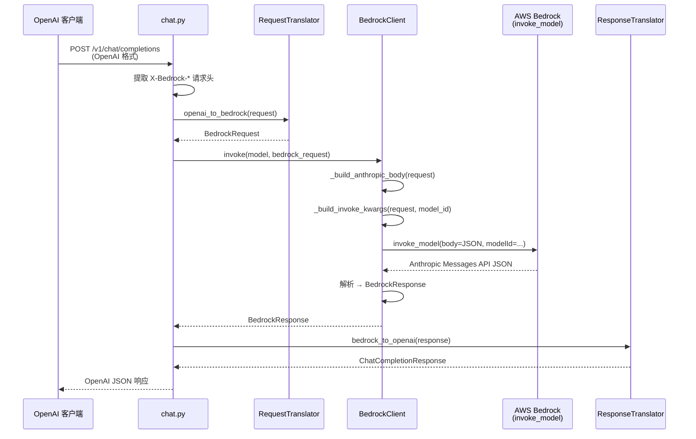
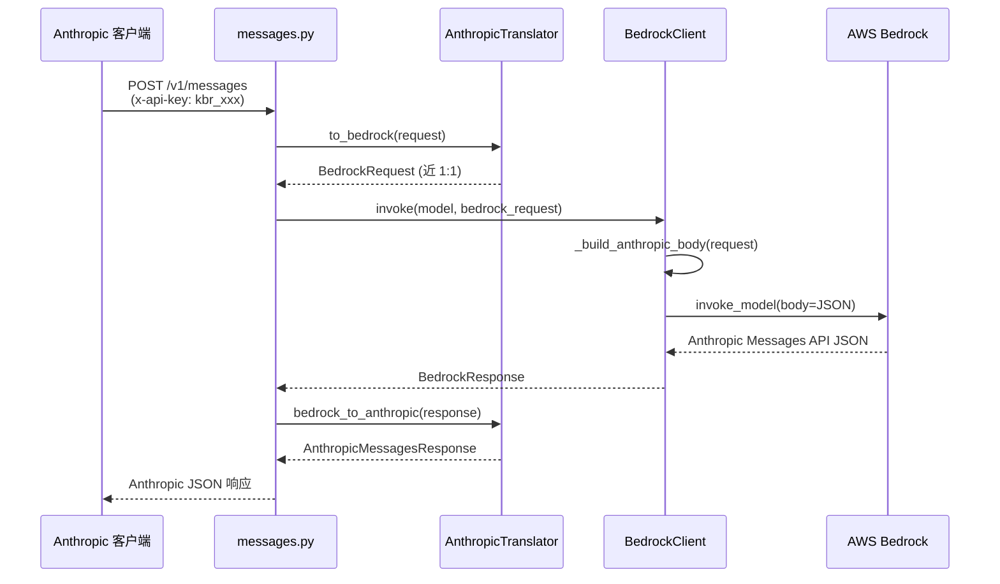
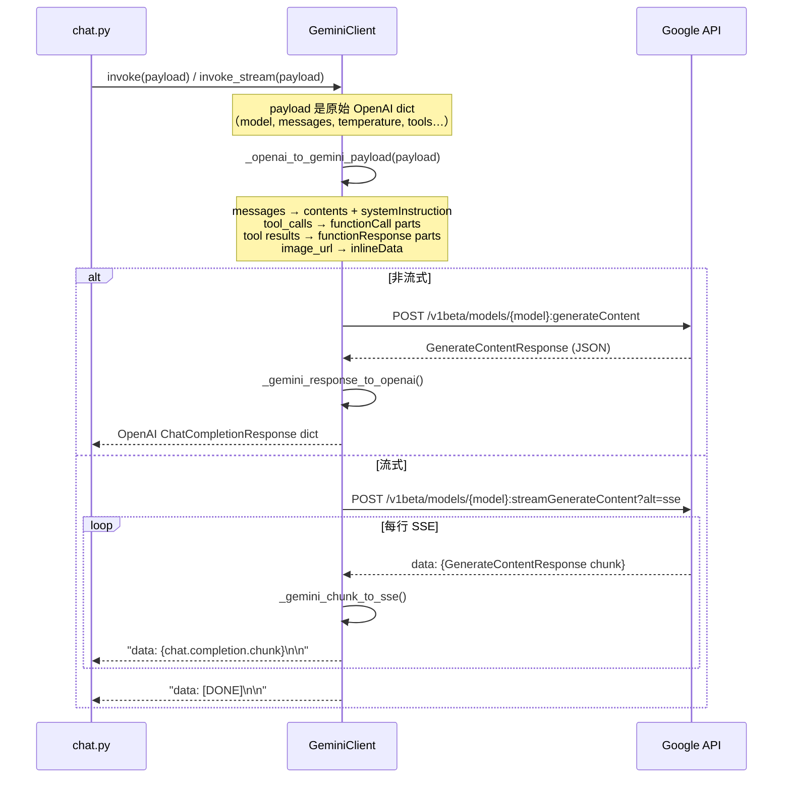
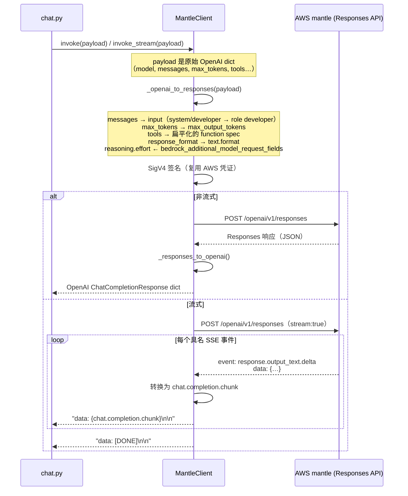

# 请求转换管线

Kolya BR Proxy 如何将请求转换为上游 LLM API 调用，以及如何将响应转换回来。代理支持三种客户端 API 格式：

- **OpenAI 兼容**（`POST /v1/chat/completions`）-- 路由到 AWS Bedrock（默认）、Google Gemini（模型以 `gemini-` 开头）或 AWS mantle / OpenAI Responses API（模型为 `openai.gpt-5.5` / `openai.gpt-5.4`）
- **Anthropic Messages API**（`POST /v1/messages`）-- 近乎直通 Bedrock InvokeModel；mantle 模型（`openai.gpt-5.5` / `openai.gpt-5.4`）改为路由到 Responses API
- **OpenAI Responses API**（`POST /v1/responses`）-- 仅服务 OpenAI GPT-5.5/5.4，原生直通 AWS mantle，零协议转换

Bedrock 端：Anthropic 模型使用 InvokeModel API（原生 Messages API 格式），非 Anthropic 模型（Nova、DeepSeek、Mistral、Llama 等）使用 Converse API。

Gemini 端：`GeminiClient` 使用原生 `generateContent` / `streamGenerateContent` API；OpenAI ↔ Gemini 的格式转换完全在 Client 层完成。

mantle 端（OpenAI GPT-5.5/5.4）：`MantleClient` 对接由 AWS "mantle" 推理引擎服务的 OpenAI Responses API。通过 `is_openai_mantle_model(model)` 精确匹配模型 id 激活。与 Gemini 一样，所有转换都在 client 内完成，`chat.py` 始终看到 OpenAI 格式 dict；原生 `/v1/responses` 端点则完全绕过转换。

---

## 目录

1. [概览](#1-概览)
2. [完整数据流](#2-完整数据流)
3. [阶段一：OpenAI → BedrockRequest](#3-阶段一openai--bedrockrequest)
4. [阶段二：BedrockRequest → Anthropic Messages API Body](#4-阶段二bedrockrequest--anthropic-messages-api-body)
5. [阶段二b：BedrockRequest → Converse API（非 Anthropic 模型）](#5-阶段二bbedrockrequest--converse-api非-anthropic-模型)
6. [阶段三：响应 → BedrockResponse → OpenAI](#6-阶段三响应--bedrockresponse--openai)
7. [流式事件转换](#7-流式事件转换)
8. [Anthropic Messages API 路径（近乎直通）](#8-anthropic-messages-api-路径近乎直通)
9. [Bedrock 扩展参数透传](#9-bedrock-扩展参数透传)
10. [effort 参数自动转换（仅 Anthropic 模型）](#10-effort-参数自动转换仅-anthropic-模型)
11. [自动修正](#11-自动修正)
12. [不支持的参数](#12-不支持的参数)
13. [Google Gemini 原生 API 路径](#13-google-gemini-原生-api-路径)
14. [OpenAI mantle（Responses API）路径](#14-openai-mantleresponses-api路径)

---

## 1. 概览

代理执行**三阶段转换**：

```mermaid
graph LR
    subgraph "阶段一 — translator.py"
        A["ChatCompletionRequest<br/>(OpenAI 格式)"] -->|"openai_to_bedrock()"| B["BedrockRequest<br/>(内部 schema)"]
    end

    subgraph "阶段二 — bedrock.py"
        B -->|"Anthropic: _build_anthropic_body()<br/>其他: _build_converse_params()"| C["JSON body / params"]
        C -->|"invoke_model() /<br/>converse()"| D["AWS Bedrock"]
    end

    subgraph "阶段三 — bedrock.py + translator.py"
        D -->|"Anthropic JSON"| E["BedrockResponse<br/>(内部 schema)"]
        E -->|"bedrock_to_openai()"| F["ChatCompletionResponse<br/>(OpenAI 格式)"]
    end

    style A fill:#4a9eff,color:#fff
    style F fill:#4a9eff,color:#fff
    style D fill:#ff9933,color:#fff
```



这种设计分离了关注点：`translator.py` 负责 OpenAI ↔ Bedrock 的 schema 映射，`bedrock.py` 负责 Bedrock → AWS API 的线上格式（Anthropic 模型用 InvokeModel，非 Anthropic 模型用 Converse API）。

---

## 2. 完整数据流



---

## 3. 阶段一：OpenAI → BedrockRequest

**文件**：`backend/app/services/translator.py` — `RequestTranslator.openai_to_bedrock()`

### 3.1 消息转换

| OpenAI 消息 | BedrockMessage | 说明 |
|---|---|---|
| `role: "system"` | 提取到 `BedrockRequest.system`（顶层字符串） | 仅使用最后一条 system 消息 |
| `role: "user"`（字符串内容） | `role: "user", content: "..."` | 直接传递 |
| `role: "user"`（数组内容） | `role: "user", content: [BedrockContentPart...]` | 多模态：文本 + 图片 |
| `role: "assistant"`（纯文本） | `role: "assistant", content: "..."` | 直接传递 |
| `role: "assistant"`（含 `tool_calls`） | `role: "assistant", content: [tool_use 块]` | 转换为 `BedrockContentPart(type="tool_use")` |
| `role: "tool"` | `role: "user", content: [tool_result 块]` | 多条连续 tool 消息合并为一条 user 消息 |

### 3.2 图片处理

```
OpenAI: {"type": "image_url", "image_url": {"url": "data:image/png;base64,..."}}
                                    ↓
Bedrock: {"type": "image", "source": {"type": "base64", "media_type": "image/png", "data": "..."}}
```

URL 格式的图片会被下载、base64 编码后转为 Bedrock 内联格式。

### 3.3 工具调用转换

```
OpenAI tool_calls:                          Bedrock content parts:
┌─────────────────────────┐                ┌───────────────────────────┐
│ id: "call_abc"          │                │ type: "tool_use"          │
│ type: "function"        │  ──────────▶   │ id: "call_abc"            │
│ function:               │                │ name: "get_weather"       │
│   name: "get_weather"   │                │ input: {"city": "London"} │
│   arguments: "{...}"    │                └───────────────────────────┘
└─────────────────────────┘
```

```
OpenAI tool 消息:                           Bedrock content part:
┌─────────────────────────┐                ┌─────────────────────────────┐
│ role: "tool"            │                │ type: "tool_result"         │
│ tool_call_id: "call_abc"│  ──────────▶   │ tool_use_id: "call_abc"     │
│ content: "晴，22°C"     │                │ content: "晴，22°C"          │
└─────────────────────────┘                └─────────────────────────────┘
```

### 3.4 标量参数映射

| OpenAI | BedrockRequest | 行为 |
|---|---|---|
| `temperature` | `temperature` | 直接映射（0.0 - 1.0） |
| `top_p` | `top_p` | **仅在 `temperature` 未设置时**（Bedrock 上互斥） |
| `max_tokens` | `max_tokens` | 未设置时默认 4096 |
| `stop`（字符串或数组） | `stop_sequences`（数组） | 字符串包装为数组 |
| `tools` | `tools` | `parameters` → `input_schema` |
| `tool_choice: "auto"` | `{"type": "auto"}` | |
| `tool_choice: "required"` | `{"type": "any"}` | OpenAI 的 "required" = Anthropic 的 "any" |
| `tool_choice: "none"` | `{"type": "none"}` | |
| `tool_choice: {function: {name}}` | `{"type": "tool", "name": ...}` | |
| `n` | 忽略 | n ≠ 1 时记录警告 |
| `presence_penalty` | 忽略 | ≠ 0 时记录警告 |
| `frequency_penalty` | 忽略 | ≠ 0 时记录警告 |

### 3.5 Bedrock 扩展字段（透传）

以下 OpenAI 请求体字段直接传递到 `BedrockRequest`：

| OpenAI 请求字段 | BedrockRequest 字段 |
|---|---|
| `bedrock_guardrail_config` | `guardrail_config` |
| `bedrock_additional_model_request_fields` | `additional_model_request_fields` |
| `bedrock_trace` | `trace` |
| `bedrock_performance_config` | `performance_config` |
| `bedrock_prompt_caching` | `prompt_caching` |
| `bedrock_prompt_variables` | `prompt_variables` |
| `bedrock_additional_model_response_field_paths` | `additional_model_response_field_paths` |
| `bedrock_request_metadata` | `request_metadata` |

也可通过 `X-Bedrock-*` HTTP 请求头设置（请求头优先于请求体）：

| 请求头 | 映射到 |
|---|---|
| `X-Bedrock-Guardrail-Id` + `X-Bedrock-Guardrail-Version` | `bedrock_guardrail_config` |
| `X-Bedrock-Additional-Fields`（JSON） | `bedrock_additional_model_request_fields` |
| `X-Bedrock-Trace` | `bedrock_trace` |
| `X-Bedrock-Performance-Config`（JSON） | `bedrock_performance_config` |
| `X-Bedrock-Prompt-Caching`（JSON） | `bedrock_prompt_caching` |

---

## 4. 阶段二：BedrockRequest → Anthropic Messages API Body

**文件**：`backend/app/services/bedrock.py` — `_build_anthropic_body()` + `_build_invoke_kwargs()`

此阶段将内部 `BedrockRequest` 转换为 Bedrock `invoke_model` API 所需的精确 JSON 请求体（Anthropic Messages API 格式）。

### 4.1 Body 构建

```python
# 发送给 invoke_model 的最终 JSON body：
{
    "anthropic_version": "bedrock-2023-05-31",
    "max_tokens": 4096,
    "messages": [...],          # BedrockContentPart.model_dump(exclude_none=True)

    # 可选 — 仅在设置时包含：
    "system": "You are...",
    "temperature": 0.7,
    "top_p": 0.9,
    "stop_sequences": ["END"],
    "tools": [...],
    "tool_choice": {"type": "auto"},

    # 来自 additional_model_request_fields（通过 body.update() 合并）：
    "thinking": {"type": "enabled", "budget_tokens": 5000},

    # 从 "effort" 自动转换（见第 8 节）：
    "anthropic_beta": ["effort-2025-11-24"],
    "output_config": {"effort": "medium"},

    # 来自 prompt_caching（通过 body.update() 合并）：
    "prompt_caching": {...}
}
```

### 4.2 invoke_model 顶层参数

```python
# invoke_model() 的关键字参数（body 之外的所有内容）：
{
    "modelId": "global.anthropic.claude-opus-4-6-v1",
    "contentType": "application/json",
    "accept": "application/json",

    # 可选 — 来自 guardrail_config：
    "guardrailIdentifier": "abc123",
    "guardrailVersion": "1",

    # 可选：
    "trace": "ENABLED",
    "performanceConfig": {...}
}
```

### 4.3 为何 Anthropic 模型使用 InvokeModel

Converse API 使用 AWS 特有格式（camelCase 字段、嵌套 `inferenceConfig`）。使用 `invoke_model` 后，body 就是**原生 Anthropic Messages API 格式** — 无需字段重命名。这使得 `thinking` 和 `effort` 等 Anthropic 原生参数可以直接透传。

| 方面 | Converse API | InvokeModel API |
|---|---|---|
| Body 格式 | AWS 特有（camelCase） | Anthropic Messages API（snake_case） |
| `thinking` 支持 | 通过 `additionalModelRequestFields`（受限） | 直接作为 body 字段 |
| `effort` 支持 | 不支持 | 通过 `output_config` + beta 标志支持 |
| 响应格式 | `inputTokens`、`stopReason` | `input_tokens`、`stop_reason` |
| 工具调用 | `toolUse` / `toolResult`（camelCase） | `tool_use` / `tool_result`（snake_case） |
| 流式事件 | `contentBlockStart`、`contentBlockDelta` | `content_block_start`、`content_block_delta` |

---

## 5. 阶段二b：BedrockRequest → Converse API（非 Anthropic 模型）

**文件**：`backend/app/services/bedrock.py` — `_build_converse_params()`

非 Anthropic 模型（Amazon Nova、DeepSeek、Mistral、Llama 等）使用 Bedrock Converse API，这是一个模型无关的 API，自动处理不同模型的格式转换。`BedrockClient.is_anthropic_model()` 方法根据 `anthropic.` 前缀（可带地理前缀如 `us.`、`eu.` 等）检测模型类型。

### 5.1 Converse API 参数映射

```python
# 发送给 converse() / converse_stream() 的参数：
{
    "modelId": "us.amazon.nova-pro-v1:0",
    "messages": [
        {"role": "user", "content": [{"text": "Hello!"}]}
    ],

    # 可选：
    "system": [{"text": "You are..."}],
    "inferenceConfig": {
        "maxTokens": 4096,
        "temperature": 0.7,
        "topP": 0.9,
        "stopSequences": ["END"]
    },
    "toolConfig": {
        "tools": [{"toolSpec": {"name": "...", "description": "...", "inputSchema": {"json": {...}}}}],
        "toolChoice": {"auto": {}}
    },

    # 可选 — 来自 guardrail_config：
    "guardrailConfig": {"guardrailIdentifier": "abc123", "guardrailVersion": "1"},

    # 可选 — 来自 additional_model_request_fields：
    "additionalModelRequestFields": {...},

    # 可选 — 来自 performance_config：
    "performanceConfig": {...}
}
```

### 5.2 内容块格式差异

| 内容类型 | Anthropic (InvokeModel) | Converse API |
|---|---|---|
| 文本 | `{"type": "text", "text": "..."}` | `{"text": "..."}` |
| 图片 | `{"type": "image", "source": {"type": "base64", "media_type": "image/png", "data": "..."}}` | `{"image": {"format": "png", "source": {"bytes": <原始字节>}}}` |
| 工具调用 | `{"type": "tool_use", "id": "...", "name": "...", "input": {...}}` | `{"toolUse": {"toolUseId": "...", "name": "...", "input": {...}}}` |
| 工具结果 | `{"type": "tool_result", "tool_use_id": "...", "content": "..."}` | `{"toolResult": {"toolUseId": "...", "content": [{"text": "..."}]}}` |

### 5.3 Converse API 响应映射

```
Converse API 响应                          BedrockResponse
──────────────────                        ───────────────
{                                         BedrockResponse(
  "output": {                               id=<RequestId>,
    "message": {                            content=[
      "content": [                            BedrockContentBlock(type="text", text="你好"),
        {"text": "你好"},                      BedrockContentBlock(type="tool_use", ...),
        {"toolUse": {"toolUseId":...}}      ],
      ]                                     stop_reason="end_turn",
    }                                       usage=BedrockUsage(
  },                                          input_tokens=100,
  "stopReason": "end_turn",                   output_tokens=50
  "usage": {                                )
    "inputTokens": 100,                   )
    "outputTokens": 50
  }
}
```

---

## 6. 阶段三：响应 → BedrockResponse → OpenAI

### 6.1 非流式响应解析

**文件**：`bedrock.py` — `_invoke_inner()`

```
Anthropic JSON 响应                       BedrockResponse
───────────────────                       ───────────────
{                                         BedrockResponse(
  "id": "msg_...",                          id="msg_...",
  "content": [                              content=[
    {"type": "thinking",                      BedrockContentBlock(type="thinking",
     "thinking": "...",                         thinking="...", signature="Eqs..."),
     "signature": "Eqs..."}                   BedrockContentBlock(type="text", text="你好"),
    {"type": "text", "text": "你好"}          BedrockContentBlock(type="tool_use", ...),
    {"type": "tool_use", "id": "...",
     "name": "...", "input": {...}}
  ],                                        ],
  "stop_reason": "end_turn",                stop_reason="end_turn",
  "usage": {                                usage=BedrockUsage(
    "input_tokens": 100,                      input_tokens=100,
    "output_tokens": 50                       output_tokens=50
  }                                         )
}                                         )
```

### 6.2 BedrockResponse → OpenAI ChatCompletionResponse

**文件**：`translator.py` — `ResponseTranslator.bedrock_to_openai()`

| Bedrock | OpenAI | 说明 |
|---|---|---|
| `content[type="text"]` | `choices[0].message.content` | 多个文本块拼接 |
| `content[type="tool_use"]` | `choices[0].message.tool_calls[]` | `input` → JSON 字符串 `arguments` |
| `content[type="thinking"]` | 跳过 | 不属于 OpenAI 格式 |
| `stop_reason="end_turn"` | `finish_reason="stop"` | |
| `stop_reason="tool_use"` | `finish_reason="tool_calls"` | |
| `stop_reason="max_tokens"` | `finish_reason="length"` | |
| `usage.input_tokens` | `usage.prompt_tokens` | |
| `usage.output_tokens` | `usage.completion_tokens` | |

---

## 7. 流式事件转换

### 7.1 Anthropic SSE → BedrockStreamEvent（Anthropic 模型）

**文件**：`bedrock.py` — `_anthropic_event_to_bedrock()`

`invoke_model_with_response_stream` API 返回字节流。每个 chunk 被解码为 JSON 后映射：

| Anthropic 事件 | BedrockStreamEvent.type | 关键数据 |
|---|---|---|
| `message_start` | `message_start` | `usage.input_tokens`（来自 `message.usage`） |
| `content_block_start` | `content_block_start` | `content_block.type`：`text` / `tool_use` / `thinking` |
| `content_block_delta`（delta.type=`text_delta`） | `content_block_delta` | `delta.text` |
| `content_block_delta`（delta.type=`input_json_delta`） | `content_block_delta` | `delta.partial_json` |
| `content_block_delta`（delta.type=`thinking_delta`） | `content_block_delta` | `delta.thinking` |
| `content_block_delta`（delta.type=`signature_delta`） | `content_block_delta` | `delta.signature` |
| `content_block_stop` | `content_block_stop` | `index` |
| `message_delta` | `message_delta` | `usage.output_tokens`、`delta.stop_reason` |
| `message_stop` | `message_stop` | — |
| `ping` | 跳过 | — |

### 7.2 Converse Stream 事件 → BedrockStreamEvent（非 Anthropic 模型）

**文件**：`bedrock.py` — `_converse_stream_event_to_bedrock()`

`converse_stream` API 返回的事件为字典，每个事件包含一个键：

| Converse 事件 | BedrockStreamEvent.type | 关键数据 |
|---|---|---|
| `messageStart` | `message_start` | `role` |
| `contentBlockStart`（text） | `content_block_start` | `content_block.type: "text"` |
| `contentBlockStart`（toolUse） | `content_block_start` | `content_block: {type: "tool_use", id, name}` |
| `contentBlockDelta`（text） | `content_block_delta` | `delta.text` |
| `contentBlockDelta`（toolUse） | `content_block_delta` | `delta.partial_json` |
| `contentBlockStop` | `content_block_stop` | `index` |
| `messageStop` | `message_delta` | `delta.stop_reason` |
| `metadata` | `message_delta` | `usage.input_tokens`、`usage.output_tokens` |

### 7.3 BedrockStreamEvent → OpenAI SSE Chunks

**文件**：`chat.py` — `stream_chat_completion()`

| BedrockStreamEvent | OpenAI SSE 输出 | 说明 |
|---|---|---|
| `message_start` | （无输出） | 捕获 `input_tokens` 用于用量统计 |
| `content_block_start`（text） | （无输出） | — |
| `content_block_start`（tool_use） | `{"delta": {"tool_calls": [...]}}` | 发送工具调用 ID + 名称 |
| `content_block_start`（thinking） | 完全跳过 | thinking 块被过滤 |
| `content_block_delta`（text） | `{"delta": {"content": "..."}}` | 文本流式输出 |
| `content_block_delta`（partial_json） | `{"delta": {"tool_calls": [...]}}` | 工具参数流式输出 |
| `content_block_delta`（thinking） | 完全跳过 | — |
| `message_delta` | （无输出） | 捕获 `output_tokens` |
| `message_stop` | `{"finish_reason": "stop"}` 或 `"tool_calls"` | 最终 chunk |
| — | `data: [DONE]\n\n` | 流结束标记 |

### 7.4 流式 Token 计数

```
message_start  ──▶  input_tokens   （在流开始时捕获）
message_delta  ──▶  output_tokens  （在流接近结束时捕获）
                         │
                         ▼
              record_usage(prompt_tokens, completion_tokens)
```

---

## 8. Anthropic Messages API 路径（近乎直通）

**文件**：`backend/app/api/anthropic/endpoints/messages.py`、`backend/app/services/anthropic_translator.py`

当客户端使用 Anthropic Messages API（`POST /v1/messages`，通过 `x-api-key` 请求头认证）时，转换非常少，因为 Bedrock 的 InvokeModel API 对 Anthropic 模型原生使用 Messages API 格式。注意"近乎直通"指的是**格式相似**,并非字节级直通:请求仍经 `to_bedrock` → `BedrockRequest` 映射,内部模型不携带的字段——尤其是 inline 的 `cache_control` 标记——会被丢弃。另有 `to_bedrock_with_passthrough` 辅助函数可做真正透传,但**当前未接入该端点**。

### 8.1 数据流



### 8.2 与 OpenAI 路径的关键差异

| 方面 | OpenAI 路径 | Anthropic 路径 |
|------|-----------|---------------|
| 认证 | `Authorization: Bearer` | `x-api-key` 请求头 |
| 请求转换 | 复杂（角色映射、工具格式转换） | 近乎直通（与 Bedrock 格式相同） |
| `thinking` 块 | 响应中跳过 | 响应中保留 |
| `stop_reason` | 映射为 `finish_reason`（`end_turn` → `stop`） | 原样传递 |
| 流式格式 | `data: {json}\n\n` + `data: [DONE]\n\n` | `event: type\ndata: {json}\n\n` |
| 错误格式 | `{"error": {"message": "...", "type": "..."}}` | `{"type": "error", "error": {"type": "...", "message": "..."}}` |
| `cache_control` | 通过 `bedrock_auto_cache` / `X-Bedrock-Auto-Cache`；inline 标记在翻译中被丢弃 | 同样:inline `cache_control` 标记会被 `to_bedrock` **丢弃**（`BedrockRequest` 无此字段）。自动注入开启时由代理注入自己的断点。详见 [Prompt Caching](prompt-caching.md)。 |

### 8.3 Thinking 块透传

当使用 Anthropic Messages API 路径并启用扩展思考时，代理会将 `thinking` 和 `redacted_thinking` 内容块**原样透传**给 Bedrock。这是必需的，因为 Bedrock 在 `thinking` 启用时会校验 assistant 消息必须包含 thinking 块。

**透传内容：**
```json
// 会话历史中的 assistant 消息 — 原样传递
{
  "role": "assistant",
  "content": [
    {"type": "thinking", "thinking": "之前的推理...", "signature": "Eqs..."},
    {"type": "text", "text": "这是我的回答"}
  ]
}
```

**重要细节：**
- thinking 块上的 `signature` 字段会被保留 — Bedrock 需要它进行验证
- `redacted_thinking` 块（包含加密的 `data` 字段）也会被透传
- 代理确保流式响应中的 `signature_delta` 事件被转发，使客户端在后续轮次中获得有效的签名
- 如果客户端发送的 thinking 块包含无效签名（例如来自其他提供商），Bedrock 会返回 `ValidationException`

### 8.4 自适应思考模式

`thinking.type` 参数支持三个值：

| 值 | 行为 |
|----|------|
| `"enabled"` | 始终使用扩展思考（需要 `budget_tokens`） |
| `"disabled"` | 不使用扩展思考 |
| `"adaptive"` | 模型根据查询复杂度决定是否使用扩展思考 |

使用自适应思考的示例请求：

```json
{
  "model": "claude-opus-4",
  "max_tokens": 4096,
  "messages": [...],
  "thinking": {
    "type": "adaptive",
    "budget_tokens": 10000
  }
}
```

在自适应模式下，模型会自动为复杂查询启用扩展思考，而对简单查询直接回答。`budget_tokens` 设置模型选择使用思考时的最大允许值。

### 8.5 流式事件映射

Anthropic 路径将 `BedrockStreamEvent` 转回 Anthropic SSE 格式，本质上是 `_anthropic_event_to_bedrock()` 的逆操作：

| BedrockStreamEvent | Anthropic SSE 事件 | 与 OpenAI 的关键区别 |
|---|---|---|
| `message_start` | `event: message_start` | 完整 message 对象（不仅是 usage） |
| `content_block_start` | `event: content_block_start` | 包含 thinking 块 |
| `content_block_delta`（text） | `event: content_block_delta`（text_delta） | 原生 delta 格式 |
| `content_block_delta`（partial_json） | `event: content_block_delta`（input_json_delta） | 原生格式 |
| `content_block_delta`（thinking） | `event: content_block_delta`（thinking_delta） | **保留**（OpenAI 跳过） |
| `content_block_delta`（signature） | `event: content_block_delta`（signature_delta） | **保留** — 多轮 thinking 必需 |
| `content_block_stop` | `event: content_block_stop` | 直接映射 |
| `message_delta` | `event: message_delta` | `stop_reason` 保留（无映射） |
| `message_stop` | `event: message_stop` | 无 `[DONE]` 标记 |

---

## 9. Bedrock 扩展参数透传

`bedrock_additional_model_request_fields` 值的完整生命周期：

```
客户端请求体：
{
  "bedrock_additional_model_request_fields": {
    "thinking": {"type": "enabled", "budget_tokens": 5000}
  }
}

    │  （或通过请求头：X-Bedrock-Additional-Fields: {"thinking": ...}）
    ▼

chat.py：提取请求头 → 设置 request_data.bedrock_additional_model_request_fields
    │
    ▼

translator.py：openai_to_bedrock()
    → BedrockRequest.additional_model_request_fields = {"thinking": {...}}
    │
    ▼

bedrock.py：_build_anthropic_body()
    → body.update(request.additional_model_request_fields)
    → body 现在包含：{"thinking": {"type": "enabled", "budget_tokens": 5000}, ...}
    │
    ▼

invoke_model(body=json.dumps(body))
    → Anthropic Messages API 接收到 "thinking" 作为原生字段
```

---

## 10. effort 参数自动转换（仅 Anthropic 模型）

Anthropic 的 `effort` 参数在 Bedrock 上需要特殊处理：

1. 必须嵌套在 `output_config` 内（不能放在顶层）
2. 需要 `anthropic_beta: ["effort-2025-11-24"]` 标志

代理会自动转换。用户可以发送：

```json
{
  "bedrock_additional_model_request_fields": {
    "thinking": {"type": "enabled", "budget_tokens": 5000},
    "effort": "medium"
  }
}
```

`bedrock.py` 中的 `_build_anthropic_body()` 方法将其转换为：

```json
{
  "thinking": {"type": "enabled", "budget_tokens": 5000},
  "anthropic_beta": ["effort-2025-11-24"],
  "output_config": {"effort": "medium"}
}
```

**转换步骤：**

```
1. body.update(additional_model_request_fields)
   → body = {..., "effort": "medium", "thinking": {...}}

2. 检测到 body 中有 "effort"
   → 弹出 "effort" 值
   → 包装到 output_config：{"effort": "medium"}
   → 添加 beta 标志：["effort-2025-11-24"]

3. 发送给 invoke_model 的最终 body：
   → 顶层已无 "effort"
   → "output_config": {"effort": "medium"} 已存在
   → "anthropic_beta": ["effort-2025-11-24"] 已存在
```

---

## 11. 自动修正

### 11.1 budget_tokens 最小值

Bedrock 要求 `thinking.budget_tokens >= 1024`。如果客户端发送了较小的值，代理会自动调整：

```
修正前：budget_tokens=500    （无效：Bedrock 最小值为 1024）
修正后：budget_tokens=1024   （自动修正为最小值）
```

### 11.2 max_tokens 与 budget_tokens

Anthropic 要求 `max_tokens > thinking.budget_tokens`。如果请求中 `max_tokens=2000` 且 `budget_tokens=2000`，代理会自动调整：

```
修正前：max_tokens=2000, budget_tokens=2000  （无效：max_tokens 必须 > budget_tokens）
修正后：max_tokens=4000, budget_tokens=2000  （自动修正：max_tokens = budget + 原始 max）
```

注意：budget_tokens 最小值检查先于此检查执行，因此如果客户端发送 `budget_tokens=500, max_tokens=800`，最终会变为 `budget_tokens=1024, max_tokens=1824`。

### 11.3 temperature / top_p 互斥

Anthropic 不允许在同一请求中同时设置 `temperature` 和 `top_p`。转换器强制执行：

```
如果设置了 temperature → 忽略 top_p
如果未设置 temperature → 传递 top_p
```

---

## 12. 不支持的参数

使用 `invoke_model`（Anthropic 模型）时，以下 OpenAI/Bedrock 参数会被**警告并忽略**：

| 参数 | 原因 |
|---|---|
| `n`（如果 ≠ 1） | Bedrock 仅支持单个补全 |
| `presence_penalty` | Anthropic 不支持 |
| `frequency_penalty` | Anthropic 不支持 |
| `prompt_variables` | 仅 Converse API 支持 |
| `request_metadata` | 仅 Converse API 支持 |
| `additional_model_response_field_paths` | 仅 Converse API 支持 |

---

## 13. Google Gemini 原生 API 路径

**文件**：`backend/app/services/gemini_client.py`

当 `model.startswith("gemini-")` 时激活。所有格式转换均在 `GeminiClient` 内部完成；`chat.py` 始终收到 OpenAI 格式的 dict，与处理 Bedrock 响应完全对称。

### 13.1 数据流



### 13.2 请求转换（`_openai_to_gemini_payload`）

| OpenAI 字段 | Gemini 字段 | 说明 |
|---|---|---|
| `messages[role=system]` | `systemInstruction.parts[{text}]` | 所有 system 消息合并 |
| `messages[role=user]` | `contents[role=user].parts` | 文本或多模态 parts |
| `messages[role=assistant]` | `contents[role=model].parts` | `tool_calls` → `functionCall` parts |
| `messages[role=tool]` | `contents[role=user].parts[functionResponse]` | 连续 tool 消息合并为一个 user turn |
| `image_url.url: "data:…"` | `inlineData.mimeType + inlineData.data` | Base64 数据 URI 解码 |
| `image_url.url: "https://…"` | `fileData.mimeType + fileData.fileUri` | 普通 URL 作为 fileData |
| `max_tokens` | `generationConfig.maxOutputTokens` | |
| `temperature` | `generationConfig.temperature` | |
| `top_p` | `generationConfig.topP` | |
| `stop` | `generationConfig.stopSequences` | |
| `tools[].function` | `tools[0].functionDeclarations[]` | |
| `tool_choice: "none/auto/required"` | `toolConfig.functionCallingConfig.mode: NONE/AUTO/ANY` | |
| `frequency_penalty`, `presence_penalty`, `n`, `bedrock_*` 等 | **静默忽略** | 无需在调用方过滤 |

### 13.3 响应转换（`_gemini_response_to_openai`）

| Gemini 字段 | OpenAI 字段 | 说明 |
|---|---|---|
| `candidates[i].content.parts[text]` | `choices[i].message.content` | 多个 text parts 拼接 |
| `candidates[i].content.parts[functionCall]` | `choices[i].message.tool_calls[]` | `args` → JSON 序列化的 `arguments` |
| `candidates[i].content.parts[inlineData]` | `choices[i].message.content`（数组）| `image_url` 格式，data URI |
| `candidates[i].content.parts[thought:true]` | **跳过** | 内部推理 token 不转发 |
| `finishReason: STOP` | `finish_reason: stop` | 有工具调用时覆盖为 `tool_calls` |
| `finishReason: MAX_TOKENS` | `finish_reason: length` | |
| `finishReason: SAFETY/RECITATION/…` | `finish_reason: content_filter` | |
| `usageMetadata.promptTokenCount` | `usage.prompt_tokens` | |
| `usageMetadata.candidatesTokenCount` | `usage.completion_tokens` | |
| `usageMetadata.cachedContentTokenCount` | `usage.prompt_tokens_details.cached_tokens` | 仅 > 0 时设置 |

### 13.4 特殊说明

| 特性 | 说明 |
|---|---|
| 图片生成（🍌 模型） | 支持——`inlineData` parts 以 `image_url` base64 content 返回；需设置 `stream: false`（图片模型不支持流式） |
| Grounding（Google 搜索）| 本代理暂不支持 |
| `cachedContent`（上下文缓存）| 本代理暂不支持 |
| 缓存 token 计费 | `usageMetadata.cachedContentTokenCount` 映射到 `usage.prompt_tokens_details.cached_tokens`；`chat.py` 从中扣除缓存 token，避免重复按输入价格计费 |

---

## 14. OpenAI mantle（Responses API）路径

**文件**：`backend/app/services/mantle_client.py`

OpenAI **GPT-5.5**（`openai.gpt-5.5`，仅 us-east-2）与 **GPT-5.4**（`openai.gpt-5.4`，us-east-2 + us-west-2）由 AWS "mantle" 推理引擎通过 **OpenAI Responses API** 服务，而非 boto3 `converse` / `invoke_model` 路径。当 `is_openai_mantle_model(model)` 返回 `True` 时激活——这是对模型 id 的精确匹配（若用 `openai.` 前缀匹配会错误地捕获走标准 Bedrock Converse 路径的开源权重 `openai.gpt-oss-*` 模型）。mantle 的区域注册表与路由逻辑位于 `mantle_models.py`；鉴权使用 SigV4，复用现有 AWS 凭证链（取自 `BedrockClient`），因此不引入新的 bearer token。

与 Gemini 一样，所有格式转换均在 `MantleClient` 内部完成；`chat.py` 始终收到 OpenAI 格式的 dict，与处理 Bedrock 响应完全对称。

### 14.1 数据流



### 14.2 请求转换（`_openai_to_responses`）

OpenAI ChatCompletions → OpenAI Responses 请求体。

| OpenAI 字段 | Responses 字段 | 说明 |
|---|---|---|
| `messages[role=system]` | `input[{role:"developer", content}]` | system / developer 消息映射为 role `developer` |
| `messages[role=user]` | `input[{role:"user", content}]` | 文本 part → `input_text`；多模态保留 |
| `messages[role=assistant]` | `input[{role:"assistant", content}]` | 文本 part → `output_text`；`tool_calls` → `function_call` item |
| `messages[role=tool]` | `input[{type:"function_call_output", call_id, output}]` | 以 `tool_call_id` 关联 |
| `content: [{type:"image_url", image_url:{url:"data:…"}}]` | `content[{type:"input_image", image_url}]` | data URL（或普通 URL）直接放在 `input_image` |
| `max_tokens` | `max_output_tokens` | |
| `temperature` | `temperature` | |
| `top_p` | `top_p` | |
| `tools[].function` | `tools[{type:"function", name, description, parameters}]` | function spec 扁平化到 tool 顶层 |
| `tool_choice: "none"/"auto"/"required"` | `tool_choice` | 原样透传 |
| `tool_choice: {type:"function", function:{name}}` | `tool_choice: {type:"function", name}` | 扁平化 |
| `response_format: {type:"text"\|"json_object"}` | `text.format: {type}` | 透传 |
| `response_format: {type:"json_schema", json_schema:{name, schema, strict, description}}` | `text.format: {type:"json_schema", name, schema, strict, description}` | 从嵌套的 `json_schema` 扁平化到顶层 |
| `bedrock_additional_model_request_fields.reasoning.effort` | `reasoning: {effort}` | 复用现有 Bedrock 透传通道（无需新增 schema 字段）。mantle 支持 `none`/`low`/`medium`/`high`/`xhigh`；**不支持** `minimal` |
| `frequency_penalty`、`presence_penalty`、`n`、`logprobs`、`user`、其他 `bedrock_*` | **静默忽略** | 不传给 mantle；无需在调用方过滤 |

### 14.3 响应转换（`_responses_to_openai`）

OpenAI Responses → OpenAI ChatCompletions。

| Responses 字段 | OpenAI 字段 | 说明 |
|---|---|---|
| `output[type=message].content[output_text]` | `choices[0].message.content` | 多个 text part 拼接 |
| `output[type=function_call]` | `choices[0].message.tool_calls[]` | `arguments` 原样携带；缺失 `call_id` 时合成 |
| `output[type=reasoning]` | **跳过** | 内部推理 item 不转发 |
| `status: "incomplete"` | `finish_reason: length` | 否则为 `stop`；有工具调用时覆盖为 `tool_calls` |
| `usage.input_tokens` | `usage.prompt_tokens` | |
| `usage.output_tokens` | `usage.completion_tokens` | |
| `usage.total_tokens` | `usage.total_tokens` | 缺失时回退为 prompt + completion |
| `usage.input_tokens_details.cached_tokens` | `usage.prompt_tokens_details.cached_tokens` | 仅 > 0 时设置 |

### 14.4 流式转换（`invoke_stream`）

与 Gemini 每行一段 JSON 的流不同，Responses API 发出**具名 SSE 事件**（`event: <name>` + `data: {…}`）。`invoke_stream` 解析这些事件并转换为 OpenAI `chat.completion.chunk` SSE 行：

| Responses 事件 | OpenAI chunk delta |
|---|---|
| `response.output_text.delta` | `{content: <delta>}` |
| `response.output_item.added`（function_call）| `{tool_calls:[{index, id, type:"function", function:{name, arguments:""}}]}`——开启一个工具调用 |
| `response.function_call_arguments.delta` | `{tool_calls:[{index, function:{arguments:<delta>}}]}` |
| `response.completed` / `response.incomplete` | 空 delta + `finish_reason`（`tool_calls` / `length` / `stop`）+ 用于计费的 `usage` |
| `response.failed` / `error` | 空 delta + `finish_reason: stop`（记录错误日志）|

终止 chunk 携带 `"usage"`，供 `stream_mantle_completion` 提取计费（`extract_cached_tokens_from_chunk`）。流以 `data: [DONE]` 结束。

### 14.5 缓存 token 计费

`chat.py` 在 OpenAI 格式的响应/chunk 上调用 `extract_cached_tokens()` / `extract_cached_tokens_from_chunk()`（定义于 `mantle_client.py`）。它们读取 `usage.prompt_tokens_details.cached_tokens`，该值由 `_build_usage()` 从 Responses 的 `input_tokens_details.cached_tokens` 设置。缓存 token 会从 prompt token 中扣除，避免缓存输入按完整输入价格计费。

### 14.6 三条访问路径

mantle 模型可通过三个端点访问，转换损耗依次递减：

| 端点 | 转换 | 损耗 |
|---|---|---|
| `/v1/chat/completions` | OpenAI ChatCompletions ↔ Responses（`invoke` / `invoke_stream`）| 有损——仅上表映射的字段会保留 |
| `/v1/messages` | Anthropic ↔ Responses | 有损——Anthropic `system` + `messages` 先扁平化为 OpenAI 风格 messages（`_anthropic_to_openai_messages`），再走 `MantleClient.invoke`；仅转发文本内容和 `temperature` / `max_tokens` |
| `/v1/responses` | **无**——原生直通（`responses_passthrough` / `responses_passthrough_stream`）| 无损——body 原样转发、SSE 原样回传；只嗅探 `response.completed` / `response.incomplete` 事件中的 usage 计费 |

`/v1/responses` 路径（`backend/app/api/v1/endpoints/responses.py`）是唯一能拿到 mantle 全量能力的路径，未来 AWS 一旦启用新功能即可透明可用——无需改代码。请求 body 以开放 JSON 对象接收，未知/新增的 Responses 字段直接透传。该端点对非 mantle 模型返回 HTTP 400。

### 14.7 mantle 能力边界

mantle 支持：文本 + vision 输入、function calling、custom tools、tool_search、namespace、MCP、reasoning effort、structured output。**不支持**：`image_generation`、`web_search`、`code_interpreter`、`file_search`、`computer_use_preview`。

由于 ChatCompletions（`/v1/chat/completions`）和 Anthropic（`/v1/messages`）路径会转换到/自一个更窄的协议，任何不在 §14.2 映射表内的 Responses 专属功能（built-in tools、custom tools、MCP、多模态输出等）在这两条路径上都会被丢弃。需使用 `/v1/responses` 才能访问它们。

---

## 文件参考

| 文件 | 在转换中的角色 |
|---|---|
| `api/v1/endpoints/chat.py` | OpenAI 入口点；路由到 Bedrock、Gemini 或 mantle；编排流式/非流式流程 |
| `api/v1/endpoints/responses.py` | OpenAI Responses API 入口点（`/v1/responses`）；mantle 原生直通，仅嗅探 usage 计费 |
| `api/anthropic/endpoints/messages.py` | Anthropic 入口点；`x-api-key` 认证；Anthropic SSE 流式输出；将 mantle 模型路由到 Responses API |
| `services/translator.py` | `RequestTranslator`：OpenAI → BedrockRequest；`ResponseTranslator`：BedrockResponse → OpenAI |
| `services/anthropic_translator.py` | `AnthropicRequestTranslator`：Anthropic → BedrockRequest；`AnthropicResponseTranslator`：BedrockResponse → Anthropic |
| `services/bedrock.py` | `_build_anthropic_body()`：BedrockRequest → Anthropic JSON（Anthropic 模型）；`_build_converse_params()`：BedrockRequest → Converse API 参数（非 Anthropic）；`_anthropic_event_to_bedrock()` / `_converse_stream_event_to_bedrock()`：流式事件映射 |
| `services/gemini_client.py` | `GeminiClient`：`invoke()` / `invoke_stream()` 含完整 OpenAI ↔ Gemini 原生格式转换；`extract_cached_tokens()` 计费辅助函数 |
| `services/mantle_client.py` | `MantleClient`：`invoke()` / `invoke_stream()` 含 OpenAI ↔ Responses 转换；`responses_passthrough()` / `responses_passthrough_stream()` 原生直通；SigV4 签名；`extract_cached_tokens()` 辅助函数 |
| `services/mantle_models.py` | mantle 模型注册表：`is_openai_mantle_model()`、`resolve_mantle_region()`、区域映射、base URL |
| `schemas/openai.py` | OpenAI 请求/响应 Pydantic 模型 |
| `schemas/anthropic.py` | Anthropic Messages API 请求/响应/流式 Pydantic 模型 |
| `schemas/bedrock.py` | 内部 Bedrock Pydantic 模型（BedrockRequest、BedrockResponse、BedrockStreamEvent） |
