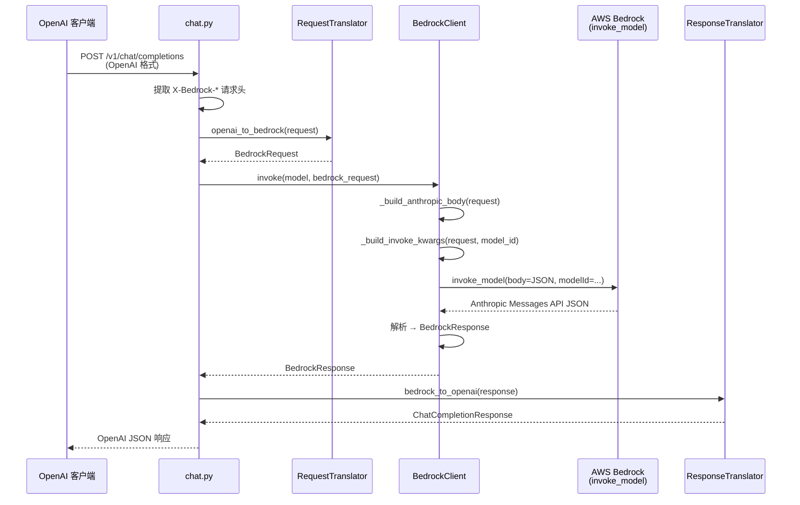

# 请求转换管线

Kolya BR Proxy 如何将 OpenAI 格式的请求转换为 AWS Bedrock API 调用，以及如何将响应转换回来。Anthropic 模型使用 InvokeModel API（原生 Messages API 格式），非 Anthropic 模型（Nova、DeepSeek、Mistral、Llama 等）使用 Converse API。

---

## 目录

1. [概览](#1-概览)
2. [完整数据流](#2-完整数据流)
3. [阶段一：OpenAI → BedrockRequest](#3-阶段一openai--bedrockrequest)
4. [阶段二：BedrockRequest → Anthropic Messages API Body](#4-阶段二bedrockrequest--anthropic-messages-api-body)
5. [阶段二b：BedrockRequest → Converse API（非 Anthropic 模型）](#5-阶段二bbedrockrequest--converse-api非-anthropic-模型)
6. [阶段三：响应 → BedrockResponse → OpenAI](#6-阶段三响应--bedrockresponse--openai)
7. [流式事件转换](#7-流式事件转换)
8. [Bedrock 扩展参数透传](#8-bedrock-扩展参数透传)
9. [effort 参数自动转换（仅 Anthropic 模型）](#9-effort-参数自动转换仅-anthropic-模型)
10. [自动修正](#10-自动修正)
11. [不支持的参数](#11-不支持的参数)

---

## 1. 概览

代理执行**三阶段转换**：

```mermaid
graph LR
    subgraph "阶段一 — translator.py"
        A["ChatCompletionRequest<br/>(OpenAI 格式)"] -->|"openai_to_bedrock()"| B["BedrockRequest<br/>(内部 schema)"]
    end

    subgraph "阶段二 — bedrock.py"
        B -->|"Anthropic: _build_anthropic_body()<br/>其他: _build_converse_params()"| C["JSON body / params"]
        C -->|"invoke_model() /<br/>converse()"| D["AWS Bedrock"]
    end

    subgraph "阶段三 — bedrock.py + translator.py"
        D -->|"Anthropic JSON"| E["BedrockResponse<br/>(内部 schema)"]
        E -->|"bedrock_to_openai()"| F["ChatCompletionResponse<br/>(OpenAI 格式)"]
    end

    style A fill:#4a9eff,color:#fff
    style F fill:#4a9eff,color:#fff
    style D fill:#ff9933,color:#fff
```



这种设计分离了关注点：`translator.py` 负责 OpenAI ↔ Bedrock 的 schema 映射，`bedrock.py` 负责 Bedrock → AWS API 的线上格式（Anthropic 模型用 InvokeModel，非 Anthropic 模型用 Converse API）。

---

## 2. 完整数据流



---

## 3. 阶段一：OpenAI → BedrockRequest

**文件**：`backend/app/services/translator.py` — `RequestTranslator.openai_to_bedrock()`

### 3.1 消息转换

| OpenAI 消息 | BedrockMessage | 说明 |
|---|---|---|
| `role: "system"` | 提取到 `BedrockRequest.system`（顶层字符串） | 仅使用最后一条 system 消息 |
| `role: "user"`（字符串内容） | `role: "user", content: "..."` | 直接传递 |
| `role: "user"`（数组内容） | `role: "user", content: [BedrockContentPart...]` | 多模态：文本 + 图片 |
| `role: "assistant"`（纯文本） | `role: "assistant", content: "..."` | 直接传递 |
| `role: "assistant"`（含 `tool_calls`） | `role: "assistant", content: [tool_use 块]` | 转换为 `BedrockContentPart(type="tool_use")` |
| `role: "tool"` | `role: "user", content: [tool_result 块]` | 多条连续 tool 消息合并为一条 user 消息 |

### 3.2 图片处理

```
OpenAI: {"type": "image_url", "image_url": {"url": "data:image/png;base64,..."}}
                                    ↓
Bedrock: {"type": "image", "source": {"type": "base64", "media_type": "image/png", "data": "..."}}
```

URL 格式的图片会被下载、base64 编码后转为 Bedrock 内联格式。

### 3.3 工具调用转换

```
OpenAI tool_calls:                          Bedrock content parts:
┌─────────────────────────┐                ┌───────────────────────────┐
│ id: "call_abc"          │                │ type: "tool_use"          │
│ type: "function"        │  ──────────▶   │ id: "call_abc"            │
│ function:               │                │ name: "get_weather"       │
│   name: "get_weather"   │                │ input: {"city": "London"} │
│   arguments: "{...}"    │                └───────────────────────────┘
└─────────────────────────┘
```

```
OpenAI tool 消息:                           Bedrock content part:
┌─────────────────────────┐                ┌─────────────────────────────┐
│ role: "tool"            │                │ type: "tool_result"         │
│ tool_call_id: "call_abc"│  ──────────▶   │ tool_use_id: "call_abc"     │
│ content: "晴，22°C"     │                │ content: "晴，22°C"          │
└─────────────────────────┘                └─────────────────────────────┘
```

### 3.4 标量参数映射

| OpenAI | BedrockRequest | 行为 |
|---|---|---|
| `temperature` | `temperature` | 直接映射（0.0 - 1.0） |
| `top_p` | `top_p` | **仅在 `temperature` 未设置时**（Bedrock 上互斥） |
| `max_tokens` | `max_tokens` | 未设置时默认 4096 |
| `stop`（字符串或数组） | `stop_sequences`（数组） | 字符串包装为数组 |
| `tools` | `tools` | `parameters` → `input_schema` |
| `tool_choice: "auto"` | `{"type": "auto"}` | |
| `tool_choice: "required"` | `{"type": "any"}` | OpenAI 的 "required" = Anthropic 的 "any" |
| `tool_choice: "none"` | `{"type": "none"}` | |
| `tool_choice: {function: {name}}` | `{"type": "tool", "name": ...}` | |
| `n` | 忽略 | n ≠ 1 时记录警告 |
| `presence_penalty` | 忽略 | ≠ 0 时记录警告 |
| `frequency_penalty` | 忽略 | ≠ 0 时记录警告 |

### 3.5 Bedrock 扩展字段（透传）

以下 OpenAI 请求体字段直接传递到 `BedrockRequest`：

| OpenAI 请求字段 | BedrockRequest 字段 |
|---|---|
| `bedrock_guardrail_config` | `guardrail_config` |
| `bedrock_additional_model_request_fields` | `additional_model_request_fields` |
| `bedrock_trace` | `trace` |
| `bedrock_performance_config` | `performance_config` |
| `bedrock_prompt_caching` | `prompt_caching` |
| `bedrock_prompt_variables` | `prompt_variables` |
| `bedrock_additional_model_response_field_paths` | `additional_model_response_field_paths` |
| `bedrock_request_metadata` | `request_metadata` |

也可通过 `X-Bedrock-*` HTTP 请求头设置（请求头优先于请求体）：

| 请求头 | 映射到 |
|---|---|
| `X-Bedrock-Guardrail-Id` + `X-Bedrock-Guardrail-Version` | `bedrock_guardrail_config` |
| `X-Bedrock-Additional-Fields`（JSON） | `bedrock_additional_model_request_fields` |
| `X-Bedrock-Trace` | `bedrock_trace` |
| `X-Bedrock-Performance-Config`（JSON） | `bedrock_performance_config` |
| `X-Bedrock-Prompt-Caching`（JSON） | `bedrock_prompt_caching` |

---

## 4. 阶段二：BedrockRequest → Anthropic Messages API Body

**文件**：`backend/app/services/bedrock.py` — `_build_anthropic_body()` + `_build_invoke_kwargs()`

此阶段将内部 `BedrockRequest` 转换为 Bedrock `invoke_model` API 所需的精确 JSON 请求体（Anthropic Messages API 格式）。

### 4.1 Body 构建

```python
# 发送给 invoke_model 的最终 JSON body：
{
    "anthropic_version": "bedrock-2023-05-31",
    "max_tokens": 4096,
    "messages": [...],          # BedrockContentPart.model_dump(exclude_none=True)

    # 可选 — 仅在设置时包含：
    "system": "You are...",
    "temperature": 0.7,
    "top_p": 0.9,
    "stop_sequences": ["END"],
    "tools": [...],
    "tool_choice": {"type": "auto"},

    # 来自 additional_model_request_fields（通过 body.update() 合并）：
    "thinking": {"type": "enabled", "budget_tokens": 5000},

    # 从 "effort" 自动转换（见第 8 节）：
    "anthropic_beta": ["effort-2025-11-24"],
    "output_config": {"effort": "medium"},

    # 来自 prompt_caching（通过 body.update() 合并）：
    "prompt_caching": {...}
}
```

### 4.2 invoke_model 顶层参数

```python
# invoke_model() 的关键字参数（body 之外的所有内容）：
{
    "modelId": "global.anthropic.claude-opus-4-6-v1",
    "contentType": "application/json",
    "accept": "application/json",

    # 可选 — 来自 guardrail_config：
    "guardrailIdentifier": "abc123",
    "guardrailVersion": "1",

    # 可选：
    "trace": "ENABLED",
    "performanceConfig": {...}
}
```

### 4.3 为何 Anthropic 模型使用 InvokeModel

Converse API 使用 AWS 特有格式（camelCase 字段、嵌套 `inferenceConfig`）。使用 `invoke_model` 后，body 就是**原生 Anthropic Messages API 格式** — 无需字段重命名。这使得 `thinking` 和 `effort` 等 Anthropic 原生参数可以直接透传。

| 方面 | Converse API | InvokeModel API |
|---|---|---|
| Body 格式 | AWS 特有（camelCase） | Anthropic Messages API（snake_case） |
| `thinking` 支持 | 通过 `additionalModelRequestFields`（受限） | 直接作为 body 字段 |
| `effort` 支持 | 不支持 | 通过 `output_config` + beta 标志支持 |
| 响应格式 | `inputTokens`、`stopReason` | `input_tokens`、`stop_reason` |
| 工具调用 | `toolUse` / `toolResult`（camelCase） | `tool_use` / `tool_result`（snake_case） |
| 流式事件 | `contentBlockStart`、`contentBlockDelta` | `content_block_start`、`content_block_delta` |

---

## 5. 阶段二b：BedrockRequest → Converse API（非 Anthropic 模型）

**文件**：`backend/app/services/bedrock.py` — `_build_converse_params()`

非 Anthropic 模型（Amazon Nova、DeepSeek、Mistral、Llama 等）使用 Bedrock Converse API，这是一个模型无关的 API，自动处理不同模型的格式转换。`BedrockClient.is_anthropic_model()` 方法根据 `anthropic.` 前缀（可带地理前缀如 `us.`、`eu.` 等）检测模型类型。

### 5.1 Converse API 参数映射

```python
# 发送给 converse() / converse_stream() 的参数：
{
    "modelId": "us.amazon.nova-pro-v1:0",
    "messages": [
        {"role": "user", "content": [{"text": "Hello!"}]}
    ],

    # 可选：
    "system": [{"text": "You are..."}],
    "inferenceConfig": {
        "maxTokens": 4096,
        "temperature": 0.7,
        "topP": 0.9,
        "stopSequences": ["END"]
    },
    "toolConfig": {
        "tools": [{"toolSpec": {"name": "...", "description": "...", "inputSchema": {"json": {...}}}}],
        "toolChoice": {"auto": {}}
    },

    # 可选 — 来自 guardrail_config：
    "guardrailConfig": {"guardrailIdentifier": "abc123", "guardrailVersion": "1"},

    # 可选 — 来自 additional_model_request_fields：
    "additionalModelRequestFields": {...},

    # 可选 — 来自 performance_config：
    "performanceConfig": {...}
}
```

### 5.2 内容块格式差异

| 内容类型 | Anthropic (InvokeModel) | Converse API |
|---|---|---|
| 文本 | `{"type": "text", "text": "..."}` | `{"text": "..."}` |
| 图片 | `{"type": "image", "source": {"type": "base64", "media_type": "image/png", "data": "..."}}` | `{"image": {"format": "png", "source": {"bytes": <原始字节>}}}` |
| 工具调用 | `{"type": "tool_use", "id": "...", "name": "...", "input": {...}}` | `{"toolUse": {"toolUseId": "...", "name": "...", "input": {...}}}` |
| 工具结果 | `{"type": "tool_result", "tool_use_id": "...", "content": "..."}` | `{"toolResult": {"toolUseId": "...", "content": [{"text": "..."}]}}` |

### 5.3 Converse API 响应映射

```
Converse API 响应                          BedrockResponse
──────────────────                        ───────────────
{                                         BedrockResponse(
  "output": {                               id=<RequestId>,
    "message": {                            content=[
      "content": [                            BedrockContentBlock(type="text", text="你好"),
        {"text": "你好"},                      BedrockContentBlock(type="tool_use", ...),
        {"toolUse": {"toolUseId":...}}      ],
      ]                                     stop_reason="end_turn",
    }                                       usage=BedrockUsage(
  },                                          input_tokens=100,
  "stopReason": "end_turn",                   output_tokens=50
  "usage": {                                )
    "inputTokens": 100,                   )
    "outputTokens": 50
  }
}
```

---

## 6. 阶段三：响应 → BedrockResponse → OpenAI

### 6.1 非流式响应解析

**文件**：`bedrock.py` — `_invoke_inner()`

```
Anthropic JSON 响应                       BedrockResponse
───────────────────                       ───────────────
{                                         BedrockResponse(
  "id": "msg_...",                          id="msg_...",
  "content": [                              content=[
    {"type": "text", "text": "你好"}          BedrockContentBlock(type="text", text="你好"),
    {"type": "tool_use", "id": "...",         BedrockContentBlock(type="tool_use", ...),
     "name": "...", "input": {...}}           BedrockContentBlock(type="thinking"),
    {"type": "thinking", "thinking": "..."}
  ],                                        ],
  "stop_reason": "end_turn",                stop_reason="end_turn",
  "usage": {                                usage=BedrockUsage(
    "input_tokens": 100,                      input_tokens=100,
    "output_tokens": 50                       output_tokens=50
  }                                         )
}                                         )
```

### 6.2 BedrockResponse → OpenAI ChatCompletionResponse

**文件**：`translator.py` — `ResponseTranslator.bedrock_to_openai()`

| Bedrock | OpenAI | 说明 |
|---|---|---|
| `content[type="text"]` | `choices[0].message.content` | 多个文本块拼接 |
| `content[type="tool_use"]` | `choices[0].message.tool_calls[]` | `input` → JSON 字符串 `arguments` |
| `content[type="thinking"]` | 跳过 | 不属于 OpenAI 格式 |
| `stop_reason="end_turn"` | `finish_reason="stop"` | |
| `stop_reason="tool_use"` | `finish_reason="tool_calls"` | |
| `stop_reason="max_tokens"` | `finish_reason="length"` | |
| `usage.input_tokens` | `usage.prompt_tokens` | |
| `usage.output_tokens` | `usage.completion_tokens` | |

---

## 7. 流式事件转换

### 7.1 Anthropic SSE → BedrockStreamEvent（Anthropic 模型）

**文件**：`bedrock.py` — `_anthropic_event_to_bedrock()`

`invoke_model_with_response_stream` API 返回字节流。每个 chunk 被解码为 JSON 后映射：

| Anthropic 事件 | BedrockStreamEvent.type | 关键数据 |
|---|---|---|
| `message_start` | `message_start` | `usage.input_tokens`（来自 `message.usage`） |
| `content_block_start` | `content_block_start` | `content_block.type`：`text` / `tool_use` / `thinking` |
| `content_block_delta`（delta.type=`text_delta`） | `content_block_delta` | `delta.text` |
| `content_block_delta`（delta.type=`input_json_delta`） | `content_block_delta` | `delta.partial_json` |
| `content_block_delta`（delta.type=`thinking_delta`） | `content_block_delta` | `delta.thinking` |
| `content_block_stop` | `content_block_stop` | `index` |
| `message_delta` | `message_delta` | `usage.output_tokens`、`delta.stop_reason` |
| `message_stop` | `message_stop` | — |
| `ping` | 跳过 | — |

### 7.2 Converse Stream 事件 → BedrockStreamEvent（非 Anthropic 模型）

**文件**：`bedrock.py` — `_converse_stream_event_to_bedrock()`

`converse_stream` API 返回的事件为字典，每个事件包含一个键：

| Converse 事件 | BedrockStreamEvent.type | 关键数据 |
|---|---|---|
| `messageStart` | `message_start` | `role` |
| `contentBlockStart`（text） | `content_block_start` | `content_block.type: "text"` |
| `contentBlockStart`（toolUse） | `content_block_start` | `content_block: {type: "tool_use", id, name}` |
| `contentBlockDelta`（text） | `content_block_delta` | `delta.text` |
| `contentBlockDelta`（toolUse） | `content_block_delta` | `delta.partial_json` |
| `contentBlockStop` | `content_block_stop` | `index` |
| `messageStop` | `message_delta` | `delta.stop_reason` |
| `metadata` | `message_delta` | `usage.input_tokens`、`usage.output_tokens` |

### 7.3 BedrockStreamEvent → OpenAI SSE Chunks

**文件**：`chat.py` — `stream_chat_completion()`

| BedrockStreamEvent | OpenAI SSE 输出 | 说明 |
|---|---|---|
| `message_start` | （无输出） | 捕获 `input_tokens` 用于用量统计 |
| `content_block_start`（text） | （无输出） | — |
| `content_block_start`（tool_use） | `{"delta": {"tool_calls": [...]}}` | 发送工具调用 ID + 名称 |
| `content_block_start`（thinking） | 完全跳过 | thinking 块被过滤 |
| `content_block_delta`（text） | `{"delta": {"content": "..."}}` | 文本流式输出 |
| `content_block_delta`（partial_json） | `{"delta": {"tool_calls": [...]}}` | 工具参数流式输出 |
| `content_block_delta`（thinking） | 完全跳过 | — |
| `message_delta` | （无输出） | 捕获 `output_tokens` |
| `message_stop` | `{"finish_reason": "stop"}` 或 `"tool_calls"` | 最终 chunk |
| — | `data: [DONE]\n\n` | 流结束标记 |

### 7.4 流式 Token 计数

```
message_start  ──▶  input_tokens   （在流开始时捕获）
message_delta  ──▶  output_tokens  （在流接近结束时捕获）
                         │
                         ▼
              record_usage(prompt_tokens, completion_tokens)
```

---

## 8. Bedrock 扩展参数透传

`bedrock_additional_model_request_fields` 值的完整生命周期：

```
客户端请求体：
{
  "bedrock_additional_model_request_fields": {
    "thinking": {"type": "enabled", "budget_tokens": 5000}
  }
}

    │  （或通过请求头：X-Bedrock-Additional-Fields: {"thinking": ...}）
    ▼

chat.py：提取请求头 → 设置 request_data.bedrock_additional_model_request_fields
    │
    ▼

translator.py：openai_to_bedrock()
    → BedrockRequest.additional_model_request_fields = {"thinking": {...}}
    │
    ▼

bedrock.py：_build_anthropic_body()
    → body.update(request.additional_model_request_fields)
    → body 现在包含：{"thinking": {"type": "enabled", "budget_tokens": 5000}, ...}
    │
    ▼

invoke_model(body=json.dumps(body))
    → Anthropic Messages API 接收到 "thinking" 作为原生字段
```

---

## 9. effort 参数自动转换（仅 Anthropic 模型）

Anthropic 的 `effort` 参数在 Bedrock 上需要特殊处理：

1. 必须嵌套在 `output_config` 内（不能放在顶层）
2. 需要 `anthropic_beta: ["effort-2025-11-24"]` 标志

代理会自动转换。用户可以发送：

```json
{
  "bedrock_additional_model_request_fields": {
    "thinking": {"type": "enabled", "budget_tokens": 5000},
    "effort": "medium"
  }
}
```

`bedrock.py` 中的 `_build_anthropic_body()` 方法将其转换为：

```json
{
  "thinking": {"type": "enabled", "budget_tokens": 5000},
  "anthropic_beta": ["effort-2025-11-24"],
  "output_config": {"effort": "medium"}
}
```

**转换步骤：**

```
1. body.update(additional_model_request_fields)
   → body = {..., "effort": "medium", "thinking": {...}}

2. 检测到 body 中有 "effort"
   → 弹出 "effort" 值
   → 包装到 output_config：{"effort": "medium"}
   → 添加 beta 标志：["effort-2025-11-24"]

3. 发送给 invoke_model 的最终 body：
   → 顶层已无 "effort"
   → "output_config": {"effort": "medium"} 已存在
   → "anthropic_beta": ["effort-2025-11-24"] 已存在
```

---

## 10. 自动修正

### 10.1 max_tokens 与 budget_tokens

Anthropic 要求 `max_tokens > thinking.budget_tokens`。如果请求中 `max_tokens=2000` 且 `budget_tokens=2000`，代理会自动调整：

```
修正前：max_tokens=2000, budget_tokens=2000  （无效：max_tokens 必须 > budget_tokens）
修正后：max_tokens=4000, budget_tokens=2000  （自动修正：max_tokens = budget + 原始 max）
```

### 10.2 temperature / top_p 互斥

Anthropic 不允许在同一请求中同时设置 `temperature` 和 `top_p`。转换器强制执行：

```
如果设置了 temperature → 忽略 top_p
如果未设置 temperature → 传递 top_p
```

---

## 11. 不支持的参数

使用 `invoke_model`（Anthropic 模型）时，以下 OpenAI/Bedrock 参数会被**警告并忽略**：

| 参数 | 原因 |
|---|---|
| `n`（如果 ≠ 1） | Bedrock 仅支持单个补全 |
| `presence_penalty` | Anthropic 不支持 |
| `frequency_penalty` | Anthropic 不支持 |
| `prompt_variables` | 仅 Converse API 支持 |
| `request_metadata` | 仅 Converse API 支持 |
| `additional_model_response_field_paths` | 仅 Converse API 支持 |

---

## 文件参考

| 文件 | 在转换中的角色 |
|---|---|
| `api/v1/endpoints/chat.py` | 入口点；提取 `X-Bedrock-*` 请求头；编排流式/非流式流程 |
| `services/translator.py` | `RequestTranslator`：OpenAI → BedrockRequest；`ResponseTranslator`：BedrockResponse → OpenAI |
| `services/bedrock.py` | `_build_anthropic_body()`：BedrockRequest → Anthropic JSON（Anthropic 模型）；`_build_converse_params()`：BedrockRequest → Converse API 参数（非 Anthropic）；`_anthropic_event_to_bedrock()` / `_converse_stream_event_to_bedrock()`：流式事件映射 |
| `schemas/openai.py` | OpenAI 请求/响应 Pydantic 模型 |
| `schemas/bedrock.py` | 内部 Bedrock Pydantic 模型（BedrockRequest、BedrockResponse、BedrockStreamEvent） |
